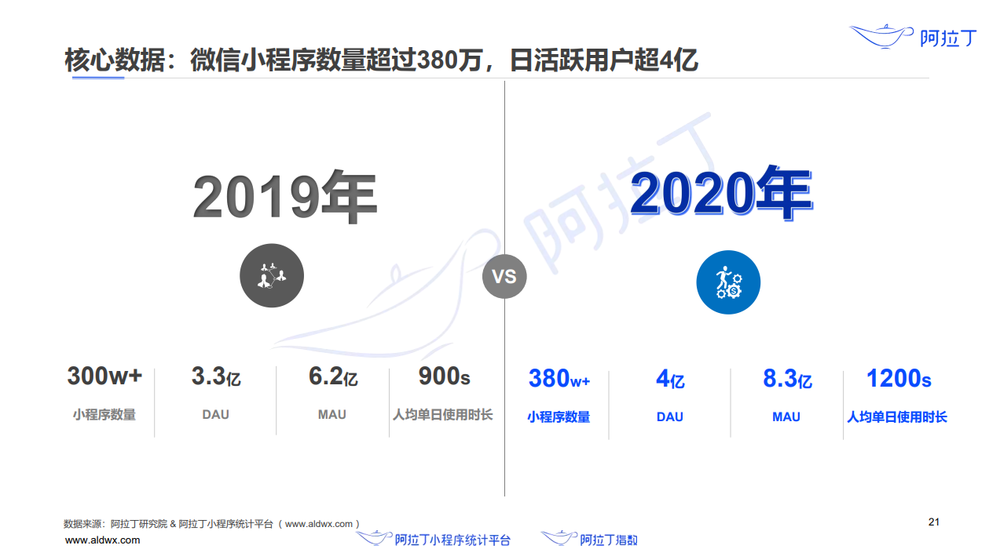
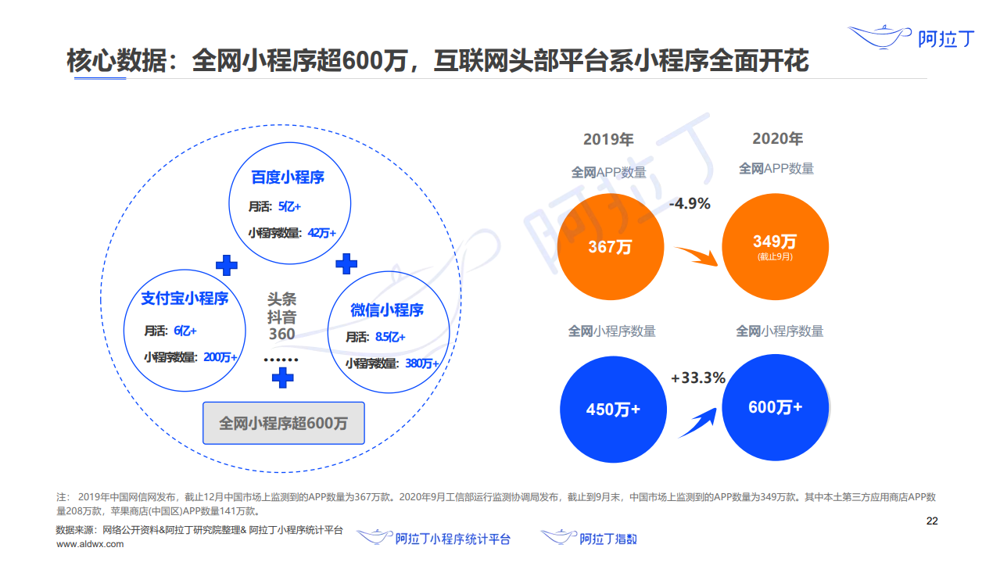
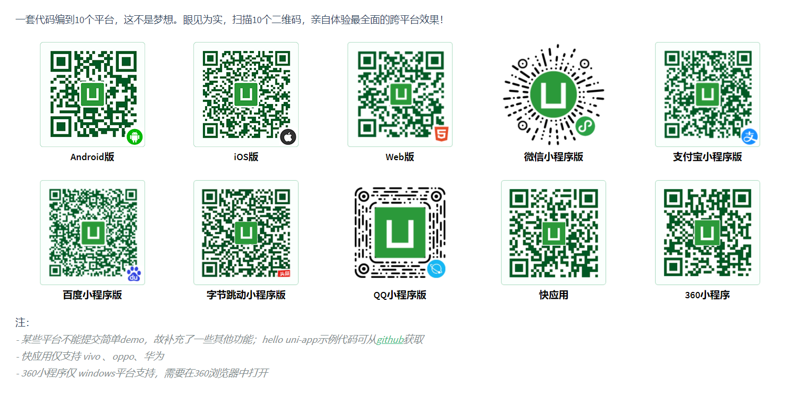

# 课程导读

Hello，慕课网的小伙伴们大家好，我是 Sunday。这次给大家带来的课程是**《小程序全解析，双路教学开发 `uni-app` 项目》**

## 小程序、`uni-app` 的介绍

在 2017 年的时候，微信推出了**一种不需要下载安装即可在微信平台上使用的应用程序** ，也就是我们现在常说的 **小程序应用**。

仅仅过了一年的时间，截止到 2018年的3月份，微信小程序用户规模就已经突破了 4 个亿。

而到了 2020 年，根据 **阿拉丁统计数据**，微信小程序  `MAU（月活跃用户数）` 已经达到了 8.3 亿。

这就使得 **微信小程序** 成为了企业和开发者们不得不重视的一个巨大市场。

其他的大厂看到了 **微信小程序** 的成功之后，也纷纷推出了自己的小程序应用，比如：

- 支付宝小程序
- 字节跳动小程序
- 百度小程序
- ...

都希望可以在这个庞大的 **小程序市场** 中分一杯羹。

同样，截止到 2020 年，全网小程序数量已经超过了 600 万

那么在小程序市场如此庞大的今天，整个的 **前端移动端市场**，已经被各种平台包围。

如果一个企业想要开发一个 **前端移动端** 项目的话，那么需要同时适配：

1. android 平台
2. IOS 平台
3. web 平台
4. 微信小程序 平台
5. 支付宝小程序 平台
6. 百度小程序平台
7. ...

对于企业来说成本剧增，对于开发者来说写的头秃....

那么在这样的一个大环境下，就势必需要有一个东西，来应对这种场景。

`uni-app` 应运而生！

对于 `uni-app` 来说，它可以一套代码，编译到 10 个平台

极大的降低了企业的开发成本，也让我们广大的程序员朋友有了 打游戏和找女朋友的时间 😀

## 本课程的内容规划 && 项目介绍

那么讲到这里，大家应该已经对  **小程序 和 uniapp** 有了一个大致的了解了。那么接下来就来说说咱们的这个课程，我们的这个课是干嘛的呢？

为了保证大家的学习体验和学习成果，让大家能够物超所值。

我们的整个课程会分为两个大的部分：

- 第一部分会为大家讲解 **微信小程序** 的知识，同时在讲解的过程中，会通过 多个案例，来让大家掌握 **微信小程序** 的各项技术在各个场景下的应用。
  - 在技术的讲述中，我们多数情况下都会采用：
    - 分析场景
    - 提出问题
    - 讲解知识
    - 解决问题
  - 这样的方式来进行讲解，争取让大家可以 **知其然亦知其所以然**
  - 这一部分的时长，大概会在 10 -15 个小时之间。

- 第二部分则会通过一个实战项目《慕课热搜》来带大家体验和学习小程序之后的 `uni-app` 开发。
  - 在项目开发过程中，我们不会一下子写出 **”完美的代码“**。而是会模拟程序员真实开发的场景，逐步迭代，面对 `bug` ，分析场景。从而得出解决问题的方案。
  - 这一部分的时长，大概在 15 个小时左右。

也就是说，我们整套课程下来，总时长接近 30 个小时。这应该是慕课网中，非常大体量的 **实战课程** 了。

而我们的《慕课热搜》也已经正式上线，大家可以访问：

1. H5端：
   
2. 微信小程序端：
   

整个项目分为：

1. 热搜
2. 热播
3. 个人中心

三个模块，项目完全对接真实数据，并具备完善的业务逻辑

> 比如我们可以在搜索模块中，通过任意关键字，进行文章搜索，点击进入文章详情，如果想要点击关注，那么需要先进行用户登录。
>
> 除了文章之外，项目中，还包含了视频播放，回复弹幕等等内容。

整个项目有接近 20 个自定义组件，最大可能的反应了真实企业级项目开发的代码和场景。

## 本课程的面向人群 && 价值描述

本课程面向 **0 -2 年开发经验** 的同学。

所以说，在课程中不光会讲授技术知识，还会针对性的讲解一些编程思想，让大家知道知道在面临企业开发的问题时，应该如何思考，如何进行解决。

从而能够最大程度的帮助大家达到 **涨薪** 或者 **就业** 的目的。

## 学习本课程的收获

总而言之，在本课程中大家不光可以学习到：

- uniapp 的相关知识

还可以：

- 学习到 - 微信小程序的完善体系
- 学习到 - 良好的代码风格
- 掌握 - 构建企业级项目的编程思维
- 尝试 - 进行独立思考的业务场景
- 最终上线 - 可商用的企业项目

努力为大家构建出一条  **前端小程序端的技术体系**