# 小程序初体验

## 章节介绍

- 初次接触小程序所需要做的准备工作
- 小程序中的基本概念
- 每一小节的重点内容会以问题的形式抛出

## 小程序开发前准备

资料文档详见：01-小程序开发前准备 ('./资料/01-小程序开发前准备.md')

## 开发第一个小程序应用

1. 打开微信开发者工具，进行微信扫码登录
   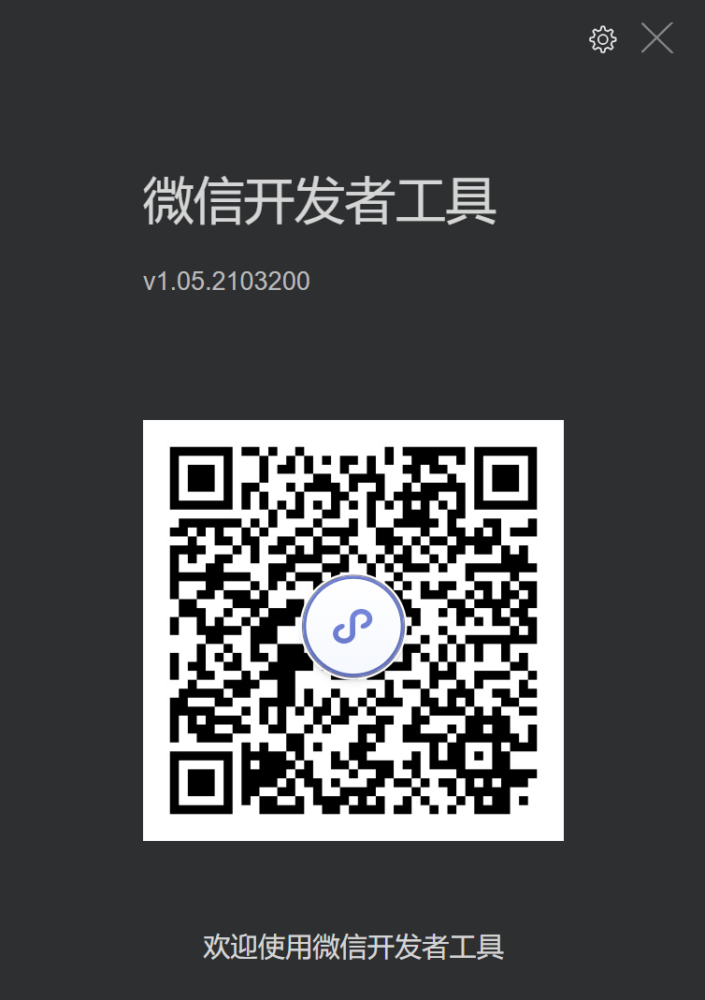
2. 登录成功之后，可以得到小程序创建页面
   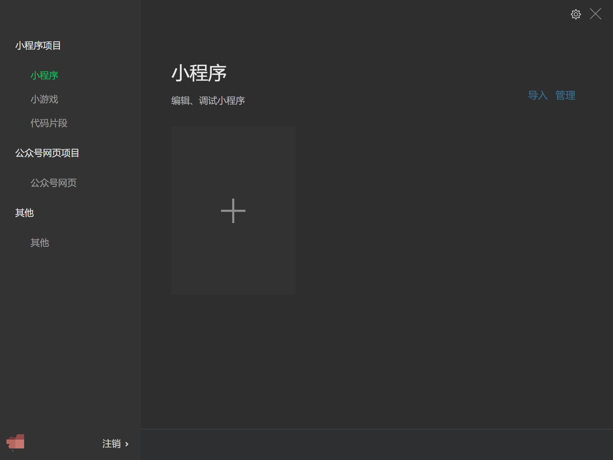
3. 接下来我们区创建小程序应用
4. 【小程序项目】选择【小程序】，然后点击加号按钮
   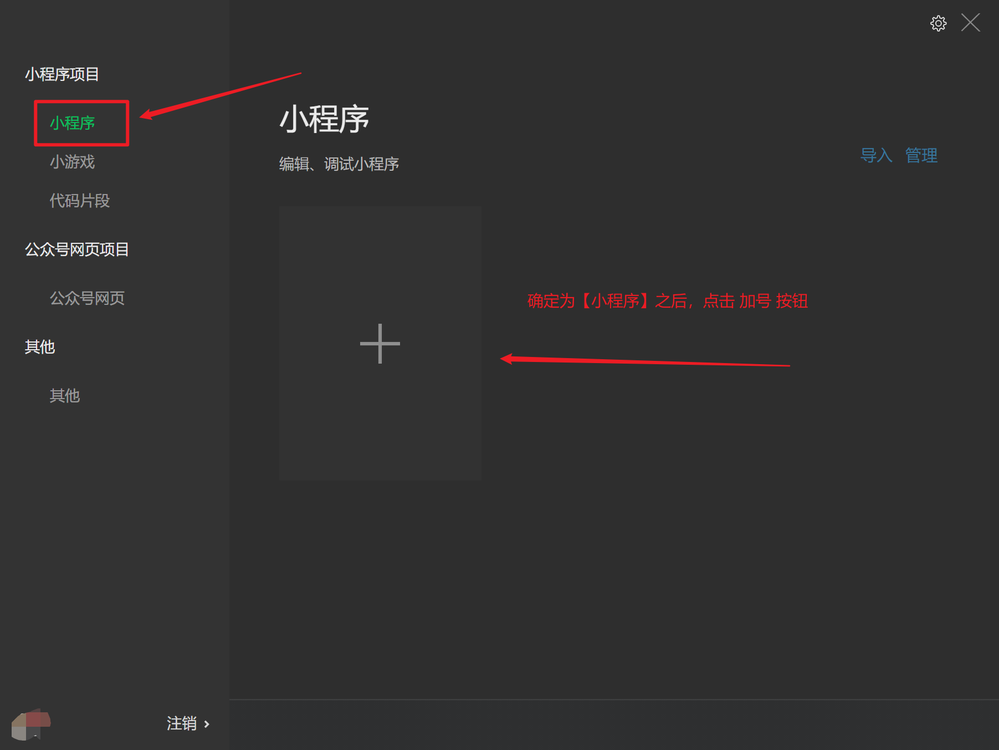
5. 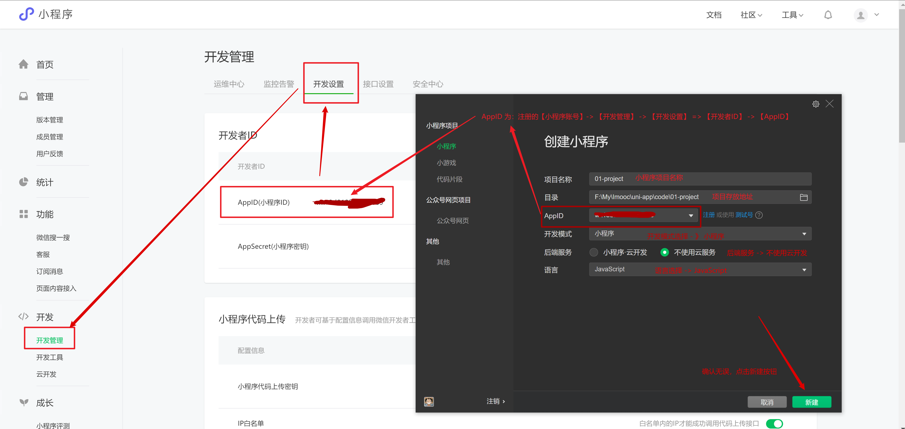
6. 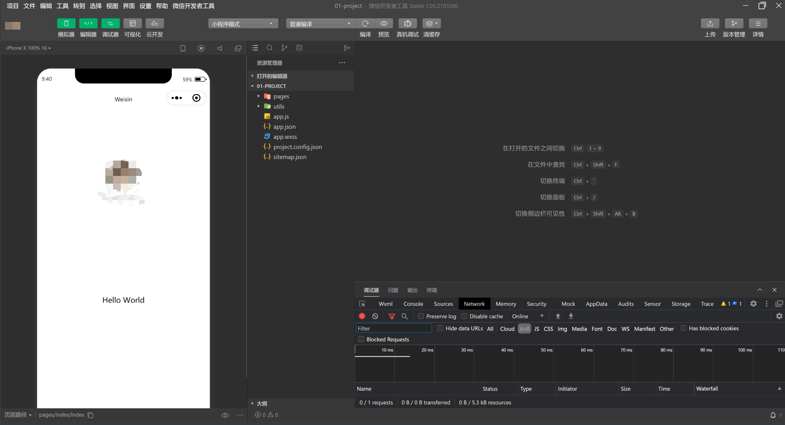
7. 看到此页面，表示小程序已经创建成功
8. 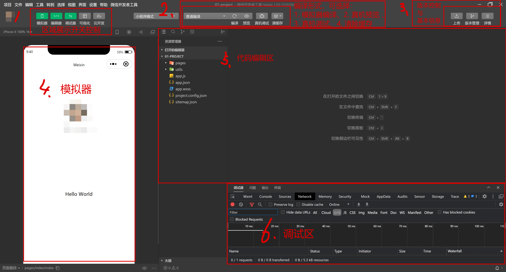

## 了解小程序项目的基本组成结构

### 问题：

> 1. 一个小程序的页面由什么组成？
> 2. project.config.json 文件的作用是什么？
> 3. sitemap.json 文件的作用是什么？

- pages：所有的 **小程序页面，**每个页面以 **单独的文件夹存在**
  - index：index 页面文件夹，文件夹下面都包含 **4 个** 基本的页面文件，这**四个文件共同组成 index 页面**
    - index.js：`.js` 文件 -- 页面的脚本文件，存放页面的数据、事件处理函数、生命周期等
    - index.json：`.json` 文件 -- 当前页面的配置文件，配置页面的外观、表现等
    - index.wxml：`.wxml` 文件 -- 页面的模板结构文件
    - index.wxss：`.wxss` 文件 -- 当前页面的样式表文件
  - logs
    - ...
- utils：工具类文件夹
  - utils.js
- app.js：小程序的**项目**逻辑文件，用来 **注册小程序实例，绑定生命周期回调函数、错误监听和页面不存在监听函数**等。
- app.json：小程序公共配置文件，决定页面文件的路径、窗口表现、设置网络超时时间、设置多 tab 等。
- app.wxss：小程序公共样式表
- project.config.json：是项目配置文件，用来记录我们对小程序开发工具所做的个性化配置
  - `setting` 中保存了`编译相关的配置`
  - `projectname` 中保存的是`项目名称`
  - `appid` 中保存的是`小程序的账号 ID`
- sitemap.json：配置小程序及其页面是否允许被微信索引
  - rules中保存了索引规则列表的配置
  - rules规则中，action表示页面是否能被索引(allow,disallow)，page表示生效的页面

### 答案：

> 1. 一个小程序的页面由什么组成？
>    1. 小程序的页面由 4 个文件组成
>    2. 并且 这4个文件 应该被放入到 pages 文件夹下的 同一个文件夹中
> 2. project.config.json 文件的作用是什么？
>    1. 项目配置文件，用来记录我们对小程序开发工具所做的个性化配置
> 3. sitemap.json 文件的作用是什么？
>    1. 配置小程序及其页面是否允许被微信索引

## wxml VS html

### 问题：

> 1. 我是否可以在 `wxml` 文件中，写入 `div` 标签？并说出原因！

1. 什么是 `WXML`

   `WXML`（`WeiXin Markup Language`）是框架设计的一套标签语言（组件），用来构建小程序页面的结构，其作用类似于网页开发中的 `HTML`

   

2. `WXML` 和 `HTML` 的区别

   - 标签名称不同

     - HTML(div, span, img, a)
     - WXML(view, text, image, navigator)

   - 属性节点不同

     - &lt;a href="#"&gt;超链接&lt;/a&gt;
     - &lt;navigator url="/pages/home/home"&gt;跳转到home页&lt;/navigator&gt;

   - 提供了动态渲染数据的模板语法

     - 数据绑定

     - 条件渲染

     - 列表渲染

### 答案：

> 1. 我是否可以在 `wxml` 文件中，写入 `div` 标签？并说出原因！
>    1. 可以写入 `div` 标签，但是**不要**使用。`div` 标签会被解析成 `类 view` 标签效果
>    2. `wxml` 中需要写入 小程序提供的组件，如果写入的为 **非小程序组件**，则会被解析为  `类 view` 标签效果

## wxss VS css

### 问题

> 1. `wxss` 新增了什么尺寸单位？
> 2. `wxss` 中推荐使用什么选择器？

1. 什么是 `WXSS`
   - WXSS` (`WeiXin Style Sheets`)是一套样式语言，用于描述 `WXML` 的组件样式
   - 类似于网页开发中的 `CSS`
   - `WXSS` 具有 `CSS` 大部分的特性
2. 新增了尺寸单位 --  **rpx**，一个 `rpx` 为页面宽度的 `1 / 750`
3. 提供了全局的样式和局部样式。
   1. 全局样式：写入到 **根目录的`wxss`** 中的样式
   2. 局部样式：写入到 **页面的 `wxss` ** 中的样式
4. 此外 `WXSS` 仅支持部分 `CSS` 选择器
   1. **`.class`（推荐使用）** 和 `#id`
   2. `element`   
   3. 并集选择器和后代选择器 
   4. `::after` 和 `::before` 等伪类选择器

### 答案：

> 1. `wxss` 新增了什么尺寸单位？
>    1. `rpx` 尺寸单位，一个 `rpx` 为页面宽度的 `1 / 750`
> 2. `wxss` 中推荐使用什么选择器？
>    1. `.class` 类选择器

## .json 配置文件

### 问题：

> 1. 小程序中的 .json 文件主要分为哪两种？
> 2. 当这两种配置文件出现相同配置时，会出现什么结果？

小程序中，额外多出了一个 .json 的配置文件，.json 文件主要分为两个：

1. 项目根目录下的 .json 文件
   1. 修改项目的基本配置
      1. 首页
      2. navigationBarBackgroundColor
2. 页面中的 .json 文件
   1. 修改页面的基本配置（优先级高）
      1. navigationBarBackgroundColor

### 答案：

> 1. 小程序中的 .json 文件主要分为哪两种？
>    1. 项目根目录下的 .json 文件
>    2. 页面中的 .json 文件
> 2. 当这两种配置文件出现相同配置时，会出现什么结果？
>    1. 以 页面的.json 文件 为主

## 宿主的概念与小程序的宿主环境

### 问题：

> 1. 什么是**宿主环境**？
> 2. 微信小程序项目为什么可以调用 **微信支付** 功能？
> 3. 小程序的运行环境是如何划分的？

1. 宿主环境指的是 **程序运行所必须的依赖环境**
   1. web 前端的宿主环境为：浏览器
   2. `android` 软件的宿主环境为：`android` 系统
   3. `IOS` 软件的宿主环境为：`IOS` 系统1
2. 小程序的宿主环境是什么？
   1. 小程序的宿主环境为：**手机微信**
      1. 所以：小程序可以调用 **手机微信** 中的
         1. 扫码
         2. 支付
         3. 登录
         4. 分享
         5. 等等功能
3. 小程序的**运行环境**：
   1. 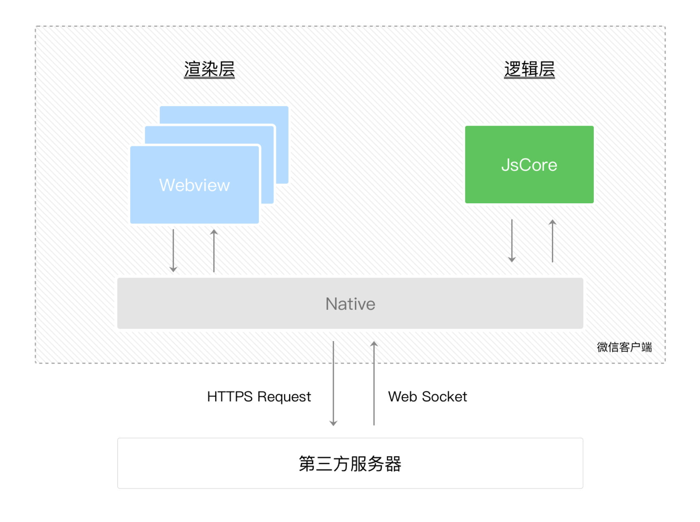
   2. 分成**渲染层**和**逻辑层**
      1. 其中 `WXML` 模板和 `WXSS` 样式工作在**渲染层**
         1. **渲染层**的界面使用了`WebView` 进行渲染
         2. 一个小程序存在**多个界面**，所以渲染层存在**多个`WebView`**线程
      2. JS 脚本工作在**逻辑层**。
         1. **逻辑层**采用`JsCore`线程运行JS脚本
   3. 这**两个线程的通信**会经由**微信客户端**做中转
      1. **逻辑层**发送**网络请求**也经由 **`Native（手机原生系统）`** 转发

### 答案：

> 1. 什么是**宿主环境**？
>    1. 宿主环境指的是 **程序运行所必须的依赖环境**
> 2. 微信小程序项目为什么可以调用 **微信支付** 功能？
>    1. 因为 微信小程序 的宿主环境为 **手机微信**，而 **手机微信** 提供了对应的功能
> 3. 小程序的运行环境是如何划分的？
>    1. 分成**渲染层**和**逻辑层**

## 小程序的内置组件

1. [view](https://developers.weixin.qq.com/miniprogram/dev/component/view.html)
3. [scroll-view](https://developers.weixin.qq.com/miniprogram/dev/component/scroll-view.html)
4. [swiper](https://developers.weixin.qq.com/miniprogram/dev/component/swiper.html) && [swiper-item](https://developers.weixin.qq.com/miniprogram/dev/component/swiper-item.html)
5. [text](https://developers.weixin.qq.com/miniprogram/dev/component/text.html) && [rich-text](https://developers.weixin.qq.com/miniprogram/dev/component/rich-text.html)
6. [button](https://developers.weixin.qq.com/miniprogram/dev/component/button.html)
7. [image](https://developers.weixin.qq.com/miniprogram/dev/component/image.html)

## 小程序成员管理

1. 在 [小程序开放平台](https://mp.weixin.qq.com/wxamp/user/manage?action=index&use_role=1&token=743024853&lang=zh_CN) 中，可以对小程序进行成员的管理
   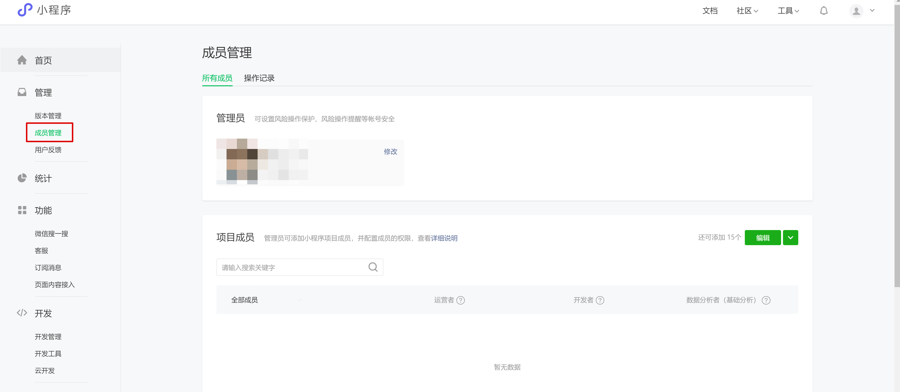
2. 项目中的所有成员被分为三个角色：
   1. 管理员：账号注册绑定的微信
   2. 项目成员：
      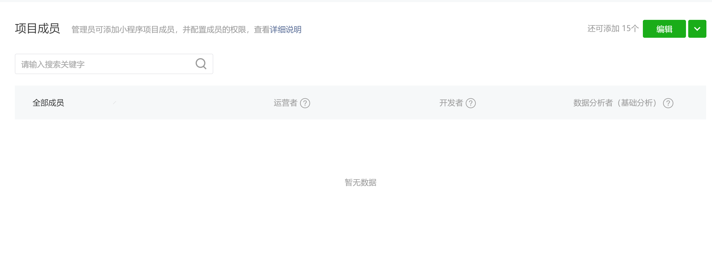
   3. 体验成员：
      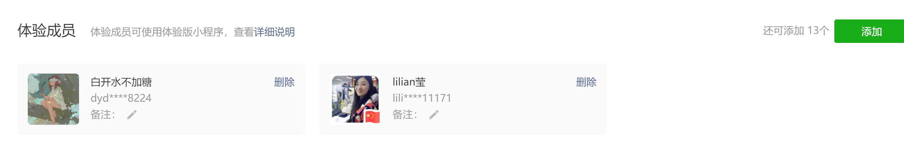

## 项目发布流程

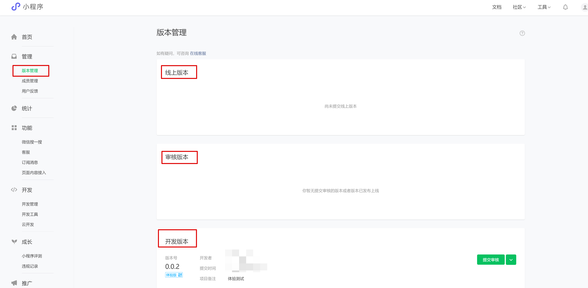

1. 本地 - 开发版本
2. 上传 - 开发版本 / 体验版本
3. 上传 - 审核版本
4. 上传 - 线上版本

## 本章小结

- 小程序账号 & 微信开发者工具 的概念
- **小程序项目的基本页面结构**
- **wxml 的概念**
- **wxss 的概念**
- **.json 配置文件的作用**
- **宿主环境的概念**
- **部分的小程序内置组件**
- 小程序成员管理的方式和项目发布的流程

