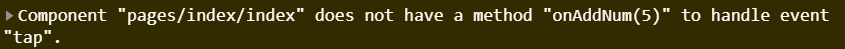
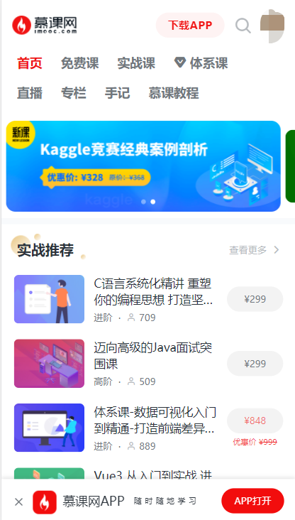
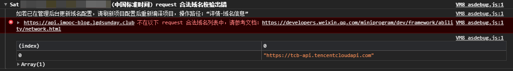
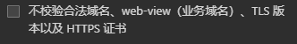
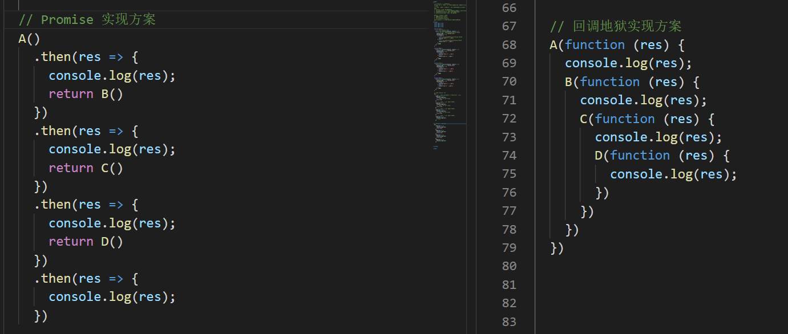
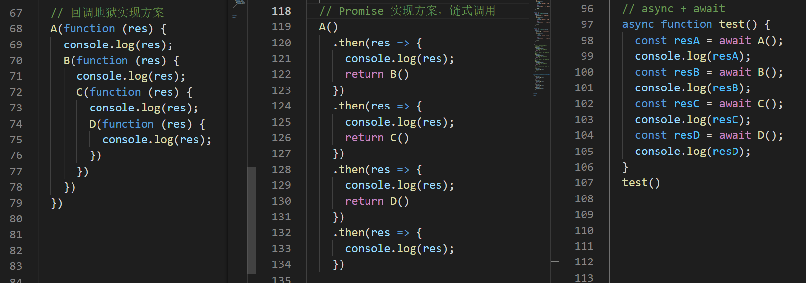

# 小程序的核心语法

## 开篇

小程序核心语法：

1. 数据驱动原则
2. 实现两个案例，串联核心知识点
   1. 商品案例
   2. 列表案例

## 小程序的数据驱动原则

### 问题：

> 1. 什么是数据驱动？
> 2. 在小程序中如何完成数据绑定？

### 数据驱动：

```js
  // 商品
  let product = {
    price: 10,
    num: 5
  }
  // 总价格
  let total = 0;
  // 计算总价格的方法
  function getTotal(product) {
    return product.price * product.num
  }
  // 计算商品的总价格
  total = getTotal(product)
  // 进行打印
  console.log('总价格：' + total);
  // 50 太贵了，所以我们少购买了两个商品，也就是让 num = 3
  product.num = 3;
  // 问：总价格是多少？
  console.log('总价格：' + total); // 此时，打印发现总价格还是 50 元，如果要说原因的话，那么应该很简单，【因为我们没有重新进行价格的计算嘛】
  // 但是，此时大家有没有想过一点？我们为什么要进行价格的计算呢？
  // ----------------------------------------------------
  // 当商品的数量发生变化时，商品的总价格【理应发生变化】，不是吗？
```

上面的例子，就是我想要跟大家说的：【当数量发生变化时，商品的总价格理应发生改变】。

那么同样的道理，在我们的页面中，假如：

> 某一个 DOM 依赖于某个数据进行展示，那么【当数据发生变化时，视图也理应发生变化】。

而这个就是【响应式数据驱动】。

> PS：如果大家想要跟深入的了解，那么可以查看博客：[聊一聊响应式构建的那些经历](https://www.imooc.com/article/317228)

### 小程序中完成响应式：

- 在 `data` 中定义数据

  ```js
  // index.js
  // 获取应用实例
  const app = getApp()
  
  Page({
   data: {
     product: {
       price: 10,
       num: 5
     }
   }
  })
  ```

  

- 在 `wxml` 中使用数据

  ```html
  <view>
    <view>
      <!-- wxml 中访问数据，必须使用 {{}} 语法，{{}} 语法中可以放置【任意的、单一的 JavaScript 表达式】 -->  
      商品的单价：{{product.price}}
    </view>
    <view>
      商品的数量：{{product.num}}
    </view>
    <view>
      商品的总价格：{{product.price * product.num}}
    </view>
  </view>
  ```

现在我们已经可以在 `js 的 data` 中定义数据，并且在 `wxml 中通过 {{}}` 语法使用数据。

那么我们回过头来看我们的问题：

### 答案：

> 1. 什么是数据驱动？
>    1. 当数据发生变化时，视图理应发生变化
> 2. 在小程序中如何完成数据绑定？
>    1. 在 data 中定义数据
>    2. 在 wxml 中通过 {{}} 使用数据

但是在此时，大家心里应该还有一个疑惑，那就是：【现在数据还没有发生变化呀？我也没有看到视图的变化呀？】。

如果你心中确实有这么一个困惑的话，那么就继续往下看！

## 小程序中的常用事件与属性列表

### 问题：

> 1. 如何为按钮添加点击事件？
> 2. 如何修改 data 中数据的值？

### 处理点击事件

接下来我们希望做一件事情：

> 创建一个按钮
>
> 当用户点击按钮时
>
> 让 product 的 num + 1

创建按钮的方式非常简单：

```html
<button type="primary">num + 1</button>
```

问题在于：我们如何给这个按钮添加点击事件呢？

有过开发经验的同学，可能会猜到：我们可以给 `button` 一个 `click` 事件来监听按钮的点击。

可是大家需要知道，现在我们是在【小程序】中，那么如果想要给 `button` 添加点击事件则不可以使用 `click` 而是 **`bind:tap / bindtap`**。

其中 `bind: / bind` 表示【绑定事件】，`tap` 为绑定的具体事件。小程序具体事件列表，可以点击 [这里](https://developers.weixin.qq.com/miniprogram/dev/framework/view/wxml/event.html#%E4%BA%8B%E4%BB%B6%E7%9A%84%E4%BD%BF%E7%94%A8%E6%96%B9%E5%BC%8F) 查看。

```html
  <button type="primary" bind:tap="onAddNum">num + 1</button>
```

接下来需要在 `js` 中定义对应的 **事件**

```js
 /**
  * 定义事件处理的方法
  */
 onAddNum () {
  console.log('onAddNum')
 }
```

到目前：我们已经 **监听了按钮的点击事件，并且写入了对应的处理函数** ，接下来就需要 **修改 num 的值 **

### 修改 data 的数据

想要修改 `data` 中的数据，那么我们需要借助一个函数 `setData`。

`setData` 接收一个 对象作为参数，这个对象就是最新的 `data` 数据。

其中 `key` 为要修改的数据， `value` 为最新的值

### 访问 data 的数据

因为我们想要让 `num + 1` ，所以我们还需要拿到 `num` 的当前值，想要访问 `num` 的值，可以通过 `this.data.product.num` 的形式访问

所以最终的修改 `num` 的代码为：

```js
 /**
  * 定义事件处理的方法
  */
 onAddNum () {
  this.setData({
    'product.num': this.data.product.num + 1
  })
```

此时，当我们点击 `button` ，可以发现：【当 num 发生改变时，总价格也发生了对应的变化】

### 答案：

> 1. 如何为按钮添加点击事件？
>    1. `bindtap` ||  `bind:tap`
> 2. 如何修改 data 中数据的值？
>    1. 通过 `this.setData({})` 定义新的值
>    2. 通过 `this.data` 访问具体的值

## 事件传参

### 问题：

> 1. 如果想要在【点击事件中】传递参数，那么需要怎么做？

### 新的需求

现在让我们把需求变得更加复杂一些。

> 我们希望 `onAddNum` 方法可以接收一个参数，每次点击 `num` 增加的数量为传入的参数

那么如果想要实现这个需求的话，那么就需要涉及到一个知识点：【事件传参】。

如果大家有过开发经验的话，那么可能会认为这是一个非常简单的需求，顺便可以写下如下代码：

```js
// html
<button type="primary" bind:tap="onAddNum(5)">num + 1</button>

// js
 onAddNum (step) {
  this.setData({
    'product.num': this.data.product.num + step
  })
 }
```

可是，假如我们真按照以上代码进行实现的话，那么 **你应该会收到以下如下的警告：**



这个警告的意思是：没有一个叫做 `onAddNum(5)` 的方法用来处理当前的这个 `tap` 事件。

也即是说：`onAddNum(5)` 会被当做一个 **完整的方法名字**，而不是 方法名为：`onAddNum`，传入了参数为 `5` ！

那么如果我们想要传递参数应该怎么做呢？

------

在小程序中，如果想要给 **点击事件传递参数的话，**那么需要借助 **event 对象** 和 **data- 属性** ！

参数的传递包含两个部分：

1. 形参
2. 实参

### 形参：

首先先来看 **形参**，对于 **点击事件的回调方法** 而言，默认会接收一个参数 **event （事件对象）**。这个 `event` 对象为：**回调方法的唯一参数**

### 实参：

对于 **小程序** 中，我们不能直接为 **回调方法传递实参**。

而是需要通过：**属性绑定的形式，把需要传递的参数绑定到 当前 `DOM` 元素中**，绑定数据的属性需要以 `data-` 开头。该属性可以通过 `e.target.dataset` 进行访问。

```js
// html
<button type="primary" bind:tap="onAddNum" data-step="5">num + 1</button>

// js
 onAddNum (e) {
  //  获取 data-step 的值
  let step = parseInt(e.target.dataset.step);
  this.setData({
    'product.num': this.data.product.num + step
  })
 }
```


### 答案：

> 1. 如果想要在【点击事件中】传递参数，那么需要怎么做？
>    1. 通过属性绑定（data-xx）的形式，把需要传递的参数绑定到 当前 `DOM` 元素中
>    2. 在对应的回调函数中，通过 `e.target.dataset` 进行访问


## 实现【双向数据绑定】

### 问题：

> 1. 什么叫做双向数据绑定？
> 2. 小程序中如何实现双向数据绑定？

上一章节中我们通过【事件传参】实现了【每次点击 + 5】 的功能，但是这样的功能未免还是有些太单调了。

所以我们接下来希望实现一个新的功能：

> 创建一个数字输入框，输入框 与【商品数量】完成 【双向数据绑定】。
>
> 即：
>
> 1. 输入框内容发生变化时，商品数量同步跟随变化
> 2. 商品数量发生变化时，输入框内容同步跟随变化

那么这样的功能我们应该如何去实现呢？

----

如果想要实现这个功能，那么我们需要先把这个功能进行拆解，【把一个复杂的功能拆解成多个简单的功能】是实现一个复杂逻辑的标准方式。

那么如何进行拆解呢？ **大家可以先进行以下思考，然后再继续向下进行学习！**

-----

以上功能拆解如下：

> 1. 创建一个【数字输入框】
> 2. 设置 【商品数量】 为输入框的初始值
> 3. 监听用户的输入行为
> 4. 获取用户输入的值
> 5. 赋值给【商品数量】

```js
// html
<view>
    商品的数量：
    <!-- 1. 创建一个【数字输入框】 -->
    <!-- 2. 设置 【商品数量】 为输入框的初始值 -->
    <input class="num-input" type="number" value="{{ product.num }}" bindinput="onInput" />
</view>
  
// js
/**
  * 3. 监听 input 的输入事件
  */
 onInput (e) {
  //  4. 获取用户输入的值
   const val = parseInt(e.detail.value);
  //  5. 赋值给【商品数量】
  this.setData({
    'product.num': val
  })

```

那么现在功能我们已经实现了，那么大家在回忆一下我们的问题：

### 答案：

> 1. 什么叫做双向数据绑定？
>    1. 当视图发生变化时，数据跟随发生变化。
>    2. 当数据发生变化时，视图跟随发生变化.
> 2. 小程序中如何实现双向数据绑定？
>    1. 通过 `value` 为 `input` 视图绑定数据
>    2. 通过监听 `bindinput` 获取视图的变化，在回调方法中修改数据

## 条件渲染

### 问题：

> 1. v-if 和 hidden 的区别是什么？

现在你已经买了很多的商品了，可是当你出去结账的时候，售货员小姐姐对你发出了一声惊呼：

> 1. 如果【总价格 <= 100 】：hello 帅哥
> 2. 如果【总价格 > 100 && 总价格 < 1000】：哇哦 有钱人哦
> 3. 如果【总价格 >= 1000】：土豪你好

如果想要实现这么一个功能的话，那么就需要使用【条件渲染】的功能了。

小程序中提供了两个 API 都可以实现【条件渲染】的功能：

1. `wx:if ... wx:elif ... wx:else`
2. `hidden`

那么下面我们就分别用这两个语法来实现一下这个功能：

```html
<!-- wx:if ... wx:elif ... wx:else：判断结果为 true 则进行渲染，否则不进行渲染 -->
  <view>
    售货员小姐姐惊呼：
    <text wx:if="{{ product.price * product.num <= 100 }}">hello 帅哥</text>
    <text wx:elif="{{ product.price * product.num > 100 && product.price * product.num < 1000 }}">哇哦 有钱人哦</text>
    <text wx:else>土豪你好</text>
  </view>
  <!-- hidden：结果为 true 则隐藏，否则不隐藏 -->
  <view>
    售货员小姐姐惊呼：
    <text hidden="{{ !(product.price * product.num <= 100) }}">hello 帅哥</text>
    <text hidden="{{ !(product.price * product.num > 100 && product.price * product.num < 1000) }}">哇哦 有钱人哦</text>
    <text hidden="{{product.price * product.num < 1000}}">土豪你好</text>
  </view>
```

### 答案：

> 1. v-if 和 hidden 的区别是什么？
>    1. `v-if` 用来控制 【组件是否会被渲染】
>    2. `hidden` 用来控制【组件是否会被隐藏】
>    3. 一般来说，`wx:if` 有更高的切换消耗而 `hidden` 有更高的初始渲染消耗。因此，如果需要频繁切换的情景下，用 `hidden` 更好，如果在运行时条件不大可能改变则 `wx:if` 较好。

## 列表渲染

### 问题：

> 1. 使用 `wx:for` 时，当前项的【下标变量名】和【当前项变量名】默认分别是什么？
> 2. `block` 组件是否会被渲染？

新的需求：

> 如果我们有一组商品，并且希望把这组商品全部渲染出来得话，那么就需要使用到【列表渲染】的功能。

小程序中为我们提供了 `v-for` 指令，让我们进行【列表渲染】的实现。

同时也为我们提供了一个：**包裹性质的容器 `block` 组件**，当我们去循环多个元素时，可以使用 `block` 进行包裹，`block` 组件只起到包裹的其他组件的作用，本身并不会进行渲染。

```js
// html
<!-- 
    利用 wx:for 循环渲染商品
    默认数组的当前项的下标变量名默认为 index，
    数组当前项的变量名默认为 item
   -->
  <view class="product-box">
    <block wx:for="{{ products }}" wx:key="index">
      <view class="product-item">
        <text>商品名：{{item.name}}</text>
        <text>价格：{{item.price}}</text>
      </view>
    </block>
  </view>
  
// js
data: {
   products: [
     {
       name: '苹果',
       price: 3.2
     },
     {
       name: '面包',
       price: 5.0
     },
     {
       name: '可乐',
       price: 2.5
     }
   ]
 }
```

### 答案：

> 1. 使用 `wx:for` 时，当前项的【下标变量名】和【当前项变量名】默认分别是什么？
>    1. 默认数组的当前项的下标变量名默认为 index
>    2. 数组当前项的变量名默认为 item
> 2. `block` 组件是否会被渲染？
>    1. `block` 只是一个包裹性质的容器，不会被渲染。

## 配置文件解读

1. `app.json` 配置文件：https://developers.weixin.qq.com/miniprogram/dev/reference/configuration/app.html
   1. `pages` 数组：https://developers.weixin.qq.com/miniprogram/dev/reference/configuration/app.html#pages
      1. 创建 `list` 页面
   2. `window` 对象：https://developers.weixin.qq.com/miniprogram/dev/reference/configuration/app.html#window
   3. `tabbar` 对象：https://developers.weixin.qq.com/miniprogram/dev/reference/configuration/app.html#tabBar
      1. `index` 页面
      2. `list` 页面
2. `页面.json` 配置文件：https://developers.weixin.qq.com/miniprogram/dev/reference/configuration/page.html

## 数据请求

### 场景

先去试想一个场景，现在你是【慕课网的前端开发工程师】，然后你开发了这样的一个【小程序】


现在系统已经上线了。

有一天，你想要修改里面的一块数据，比如：把【C语言系统化精讲】改成【C语言精讲】，那么你应该怎么做？

记住，现在你的项目已经发布上线了！你想要修改线上版本的内容，那么你怎么做呢？难道要为了修改这个文字发布一个新的版本吗？如果以后再有了类似的文字修改呢？

那么此时面对这样的场景，我们就需要使用到【数据请求】了。

### 问题

> 1. 小程序中的数据请求有什么限制？以及如何解决这种限制
> 3. 小程序的数据请求会存在跨域问题吗？为什么？
> 4. 小程序的数据请求可以叫做 `ajax` 请求吗？为什么？

### 内容

[wx.request](https://developers.weixin.qq.com/miniprogram/dev/api/network/request/wx.request.html) 发起网络请求，请求的方式主要分为两种：

1. get 请求
2. post 请求

这里准备了两个数据请求接口，可以用来测试 [wx.request](https://developers.weixin.qq.com/miniprogram/dev/api/network/request/wx.request.html) 的数据请求（详见接口文档）：

1. /api/test/getList
2. /api/test/postData


那么接下来我们就根据 [wx.request](https://developers.weixin.qq.com/miniprogram/dev/api/network/request/wx.request.html) 来完成一个基本的接口请求

```js
// html
<view>
  <button type="primary" bindtap="onGetClick">发起 get 请求</button>
</view>
// js
// index.js
// 获取应用实例
onGetClick () {
    wx.request({
        url: 'https://api.imooc-blog.lgdsunday.club/api/test/getList',
        method: 'GET',
        success: (res) => {
            console.log(res);
        }
    })
}

```

这样的代码看起来没有任何问题，但是我们却得到了一个错误（可测试的 `APPID：wxf01e2ce0eb588aac`）：



而要解决这个问题，我们就需要明确一个问题：**小程序中的数据请求有什么限制？**

1. 只能请求 `HTTPS` 类型的接口
2. 必须将接口的域名添加到信任列表中

**解决方案：**

1. 生产环境：将想要请求的域名协议【更改为 HTTPS】并【添加到域名信任列表】
2. 开发环境：通过勾选

----

当 `get` 请求完成，接下来来测试一下 `post` 请求：

```js
// html 
  <button type="primary" bindtap="onPostClick">发起 post 请求</button>
  // js
   onPostClick () {
    wx.request({
      url: 'https://api.imooc-blog.lgdsunday.club/api/test/postData',
      method: 'POST',
      data: {
        msg: '愿大家心想事成，万事如意'
      },
      success: (res) => {
        console.log(res);
      }
    })
  }
```


**题外话（扩展内容：针对有 web 前端开发经验的同学）：**

1. **跨域问题：** 跨域问题主要针对 **浏览器** 而言，而小程序宿主环境为【微信小程序客户端】，所以小程序中不存在【跨域问题】
2. **`ajax` 请求：** `ajax` 依赖于 `XMLHttpRequest` 对象，而小程序宿主环境为【微信小程序客户端】，所以小程序中的【网络请求】**不是** `ajax` 请求

### 答案

> 1. 小程序中的数据请求有什么限制？以及如何解决这种限制
>    1. 限制：
>       1. 只能请求 `HTTPS` 类型的接口
>       2. 必须将接口的域名添加到信任列表中
>    2. 解决方案：
>       1. 生产环境：将想要请求的域名协议【更改为 HTTPS】并【添加到域名信任列表】
>       2. 开发环境：通过勾选
> 3. 小程序的数据请求会存在跨域问题吗？为什么？
>    1. 不会
>   2. 【跨域问题】只存在于基于浏览器的 `Web` 开发中
>    3. 由于小程序的宿主环境不是浏览器，而是微信客户端
>    4. 所以小程序中不存在跨域问题
> 4. 小程序的数据请求可以叫做 `ajax` 请求吗？为什么？
>    1. 不可以
>    2. `ajax` 的核心是依赖于 【浏览器端】 的 `XMLHttpRequest` 对象
>    3. 由于小程序的宿主环境不是浏览器，而是微信客户端
>    4. 所以小程序的数据请求不可以叫做 `ajax` 请求


## 异步编程新方案 - promise

### 场景

首先先去假设一个场景：

> 目前有一个需求，需要你按照以下的逻辑去进行接口请求：
>
> 1. 先去请求接口 A
> 2. 在接口 A 获取到数据之后，再去请求接口 B
> 3. 在接口 B 获取到数据之后，再去请求接口 C
> 4. 在接口 C 获取到数据之后，再去请求接口 D

如果按照上一小节学习到的内容，那么我们会得到以下的代码（接口代码请见：03-小程序核心语法/02-回调地狱.html）：

```js
   A(function (res) {
    console.log(res);
    B(function (res) {
      console.log(res);
      C(function (res) {
        console.log(res);
        D(function (res) {
          console.log(res);
        })
      })
    })
  })
```

在这个 **颜值即正义** 的世界里面，我们这样的代码结构应该是 **没有前途的**。 因为它太丑了，并且太难以阅读了。

假想一下，如果我们要请求 10 个接口的话，那么代码会变成什么样子？

所以在编程圈里对这样的代码有一个非常学术的名字：**回调地狱** -> 回调函数的大量嵌套导致出现 **复杂且难以阅读** 的逻辑

### 问题

> 1. promise 是如何解决回调地狱的问题呢？
> 2. Promise 的状态分为几种，分别是什么？
> 3. 如何让 Promise 变成 已兑现（fulfilled）的状态，如何接收已兑现（fulfilled）的结果

### 内容

点击 [Promise](https://developer.mozilla.org/zh-CN/docs/Web/JavaScript/Reference/Global_Objects/Promise) 进入官方文档：

```js
<!-- 
  使用 Promise 进行定义接口：
  Promise 对象用于表示一个异步操作的最终完成 (或失败)及其结果值。
  它一个构造函数，所以可以通过 new 关键字来构建它，获取实例。
  在 Promise 中，分为了三种状态：
  1. 待定（pending）: 初始状态，既没有被兑现，也没有被拒绝。
  2. 已兑现（fulfilled）: 意味着操作成功完成。
  3. 已拒绝（rejected）: 意味着操作失败。
  
  可以通过 promise 实例的 
  1. 成功：promise.then()
  2. 失败：promise.catch() 
  3. 结束：promise.finally()
  的三个方法，进行链式调用来解决回调地狱的问题。
 -->
<script>
  const isA = true
  const isB = true
  const isC = true
  const isD = true

  function A() {
    // 1. 创建 Promise 实例
    return new Promise((resolve, reject) => {
      // 2. 当前处于 【待定（pending）】 状态下
      console.log('执行 A 接口的逻辑')
      setTimeout(() => {
        if (isA) {
          // 3. 进入 【已兑现（fulfilled）】 状态下
          resolve('接口 A 执行完成')
        } else {
          // 4. 进入 【已拒绝（rejected）】 状态下
          reject('接口 A 执行失败')
        }
      }, 1000)
    })
  }

  function B() {
    return new Promise((resolve, reject) => {
      console.log('执行 B 接口的逻辑')
      setTimeout(() => {
        if (isB) {
          resolve('接口 B 执行完成')
        } else {
          reject('接口 B 执行失败')
        }
      }, 1000)
    })
  }

  function C() {
    return new Promise((resolve, reject) => {
      console.log('执行 C 接口的逻辑')
      setTimeout(() => {
        if (isC) {
          resolve('接口 C 执行完成')
        } else {
          reject('接口 C 执行失败')
        }
      }, 1000)
    })
  }

  function D() {
    return new Promise((resolve, reject) => {
      console.log('执行 D 接口的逻辑')
      setTimeout(() => {
        if (isD) {
          resolve('接口 D 执行完成')
        } else {
          reject('接口 D 执行失败')
        }
      }, 1000)
    })
  }

  // 获取 Promise 实例
  A()
    // 通过 .then 方法获取当前 Promise 的执行结果
    .then(res => {
      console.log(res);
      // 标记下一步进入 B 方法
      return B()
    })
    // 继续 .then 进行下一次的异步操作
    .then(res => {
      console.log(res);
      // 标记下一步进入 C 方法
      return C()
    })
    // 继续 .then 进行下一次的异步操作
    .then(res => {
      console.log(res);
      // 标记下一步进入 D 方法
      return D()
    })
    // 继续 .then 进行下一次的异步操作
    .then(res => {
      console.log(res);
      // 结束
    })
```


**Promise 与 回调地狱的结果代码对比截图**



### 答案

> 1. promise 是如何解决回调地狱的问题呢？
>    1. 通过 `.then` 的方式进行 **链式调用**
> 2. Promise 的状态分为几种，分别是什么？
>    1. 待定（pending）: 初始状态，既没有被兑现，也没有被拒绝。
>    2. 已兑现（fulfilled）: 意味着操作成功完成。
>    3. 已拒绝（rejected）: 意味着操作失败。
> 3. 如何让 Promise 变成 已兑现（fulfilled）的状态，如何接收已兑现（fulfilled）的结果
>    1. 通过 `resolve` 可以把 `Promise` 的状态，从 【待定（pending）】转变为 【已兑现（fulfilled）】
>    2. 通过 `promise实例.then` 方法可以接收 已兑现（fulfilled） 的结果

但是看到这里之后，可能还会有很多同学 **充满疑惑**， “ 我并不感觉 `promise` 的这种方式更加简单呀？ ”，如果你确实有这样的 **疑问** 的话，那么你应该相信这样的疑问在之前也被人提出过。

那么这个问题是怎么解决的呢？请看下一节 **异步编程再升级 - async + await**

## 异步编程再升级 - async + await

### 场景

`Promise` 的方案解决了 **回调地狱** 的问题，但是 `Promise` 又带来了新的问题，那就是：**大量的链式调用，让我们的代码变得又臭又长！**

我们回过头看一下 `promise` 和 **回调地狱** 两种方案的代码对比：


可以发现：**回调地狱 `11` 行的代码**，在 `promise` 中足足花了 `18` 行才解决，代码量足足多了 `60%`。

这种 **“退步”** 是绝对不可以被接受的。那么针对这么一种情况，我们就需要使用到两个新的关键字 `async + await`。

### 问题

> 1. `async` 和 `await` 的作用是什么？
> 2. 使用 `await` 的注意事项是什么？

### 内容

点击 [async](https://developer.mozilla.org/zh-CN/docs/Web/JavaScript/Reference/Statements/async_function)  + [await](https://developer.mozilla.org/zh-CN/docs/Web/JavaScript/Reference/Operators/await) 进入官方文档：

```JS
  // 使用 async 和 awiat 可以简化 Promise 的异步操作，把 Promise 的异步操作变为同步写法
  // async：标记一个函数为异步函数
  // await：标记当前操作为异步操作，await 关键字只能使用在被 【async标记的函数中】
  async function test() {
    const resA = await A();
    console.log(resA);
    const resB = await B();
    console.log(resB);
    const resC = await C();
    console.log(resC);
    const resD = await D();
    console.log(resD);
  }
```

**三种实现方案截图对比：**



### 答案

> 1. `async` 和 `await` 的作用是什么？
>    1. `async` 和 `await` 可以简化  `promise` 操作
>    2. 使 `promise` 的异步操作拥有 **同步写法**
> 2. 使用 `await` 的注意事项是什么？
>    1. `await` 必须在被 `async` 标记的函数中使用

## 小程序中使用 promise 解决异步编程

### 场景

回过头来来看【小程序的代码】，同时回顾一下之前我们解决过的需求：

> 目前有一个需求，需要你按照以下的逻辑去进行接口请求：
>
> 1. 先去请求接口 A
> 2. 在接口 A 获取到数据之后，再去请求接口 B
> 3. 在接口 B 获取到数据之后，再去请求接口 C
> 4. 在接口 C 获取到数据之后，再去请求接口 D

这是我们在学习 `promise` 时所列举的场景，那么这个场景同样适用于【小程序】中的【网络请求场景】。如果我们通过 `wx.request` 实现以上需求的话，那么会得到如下代码：

```js
wx.request({
      url: 'A',
      method: 'GET',
      success: (res) => {
        wx.request({
          url: 'B',
          method: 'GET',
          success: (res) => {
            wx.request({
              url: 'C',
              method: 'GET',
              success: (res) => {
                wx.request({
                  url: 'D',
                  method: 'GET',
                  success: (res) => {
                    console.log(res);
                  }
                })
              }
            })
          }
        })
      }
    })
```

一个又臭又长的代码，对不对。

那么接下来我们需要做的就很简单了，我们要 **使用 async 和 await ** 简化以上操作。

### 问题

> 1. 如何使 `wx.request` 配合 `async` 和 `await` 使用？

### 内容

如果要达到我们的目标，那么我们需要分成两步来去操作：

1. 获取到 `promise` 实例对象
2. 使用 `async` 和 `await` 简化 `promise` 的操作

**获取到 `promise` 实例对象：**

因为 `wx.request` 不支持 `promise` 化，所以我们需要：**使用 `promise` 封装 `wx.request` 请求**

```js
  pA () {
    return new Promise((resolve, reject) => {
      console.log('执行 A 接口的逻辑');
      wx.request({
        url: 'https://api.imooc-blog.lgdsunday.club/api/test/A',
        success: (res) => {
          resolve(res)
        },
        fail: (err) => {
          reject(err)
        }
      })
    })
  }
```

**使用 `async` 和 `await` 简化 `promise` 的操作（PS：注意不要勾选 ES6 转 ES5）**

```js
async onPromiseGetClick () {
    const resA = await this.pA()
    console.log(resA.data.data.msg);
    const resB = await this.pB()
    console.log(resB.data.data.msg);
    const resC = await this.pC()
    console.log(resC.data.data.msg);
    const resD = await this.pD()
    console.log(resD.data.data.msg);
  }
```


### 答案

> 1. 如何使 `wx.request` 配合 `async` 和 `await` 使用？
>    1. 使用 `promise` 封装 `wx.request` 请求
>    2. 使用 `async` 和 `await` 简化 `promise` 的操作

## 生命周期

到现在为止我们已经学习了非常多的小程序核心知识点，那么接下来我们就需要去实现一个小的案例了。


### 场景

那么接下来我们就先去实现这个案例的第一个功能：

> 我们希望 **页面出现之后，可以获取接口数据，并进行渲染**

那么这样的一个简单需求，根据我们现在所学到的知识是：**没有办法实现的**。

如果想要实现这个功能，就需要掌握 **页面的生命周期**

### 问题

> 1. 什么是生命周期？什么是生命周期函数？
> 2. `onReady`  的调用时机是什么？

### 内容

**什么是生命周期：**

想要学习【小程序】的生命周期，那么我们必须要先搞清楚，什么是【生命周期】

所谓 **生命周期** 就是：一件事物由 **创建** 到 **销毁** 的全过程。

在这个过程中会有很多 **” 关键的时刻 “**，这些关键的时刻就是 **生命周期函数**

----

在 【小程序】中，生命周期主要分为两部分：

1. **页面的生命周期**（本章节内容）
2. **组件的生命周期**（后续章节讲解）

创建新的页面 `list`，在新创建的页面中，我们可以发现在 `js` 文件中已经默认生成了很多的代码：

```js
// pages/list/list.js
Page({
	...
    /**
     * 生命周期函数--监听页面加载
     */
    onLoad: function (options) {
        console.log('onLoad');
    },

    /**
     * 生命周期函数--监听页面初次渲染完成
     */
    onReady: function () {
        console.log('onReady');
    },

    /**
     * 生命周期函数--监听页面显示
     */
    onShow: function () {
        console.log('onShow');
    },

    /**
     * 生命周期函数--监听页面隐藏
     */
    onHide: function () {
        console.log('onHide');
    },

    /**
     * 生命周期函数--监听页面卸载
     */
    onUnload: function () {
        console.log('onUnload');
    },
	...
})
```

在这些代码中，我们重点关注 **生命周期函数--xx** 相关的内容。

这 5 个函数，就是 【小程序中的生命周期函数】，我们把鼠标放入到【函数上】，那么【小程序开发工具】会提示出对应的【函数解释】。

**这些生命周期函数不需要全部掌握**，我们只需要着重掌握其中两个就可以：

1. `onLoad`：最先被调用，可以用来【接收别的页面传递过来的数据】。在后面的【页面跳转】中会再去进行讲解。
2. `onReady`：页面初次渲染完成后调用。我们可以 **在这里从服务端获取数据** 

那么知道了这个之后，回到我们最初的需求上，我们希望 **页面出现之后，可以获取接口数据，并进行渲染**。 那么怎么去进行实现呢？

很简单！**只需要在 `onReady` 中调用获取接口数据的方法就可以了**。

那么现在 **我们已经在页面出现之后，获取到了接口的数据**，所以接下来我们只需要根据数据完成页面的渲染就可以了：

```js
// html
<scroll-view class="list-box" scroll-y>
    <block wx:for="{{ listData }}" wx:key="index">
        <view class="list-item">{{ index }} -- {{ item.title }}</view>
    </block>
</scroll-view>

// js
    /**
     * 生命周期函数--监听页面初次渲染完成
     */
    onReady: async function () {
        console.log('onReady');
        const data = await this.getList()
        this.setData({
            listData: data.list
        })
    },
    getList() {
        return new Promise((resolve, reject) => {
            wx.request({
                url: 'https://api.imooc-blog.lgdsunday.club/api/test/getList',
                method: 'GET',
                success: (res) => {
                    resolve(res.data.data)
                }
            })
        })
    }
// css
.list-item {
    padding: 26px;
    font-size: 20px;
    font-weight: bold;
    border-bottom: 1px solid #cccccc;
}
```


### 答案

> 1. 什么是生命周期？什么是生命周期函数？
>    1. 所谓 **生命周期** 就是：一件事物由 **创建** 到 **销毁** 的全过程。
>    2. 在这个过程中会有很多 **” 关键的时刻 “**，这些关键的时刻就是 **生命周期函数**
> 2. `onReady`  的调用时机是什么？
>    1. 页面初次渲染完成后调用。我们可以 **在这里从服务端获取数据** 

## pullToRefresh - 下拉刷新与上拉加载

### 场景

在现在我们已经实现了 **基本的页面渲染**，但是这样还是不够的。

因为在我们最终的成型项目中， **数据列表是分页进行展示的**。

所谓分页就是：**当列表中数据过多时，一次性加载所有的数据回导致请求过慢，所以前端就会分页来加载数据。**

这种分页的方式在移动端项目上都有大量的体现，比如 【今日头条】、【淘宝】、【微信的聊天记录】等等很多。

那么如果我们想要在当前项目中实现【分页请求】，就需要借助【下拉刷新于上拉加载】的功能，也就是 `pullToRefresh`

### 问题

> 1. 如何开启下拉刷新
> 2. 在 `onPullDownRefresh` 中，一般进行什么操作
> 3. 在 `onReachBottom` 中，一般进行什么操作

### 内容

整个【分页加载】分为两个部分：

1. 上拉加载
2. 下拉刷新

这两部分需要分别来进行处理，首先我们先来看【上拉加载】

**上拉加载：**

在 【小程序】中，默认已经实现了【上拉加载】的功能，可以直接通过监听 `onReachBottom` 函数，来监听：**页面上拉触底事件**。当页面滑动到底部时，会触发 `onReachBottom` 函数。

```js
	/**
     * 页面上拉触底事件的处理函数
     */
    onReachBottom: function () {
        console.log('onReachBottom');
    },
```

在【用户上拉】时，我们希望获取【下一页】的数据，所以我们需要对当前的数据进行分页：

```js
    /**
     * 页面的初始数据
     */
    data: {
        // 当前页数
        page: 1,
        // 每页的数据量
        size: 10
    },
```

然后【当页面进入时】，我们获取第一页的数据，所以我们需要对代码进行一下修改：

```js
    getList() {
        return new Promise((resolve, reject) => {
            wx.request({
                url: 'https://api.imooc-blog.lgdsunday.club/api/test/getList',
                method: 'GET',
                // 请求当前页的数据
                data: {
                    page: this.data.page,
                    size: this.data.size
                },
                success: (res) => {
                    resolve(res.data.data)
                }
            })
        })
    }
```

然后在【上拉操作】时，持续进行后续的数据请求：

```js
    /**
     * 页面上拉触底事件的处理函数
     */
    onReachBottom: async function () {
        console.log('onReachBottom');
        // 修改 page
        this.setData({
            page: this.data.page + 1
        })
        // 获取最新数据
        const data = await this.getList()
        // 将最新的数据补充到现有数据的后面
        this.setData({
            listData: [...this.data.listData, ...data.list]
        })
    },
```

同时我们希望 **数据加载完成后，给用户一个提示，同时不在发起数据请求**

```js
// html
    <!-- 底线 -->
    <view class="bottom" wx:if="{{ listData.length === total }}">-- 我也是有底线的！ --</view>
// js
data: {
    // 总数据量
    total: -1
},
onReady: async function () {
    const data = await this.getList()
    this.setData({
        listData: data.list,
        // 为总数据量赋值
        total: data.total
    })
},
/**
* 页面上拉触底事件的处理函数
*/
onReachBottom: async function () {
    console.log('onReachBottom');
    // 如果当前数据量已经 === 总数据量，则表示数据已经加载完成了
    if (this.data.listData.length === this.data.total) {
        return;
    }
    ...
}
```

那么到目前，我们已经完成了【上拉加载】的操作，但是我们知道，我们还缺少一个【下拉刷新】的操作！

**大家如果看到这里已经感觉代码量很大了，那么可以先暂停一下，把以上代码实现一遍，完成之后，继续往下去看！**

----

**下拉刷新：**

想要在【小程序】中实现【下拉刷新】不同于上拉加载，需要**首先开启**【下拉刷新】：

```json
// 页面.json
{
  "backgroundColor": "#cccccc",
  "enablePullDownRefresh": true
}
```

当我们开启了【下拉刷新】之后，我们就可以去监听 `onPullDownRefresh` 函数，这个函数会在：**用户下拉刷新时进行回调**

```js
    /**
     * 页面相关事件处理函数--监听用户下拉动作
     */
    onPullDownRefresh: function () {
        console.log('onPullDownRefresh');
    },
```

在此回调中，我们需要进行的操作就非常简单了，我们只需要：**重置页数，重置数据源，关闭下拉动画** 就可以了：

```js
/**
     * 页面相关事件处理函数--监听用户下拉动作
     */
    onPullDownRefresh: async function () {
        console.log('onPullDownRefresh');
        // 重置页数
        this.setData({
            page: 1
        })
         // 获取最新数据
         const data = await this.getList()
         // 将最新的数据补充到现有数据的后面
         this.setData({
             listData: data.list
         })
        //  关闭下拉刷新的动作（在真机中，下拉刷新动作不会自动关闭）
        wx.stopPullDownRefresh()
    },
```

### 答案

> 1. 如何开启下拉刷新
>    1. 对 **页面对应的 `json` 文件** 中通过 `"enablePullDownRefresh": true` 开启
> 2. 在 `onPullDownRefresh` 中，一般进行什么操作
>    1. 重置页数
>    2. 重置数据源
>    3. 关闭下拉动画
> 3. 在 `onReachBottom` 中，一般进行什么操作
>    1. 判断数据是否已经加载完成
>    2. 自增页数
>    3. 累加数据


## 页面跳转 

### 场景

我们现在已经把【数据列表】全部展示出来了，然后接下来我们需要完成【文章详情页的渲染】，也就是点击【`item` 跳转到文章详情页面】

### 问题

> 1. 页面跳转的方式有哪几种？
> 2. 跳转到 【tabbar】页面和【非 tabbar】页面的方式分别是什么？
> 3. 如何进行导航传参

### 内容

小程序的页面跳转分为两种方式：

1. 声明式导航
   1. 跳转到 `tabbar` 页面
   2. 跳转到 `非tabbar` 页面
   3. 后退页面
2. 编程式导航
   1. 跳转到 `tabbar` 页面
   2. 跳转到 `非tabbar` 页面
   3. 后退页面

**声明式导航：**

【小程序】中提供了一个：**跳转页面的组件 `navigator`** ，使用这个组件可以完成【声明式导航】

```html
<!-- 跳转到 非 tabbar 页面 -->
<block wx:for="{{ listData }}" wx:key="index">
        <view class="list-item">
            <!-- 注意：url 的表达式必须为 / 开头的页面路径 -->
            <navigator url="/pages/detail/detail">{{ index }} -- {{ item.title }}</navigator>
        </view>
    </block>

----

<!-- 跳转到 tabbar 页面 -->
<!-- 注意：跳转到 tabbar 页面，必须要指定 open-type="switchTab"-->
<navigator open-type="switchTab" url="/pages/index/index">跳转到首页</navigator>

-----

<!-- 后退页面 -->
<!-- 注意：后退页面必须指定 open-type="navigateBack" -->
<navigator open-type="navigateBack">后退</navigator>
```

**编程式导航：**

【小程序】中提供了三个 `API` ，用来帮助我们进行 **编程式导航**：

1. [wx.switchTab](https://developers.weixin.qq.com/miniprogram/dev/api/route/wx.switchTab.html)：跳转到 tabBar 页面，并关闭其他所有非 tabBar 页面

   ```js
   <!-- 编程式导航跳转到首页 -->
   <button type="primary" bindtap="onSwitchToHome">利用 switchTab 跳转到首页</button>
   
   onSwitchToHome () {
       wx.switchTab({
           url: '/pages/index/index',
       })
   }
   ```

   

2. [wx.navigateTo](https://developers.weixin.qq.com/miniprogram/dev/api/route/wx.navigateTo.html)：保留当前页面，跳转到应用内的某个页面。但是不能跳到 tabbar 页面

   ```js
   <!-- 编程式导航跳转到详情页面 -->
   <button type="primary" bindtap="onNavigateToDetail">利用 navigateTo 进入详情页</button>
   
   onNavigateToDetail () {
       wx.navigateTo({
           url: '/pages/detail/detail',
       })
   }
   ```

   

3. [wx.navigateBack](https://developers.weixin.qq.com/miniprogram/dev/api/route/wx.navigateBack.html)：关闭当前页面，返回上一页面或多级页面。

   ```js
   <!-- 编程式导航后退页面 -->
   <button type="primary" bindtap="onNavigateBack">利用 navigateBack 后退页面</button>
   
   onNavigateBack () {
       wx.navigateBack({
           delta: 1,
       })
   }
   ```

   

**导航传参：**

【小程序】的导航传参遵循：**`get` 请求的标准** 。

> 1. 以 `?` 分割 `url` 和参数
> 2. 以 `=` 连接参数的 `key` 和 `value`
> 3. 以 `&` 来拼接参数

那么下面我们来完成案例的最后一个功能：**点击跳转时，传递当前 `item` 的索引和标题，并且在 `detail` 页面中展示**：

```js
// 声明式导航传递参数
<navigator url="/pages/detail/detail?index={{index}}&title={{item.title}}">{{ index }} -- {{ item.title }}</navigator>
// 编程式导航传递参数
<button type="primary" bindtap="onNavigateToDetail" data-index="{{index}}" data-title="{{item.title}}">利用 navigateTo 进入详情页</button>
onNavigateToDetail (e) {
    const { index, title } = e.target.dataset
    wx.navigateTo({
        url: `/pages/detail/detail?index=${index}&title=${title}`,
    })
}
// 在 detail 中接收数据，并展示
<view class="msg">index：{{index}} -- title：{{title}}</view>
onLoad: function (options) {
    const {index, title} = options;
    this.setData({
        index,
        title
    })
}

```


### 答案

> 1. 页面跳转的方式有哪几种？
>    1. 声明式导航
>    2. 编程式导航
> 2. 跳转到 【tabbar】页面和【非 tabbar】页面的方式分别是什么？
>    1. 声明式导航
>       1.  `<navigator open-type="switchTab" url="xx" />`
>       2. `<navigator open-type="navigate"(默认可不指定) url="xx" />`
>    2. 编程式导航
>       1. `wx.switchTab({ url: 'xx'})`
>       2. `wx.navigateTo({ url: 'xx'})`
> 3. 如何进行导航传参
>    1. 【小程序】的导航传参遵循：**`get` 请求的标准** 。
>
>       1. 以 `?` 分割 `url` 和参数
>       2. 以 `=` 连接参数的 `key` 和 `value`
>       3. 以 `&` 来拼接参数


## 小结

1. 数据驱动原则：**由数据来驱动视图** 是 **现代前端开发的核心思想之一**
2. 商品案例：
   1. 数据驱动
   2. 组件的事件处理
   3. 处理事件方法传递参数
   4. 双向数据绑定
   5. 条件渲染
   6. 列表渲染
3. 列表展示案例：
   1. 利用配置文件生成 `tabbar` 
   2. 数据请求的限制
   3. 如何封装 `promise` 的数据请求
   4. 利用 `async + await` 简化异步请求
   5. 页面的生命周期概念
   6. 实现 `pullToRefresh`
   7. 页面跳转

