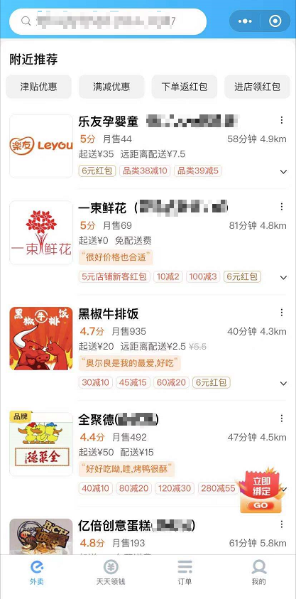
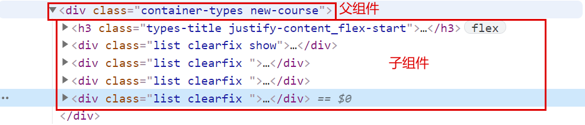
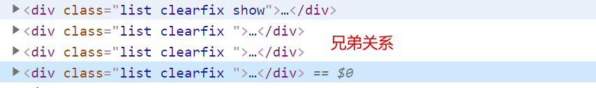
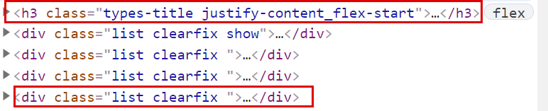

# 小程序进阶概念

## 开篇

在上一大章中我们讲解了 **小程序的核心概念**，那么这一章节我们来讲解 **小程序的进阶概念。**

在本章节中我们将会通过一个 **案例** 来贯穿整个进阶内容的知识。

## 什么是组件化思想

**对于组件化思想，如果你没有实际的开发经验得话，那么可能很难立刻理解它。**

**不过没有关系！**

**随着你对课程的逐渐深入学习，我们会一直为大家灌输组件化思想的概念！**

----

想要明白什么是组件，那么就必须要先搞清楚，组件解决了什么样的问题！ **所有的技术都是因为解决了一个或多个问题，才有存在的价值！**

### 场景




以上的 两 张截图是【饿了么小程序】中的数据截图，两个截图来自两个不同的页面。

但是我们可以发现：虽然他们来自于不同页面，但是其中店铺的 `item` 项的结构非常类似。

那么我们现在假象一种场景：

> 现在你在【饿了么】工作，现在你领导让你去完成这两个页面，那你怎么做？
>
> 你会创建两个页面，然后在一个页面中用 `wx:for` 指令，创建一堆 `item` 的 `dom结构` 然后再去渲染它们的 `wxss`。
>
> 然后在到另外一个页面里面，重复这一系列的操作吗？

如果你是这么做的话？那么我打赌你在【饿了么】待不了 3 天。原因就是因为：**你的代码太冗余了！**，换句话来说就是：**不可维护，不可扩展！**

对于代码来说，应该遵循 **所有重复的，都是可以封装的！** 

这里的封装放到当前场景下，指的就是 **组件化** 封装。

### 问题

### 内容

那么明确了，为什么要进行 **组件化** 封装之后，接下来我们来看什么是组件化。

我们可以把【整个项目】比喻成一个 **乐高积木：**


那么，【每个组件】都可以认为是【其中一块小的积木】，这些小的积木可以在当前的项目中使用，也可以直接拿走放到另外的项目中使用。

一个大的项目，由多个小的组件组成，每一个组件都封装了单独的【结构】、【样式】和【行为】。

这就是现在的组件化思想。

如果之前大家有过 `vue、react、angular` 的开发经验的化，那么应该很好理解 **组件化** 指的是什么意思。

如果大家之前只有过 `html + css + js` 的开发经验得话，那么可以把组件理解为：**包含了【结构】和【样式】的模块。**

最后不要忽略，本小节开头的话：

**对于组件化思想，如果你没有实际的开发经验得话，那么可能很难立刻理解它。**

**不过没有关系！**

**随着你对课程的逐渐深入学习，我们会一直为大家灌输组件化思想的概念！**

### 答案

## 创建第一个组件

### 场景

就像在【开篇】中说到的，**我们会开发一个【案例】，来贯穿整个第四章的内容。**

那么下面我们就来去实现这个案例：

> 对于这个案例，我们把它拆成两个部分：
>
> 1. 顶部的 tabs 
> 2. 底部的 list
>
> 两个部分，将分别通过两个组件来进行开发。

所以，我们接下来要做的第一件事情，就是【创建这两个组件，并在页面中使用它们】，而这个也就是本小节的主要内容

### 问题

> 1. 组件应该被放入到哪个文件夹中？
> 2. 如何在页面中使用【自定义组件】？

### 内容

1. 创建组件
   1. 创建 `components` 文件夹
   2. 创建 `tabs` 和 `list` 文件夹
   3. 右键 **新建 `Component`**
2. 使用组件
   1. 找到页面的 `.json` 文件
   2. 在 `usingComponents` 选项下 **注册组件**
      1. `key` 为当前组件在该页面中的标签名
      2. `value` 为组件的代码路径
   3. 在页面的 `wxml` 文件中，以 **注册的 `key`** 为标签名，使用组件

### 答案

> 1. 组件应该被放入到哪个文件夹中？
>    1. components
> 2. 如何在页面中使用【自定义组件】？
>    1. 在页面的 `.json` 文件中，通过 `usingComponents` 进行注册
>    2. 在 `wxml` 文件中，以注册的 `key`  为 **标签名** 进行使用

## 组件的生命周期

### 场景

接下来我们希望在 `tabs` 组件被渲染之后，获取 `tabs` 的数据，并且进行渲染。

参考下，上一大章中的 `列表案例` ，那么要完成这个功能，我们就必须要有一个 **前置条件：**

那就是：**明确组件的生命周期函数，明确在什么时候去获取接口数据** 

### 问题

> 1. 组件的 生命周期 和 方法 分别应该被放入到哪个节点下？
> 2. `created` 函数中可以调用 `setData` 吗？
> 3. 获取数据的操作应该在哪个函数中进行？

### 内容

**组件** 的生命周期应该被定义在 `lifetimes` 中，而方法必须要放入到 `methods` 中。

组件的生命周期一共有三个：

1. `created` ： 组件实例刚刚被创建好。**此时还不能调用 `setData`**
2. `attached`：组件完全初始化完毕、进入页面节点树后。**绝大多数初始化工作可以在这个时机进行**
3. `detached`：在组件离开页面节点树后

```js

    /**
     * 组件的初始数据
     */
    data: {
        // 数据源
        listData: [],
        // 选中项
        active: -1
    },
	/**
     * 生命周期函数
     */
    lifetimes: {
        attached() {
            this.loadTabsData()
        }
    },
    /**
     * 组件的方法列表（组件中的方法必须定义到 methods 中）
     */
    methods: {
        /**
         * 获取数据的方法
         */
        loadTabsData() {
            wx.request({
                url: 'https://api.imooc-blog.lgdsunday.club/api/hot/tabs',
                success: (res) => {
                    this.setData({
                        listData: res.data.data.list,
                        active: 0
                    })
                }
            })
        }
    }

```

```HTML
<scroll-view class="tabs-box" scroll-x>
    <view wx:for="{{ listData }}" wx:key="index" class="tab {{ active === index ? 'active' : '' }}">
        {{item.label}}
    </view>
</scroll-view>
```

```CSS
.tabs-box {
    /* 指定宽度 + 不换行 */
    width: 750rpx;
    white-space: nowrap;
    border-bottom: 1px solid #cccccc;
}

.tab {
    /* 指定 display */
    display: inline-block;
    padding: 12px 22px;
}

.active {
    color: #f94d2a;
}
```

### 答案

> 1. 组件的 生命周期 和 方法 分别应该被放入到哪个节点下？
>    1. 生命周期应该被定义在 `lifetimes` 中
>    2. 方法必须要放入到 `methods` 中
> 2. `created` 函数中可以调用 `setData` 吗？
>    1. 不可以
> 3. 获取数据的操作应该在哪个函数中进行？
>    1. `attached`

## 数据监听器

### 场景

通过 **接口文档** 我们可以看出，如果想要获取 `list` 那么我们需要传递一个 `type` 的参数，而这个 `type` 就是用户选中的 `tab 项` 的 `id`

所以接下来我们就需要来做一件事情：**监听用户选中的 `tab`，根据用户选中的 `tab` 来切换底部 `list` 的数据**

### 问题

> 1. 小程序中通过哪个选项来声明数据监听器
> 2. 数据监听器的使用场景是什么？

### 内容

目标：**监听用户选中的 `tab`，根据用户选中的 `tab` 来切换底部 `list` 的数据**

当我们面临一个复杂的需求时，我们需要把 **复杂的需求，拆解为几个可执行的步骤**

大家看到这里，可以先思考一下，我们如何拆解以上需求...

----

步骤拆解如下：

> 1. 监听用户选中项的变化
> 2. 获取用户选中的数据的 `id`
> 3. 把 `id` 传递给 `list` 组件
> 4. `list` 组件根据接收到的 `id` 获取对应的数据

```html
<view wx:for="{{ listData }}" wx:key="index" class="tab {{ active === index ? 'active' : '' }}" bindtap="onItemClick" data-index="{{index}}">
        {{item.label}}
    </view>
```

```js
        /**
         * 1. 监听用户选中项的变化
         * item 点击事件处理
         */
        onItemClick(e) {
            // 1.1：获取用户选中的 下标
            const {
                index
            } = e.target.dataset;
            // 1.2：修改选中项
            this.setData({
                active: index
            })
        }


	/**
     * 1.3：监听 active 的变化
     * 通过 observers 定义数据监听器
     */
    observers: {
        // key 为要监听的数据
        // value 为当数据发生变化时，调用的函数
        active: function (active) {
            // 2：获取用户选中的数据的 `id`
            const {id} = this.data.listData[active]
        }
    }
```

到目前，我们已经实现了需求的前两步，那么后面的两步怎么做呢？

请查看我们下一章：**组件之间的关系与通讯**

### 答案

> 1. 小程序中通过哪个选项来声明数据监听器
>    1. `observers`
> 2. 数据监听器的使用场景是什么？（需要同学自己思考）
>    1. 需要监听数据的变化
>    2. 在数据变化之后，进行一些操作的时候

## 组件之间的关系与通讯

### 场景

> 1. 监听用户选中项的变化
> 2. 获取用户选中的数据的 `id`
> 3. 把 `id` 传递给 `list` 组件
> 4. `list` 组件根据接收到的 `id` 获取对应的数据

在上一节中，我们实现了前面两步，但是接下来当我们想要把 `id` 传递给 `list` 组件的时候，却遇到了一些问题。我们不知道如何才能 **在一个组件中把数据传递给另外一个组件** ，那么这一小节我们就来去解决这个问题。

### 问题

> 1. 组件之间数据传递的关系可以分为哪几种？
> 2. 兄弟组件之间传递数据的方式是什么？

### 内容

**组件之间的关系：**

组件之间的关系和 `html` 标签之间的关系其实是相同的：

1. 父子关系
   
2. 兄弟关系
   

**不同关系之间的传递数据方式：**

1. 父子关系

   1. 父向子传参：

      ```js
      // 子组件：通过 properties 声明要从父组件中接收的数据
          /**
           * 组件的属性列表
           */
          properties: {
              tabId: String
          },
      
      // 父组件：通过自定义属性的形式传递数据，以子组件中定义的 key 为属性名，以要传递的数据为属性值
         <list tabId="{{tabSelectId}}">
      ```

   2. 子向父传参：

      ```js
      // 子组件：通过 triggerEvent 方法发送一个通知，通知父组件接收数据。
      // 方法的第一个参数为：通知名
      // 方法的第二个参数为：要传递的数据
      this.triggerEvent('change', {
          id
      })
      
      // 父组件：通过 bind 监听子组件中发送的通知
      // bind 后的内容为 子组件发送的通知名，表达式为接收到该通知时所触发的方法
      <tabs bind:change="onTabChange"></tabs>
      // 方法被触发后可以通过 e.detail 的形式获取子组件传递过来的数据对象
      onTabChange (e) {
          const {id} = e.detail;
          this.setData({
              tabSelectId: id
          })
      }
      ```

      

2. 兄弟关系

   1. 兄弟组件之间传参：**兄弟关系 === 没有关系**。 兄弟组件只是为了方便称呼的一个叫法而已。
      

      所以想要完成兄弟组件之间的传参，就需要：**为它们建立关系。**

      而建立关系说白了就是为了找到一个：**和这两个组件都认识的 ”中间人“ 。** 

      这个中间人一般为：**统一的父组件。**

      而最后：兄弟组件之间想要传递数据，就需要利用 ”中间人进行传递“，也就是：

      > 1. 【兄弟 A 组件】传递数据给 父组件（中间人）
      > 2. 父组件（中间人）再把数据传递给 【兄弟 B 组件】

      

### 答案

> 1. 组件之间数据传递的关系可以分为哪几种？
>    1. 父向子传递数据
>    2. 子向父传递数据
>    3. 兄弟组件之间传递数据
> 2. 兄弟组件之间传递数据的方式是什么？

## 组件的插槽

### 场景

整个案例还剩下最后一个功能：在列表的头部和尾部分别展示文本。

而这个功能我们有一个额外的要求：具体展示的文本和样式，我们需要在父组件中指定。

因为，组件可以进行复用，当 `list` 组件应用到 `index` 时，我们展示的文本和样式，并不一定为在其他页面时想要展示的文本和样式。所以这个文本和样式不可以在 `list` 中写死。

那么要实现这个功能就需要使用到 **插槽** 的知识了。

### 问题

> 1. 什么时候需要使用插槽？
> 2. 小程序中如何定义多个插槽？

### 内容

**1：定义：**

**1.1：定义单一插槽：**

在 **组件** 中使用 `slot` 组件定义插槽。

表示：占据了这一块空间，等待父组件填充。

**1.2：定义多个插槽：**

小程序默认只能定义一个插槽，如果要定义多个插槽那么需要：**在组件中指定 `options` 选项的 `multipleSlots` 选项为 `true`**

然后通过 `slot` 的 `name` 属性为插槽命名。例如：`<slot name="header"></slot>`

**2：使用：**

**2.1：使用单一插槽：**

在组件使用时，以 `innerHTML ` 的形式插入内容：

```html
<component>
    <view>单一插槽插入的 DOM</view>
</component>
```

**2.2：使用多个插槽：**

在组件使用时，以 `innerHTML ` 的形式插入内容，以 `slot` 属性标记当前 `DOM` 插入到哪个插槽中：

```html
<component>
    <view slot="header">该元素将被插入到 name=header 的插槽中</view>
    <view slot="footer">该元素将被插入到 name=footer 的插槽中</view>
</component>
```


### 答案

> 1. 什么时候需要使用插槽？
>    1. 由 父组件 来指定 子组件 中某一部分展示的内容和样式时
> 2. 小程序中如何定义多个插槽？
>    1. 指定 `options` 的 `multipleSlots` 为 `true`

## 本章小结

1. 组件化思想
2. 创建组件
3. 组件的生命周期
4. 数据监听器
5. 组件的关系
6. 组件的通讯
7. 组件的插槽