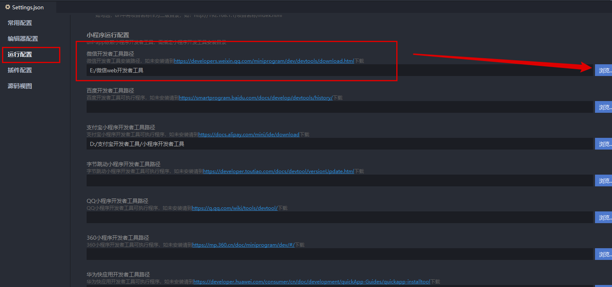

# uniapp开发ImoocBlog

## 5-1：开篇

经过前面四个章节，我们已经完成了 **微信小程序** 的学习。那么从这一章开始我们就进入 `uniapp` 的项目开发之中。

整个 `uniapp` 阶段我们会完成一个正式的项目  **慕课热搜**   ，  以这个项目来作为 `uniapp`  学习阶段的的最终产出，同时通过这个项目来贯穿所有的 `uniapp` 知识点，可以让大家在学习的过程中不至于那么枯燥。

目前我们的项目已经上线了：

1. 微信小程序：微信 -> 发现 -> 小程序 -> 搜索《慕课热搜》
2. `H5` ：`https://imooc.blog.lgdsunday.club/#/`

两个版本，因为在【第一章】中已经为大家演示了项目，所以这里就不再重复演示了。

那么现在：

- html、css、js、微信小程序，等基础知识
- 接口文档、最终效果、等各种项目需求

各种前置条件已经全部准备就绪，项目开发即可开始！

## 5-2：uniapp 难吗？

### 引言

《慕课热搜》基于 `uniapp` 进行开发，关于 `uniapp` 的优点，我们在【课程导学】阶段已经为大家描述过了，忘了的同学可以回过头去看一下。这就不再重复去夸它了。

我们这一小节来点实在的，光知道它好，不行。因为不是你的没啥用对吧。

那么怎么才能学会它呢？它难学吗？这才是这一小节我们需要说明的内容。

### 内容

[点击这里直接进入 uniapp 官网](https://uniapp.dcloud.io/)

想要学习 `uniapp` 那么需要有三个前置条件：

1. `html + css + js`： 这个相信大家都没有问题
2. 微信小程序：这个我们已经在前面的章节非常详细的为大家讲解过了
3. `vue`：可能有很多同学一看这个，心就凉了一截。我不会 `vue` 咋办啊... 
   没有关系！
   我敢把这个列出来，肯定就已经为大家想到了这么一点。
   `vue` 的理念和 **微信小程序** 的理念有非常多相同的地方，在我们后面进行项目开发的过程中，遇到一些个别的语法时，我会为大家进行介绍的。

总之，对于大家来说，这三个条件，如果你全部具备，那自然是最好的。

如果你只具备前两个条件，也不要担心，甚至可以说是更加幸运。因为接下来你将会在学会 `uniapp` 的同时，也掌握 `vue` 的核心使用！

## **5-3：配置项目开发环境**

### 下载并安装开发工具

1. `uniapp` 同样提供了一个专门的开发工具 `HBuilder X` ，可以点击 [这里直接进入下载页面]()
2. 点击 `DOWNLOAD` 
3. 选择 `App 开发版本`
   
4. `windows` 版本下载完成之后会得到一个 `zip` 的压缩包文件，解压完成即可使用
5. `macos` 版本下来完成会得到一个 `dmg` 的安装包，直接安装即可

### 安装 `sass` 依赖

因为我们的项目开发会使用 `sass`，所以需要为 `HBuilder X` 安装 `sass 编译器`。

1. 打开 `HBuilder X`
2. 打开插件地址：https://ext.dcloud.net.cn/plugin?id=2046
3. 点击【使用 `HBuilderX` 导入插件】
   
4. 在弹出框中点击【打开 `HBuilderX`】
   
5. 点击【是】
   
6. 此时会在 `HBuilderX` 右下角，提示你【正在下载】
   
7. 等待完成即可
   

## 5-4：创建 imooc-blog

### 创建 uni-app 项目

1. 创建项目
   
2. 

### 项目目录介绍

```js
├─pages			    // 页面存放文件夹，等同于 微信小程序中的 pages
│  └─index			// 默认生成的页面
├─static			// 静态资源存放文件夹
└─uni_modules		// uni-app组件目录
│  └─uni-xxx		// uni-app 所提供的业务组件，等同于 微信小程序中的组件
├─App.vue			// 应用配置文件，用来配置全局样式、生命周期函数等，等同于 微信小程序中的app.js
└─main.js			// 项目入口文件
├─mainfest.json		 // 配置应用名称、appid、logo、版本等打包信息，
└─pages.json		// 配置页面路径、窗口样式、tabBar 等页面类信息，等同于 微信小程序中的app.json
└─uni.scss			// uni-app内置的常用样式变量
```


## 5-5：运行项目到 微信开发者工具

**`uniapp` 支持10个平台，我们已 微信小程序 和 `h5` 平台为例子，进行演示。**

### 运行到 微信小程序

1. 配置【微信开发工具】路径
   
2. 设置【微信开发工具路径】
   
3. **切记：** 一定要在 `HBuilder X` 中双击打开你项目中的某一个文件（比如：`App.vue`）
   
4. 运行到微信小程序
   
5. 底部会提示编译
   
6. 编译成功，微信小程序自动启动
   

### 运行到浏览器

1. **切记：** 一定要在 `HBuilder X` 中双击打开你项目中的某一个文件（比如：`App.vue`）
   
2. 无需配置，直接运行
   
3. 编译完成，浏览器自动打开，运行成功

## 5-6：使用 VSCode 开发 uniapp（当你想要使用 `VSCode` 来开发 `uniapp` 时，可以查看本小节）

虽说 `HBuilder X` 开发体验还算不错，但是有时候金窝银窝不如自己的狗窝，当我们习惯了 `VSCode` 之后，有时候不太愿意换开发工具。

那么怎么使用 `VSCode` 来开发 `uniapp` 呢？ 其实是有办法的。

1. 使用 `HBuilder X` 运行项目（运行方式，参考上一小节）
2. 使用 `VSCode` 打开项目
3. 在 `VSCode` 中安装插件：
   1. [uni-helper](https://marketplace.visualstudio.com/items?itemName=ModyQyW.vscode-uni-helper) - 让开发者在 VSCode 中开发 uni-* 的体验尽可能好。
   2. [uni-app-snippets](https://marketplace.visualstudio.com/items?itemName=ModyQyW.vscode-uni-app-snippets) - 支持 uni-app 基本能力的代码片段，包括组件和 API
   3. [uni-app-schemas](https://marketplace.visualstudio.com/items?itemName=ModyQyW.vscode-uni-app-schemas) - 支持 uni-app `pages.json` 和 `manifest.json` 简单的格式校验
   4. [uni-ui-snippets](https://marketplace.visualstudio.com/items?itemName=ModyQyW.vscode-uni-ui-snippets) - 支持 uni-ui 组件代码片段
4. 在 `VSCode` 中修改代码，运行结果自动发生变化

## 5-7：创建与配置 tabbar 

### 创建页面

1. 删除 `pages` 下的 `index` 文件夹
2. 在 `pages` 文件夹处，右键 -> 选择新建页面
3. 确认新建页面的信息
   
4. 点击创建按钮完成新建。
5. 循环以上顺序，依次完成 `hot`、`hot-video`、`my` 三个页面的创建

### 配置 `pages.json`

1. 删除 `index` 路径

2. 新建 `tabbar` 节点

3. 复制 **资源** 文件夹下 `tab-icons` 文件夹到 `static` 文件夹中

4. 最终代码如下：

   ```js
     "tabBar": {
       "selectedColor": "#f94d2a",
       "list": [
         {
           "pagePath": "pages/hot/hot",
           "text": "热榜",
           "iconPath": "static/tab-icons/hot.png",
           "selectedIconPath": "static/tab-icons/hot-active.png"
         },
         {
           "pagePath": "pages/hot-video/hot-video",
           "text": "热播",
           "iconPath": "static/tab-icons/hot-video.png",
           "selectedIconPath": "static/tab-icons/hot-video-active.png"
         },
         {
           "pagePath": "pages/my/my",
           "text": "我的",
           "iconPath": "static/tab-icons/my.png",
           "selectedIconPath": "static/tab-icons/my-active.png"
         }
       ]
     }
   ```

5. 如果修改完成之后，依然得到了以下错误，那么可以在 `HBuilder X` 中重新运行项目到微信开发者工具解决
   

## 5-8：警告与错误处理

### 解决 【sitemap索引情况提示】的警告问题


微信小程序默认开启了索引功能，但是因为我们没有配置索引策略，导致出现了这么一个警告的问题。具体情况可以参考：https://developers.weixin.qq.com/miniprogram/dev/framework/sitemap.html

而如果想要解决这个警告也非常简单，因为一般情况项目不需要被微信索引，所以我们只需要 **关闭** 默认索引功能即可！

1. 双击打开 `manifest.json`
2. 点击源码试图
   
3. 下翻找到 `mp-weixin` 配置节点
4. 在 `settings` 下新增 `"checkSiteMap" : false`

### 解决 ` Cannot read property 'forceUpdate' of undefined` 的错误

这个错误的原因非常简单，是因为我们没有为项目配置 `appID` 的原因，所以只需要完成 `APPID` 配置即可。

1. 双击打开 `manifest.json`
2. 找到【微信小程序配置】
3. 在此处添加 `APPID` 即可
   

## 5-9：热搜页面分析


## 5-10：认识 .vue 文件结构与 logo 图片展示

### .vue 文件结构

1. `template`：定义当前页面的结构。相当于 `wxml` 
2. `script`：定义当前页面的逻辑。相当于 `js`
3. `style`：定义当前页面的样式。相当于 `wxss`
   1. 为 `style` 标签增加 `scoped` 属性：表示当前样式只在当前页面生效

### logo 图片展示

```html
<template>
  <view class="hot-container">
    <!-- logo -->
    <image class="logo" mode="aspectFit" src="@/static/images/logo.png" />
  </view>
</template>
```

 

```scss
<style lang="scss" scoped>
.hot-container {
  background-color: $uni-bg-color;
  .logo {
    width: 100%;
    height: 80px;
  }
}
</style>
```

## 5-11：创建搜索框组件

1. 创建 `components` 文件夹

2. 右键新建组件
   

3. 明确当前 `my-search` 组件的能力（暂时不需要考虑太多之后的能力）

   1. 具备输入框的样式
   2. 不可进行输入
   3. `placeholder` 内容可以在父组件定义

4. 代码实现
   **`my-search.vue`**

   ```vue
   <template>
     <view class="my-search-container">
       <!-- 搜索按钮 -->
       <view class="my-search-box">
         <image class="icon" src="@/static/images/search.png" />
         <text
           class="placeholder"
           :style="{
             color: config.textColor
           }"
           >{{ placeholderText }}</text
         >
       </view>
     </view>
   </template>
   
   <script>
   export default {
     name: 'my-search',
     props: {
       placeholderText: {
         type: String,
         default: '搜索'
       }
     },
     data() {
       return {};
     }
   };
   </script>
   
   <style lang="scss">
   .my-search-container {
     display: flex;
     align-items: center;
     .my-search-box {
       height: 36px;
       background-color: #ffffff;
       border-radius: 15px;
       border: 1px solid #c9c9c9;
       width: 100%;
       display: flex;
       align-items: center;
       padding: 0 $uni-spacing-row-base;
   
       .icon {
         width: $uni-img-size-sm;
         height: $uni-img-size-sm;
       }
   
       .placeholder {
         font-size: $uni-font-size-sm;
         margin-left: $uni-spacing-row-sm;
         color: #454545;
       }
     }
   }
   </style>
   
   ```

   **`hot.vue`**

   ```vue
   <view class="search-box">
       <!-- 搜索模块 -->
       <my-search placeholderText="uni-app 自定义组件" />
   </view>
   
   <style lang="scss" scoped>    
   .hot-container {	
     ...
     .search-box {
       padding: 0 16px;
       margin-bottom: $uni-spacing-col-base;
     }
   }
   </style>
   ```


## 5-12：tabs组件 - 创建并分析 `my-tabs` 组件

1. 创建 `my-tabs` 组件

2. 分析 `my-tabs` 组件的能力 -> 希望创建一个通用的 `my-tabs` 组件，可以满足各个应用中的需求

   1. 可在父组件中定制 `my-tabs` 样式

   2. 可在父组件中设置展示数据

   3. 可在父组件中设置默认的激活项

   4. 由此分析，定义处以下代码：

      ```vue
      <script>
      export default {
        name: 'my-tabs',
        props: {
          // 父组件传入的 tabs 数据
          tabData: {
            type: Array,
            default: () => []
          },
          // 默认激活项
          defaultIndex: {
            type: Number,
            default: 0
          },
          // 配置对象
          config: {
            type: Object,
            default: () => {
              return {};
            }
          }
        }
      };
      </script>
      ```

## 5-13：tabs组件 - 封装网络请求

1. 创建 `utils` 文件夹

2. 创建 `request.js` ，封装请求对象

   ```js
   const BASE_URL = 'https://api.imooc-blog.lgdsunday.club/api';
   function request({ url, data, method }) {
     return new Promise((resolve, reject) => {
       uni.request({
         url: BASE_URL + url,
         data,
         method,
         success: ({ data }) => {
           if (data.success) {
             resolve(data);
           } else {
             uni.showToast({
               title: data.message,
               icon: 'none',
               mask: true,
               duration: 3000
             });
             reject(data.message);
           }
         },
         fail: (error) => {
           reject(error);
         }
       });
     });
   }
   
   export default request;
   
   ```

3. 创建 `api` 文件夹

4. 创建 `hot` 文件，封装 `hot` 相关的请求方法

   ```js
   import request from '../utils/request';
   
   export function getHotTabs() {
     return request({
       url: '/hot/tabs'
     });
   }
   
   ```

   

## 5-14：tabs组件 - 进行基本的数据展示

1. 在 `hot` 中使用

   ```vue
   <template>
     <view class="hot-container">
     	... 
       <!-- tabs -->
       <my-tabs :tabData="tabData" :defaultIndex="currentIndex"></my-tabs>
     </view>
   </template>
   
   <script>
   import { getHotTabs } from 'api/hot';
   export default {
     data() {
       return {
         // tabs 数据源
         tabData: [],
         // 当前的切换 index
         currentIndex: 0
       };
     },
     // 在实例创建完成后被立即调用
     created() {
       this.getHotTabs();
     },
     // 定义方法
     methods: {
       /**
        * 获取热搜标题数据
        */
       async getHotTabs() {
         // uniapp 支持 async await
         const { data: res } = await getHotTabs();
         this.tabData = res.list;
       }
     }
   };
   </script>
   ```

   

2. 在 `tabs` 中展示

   ```vue
   <template>
     <view class="tab-container">
       <view class="tab-box">
         <scroll-view id="_scroll" scroll-x class="scroll-view" scroll-with-animation>
           <view class="scroll-content">
             <view class="tab-item-box">
               <block v-for="(item, index) in tabData" :key="index">
                 <view class="tab-item">{{ item.label || item }}</view>
               </block>
             </view>
           </view>
         </scroll-view>
       </view>
     </view>
   </template>
   ```

   

## 5-15：tabs组件 - 美化样式

**`my-tabs`**

```scss
<style lang="scss" scoped>
.tab-container {
  font-size: $uni-font-size-base;
  height: 45px;
  line-height: 45px;
  background-color: $uni-bg-color;
  .tab-box {
    width: 100%;
    height: 45px;
    display: flex;
    position: relative;
    .scroll-view {
      white-space: nowrap;
      width: 100%;
      height: 100%;
      box-sizing: border-box;
      .scroll-content {
        width: 100%;
        height: 100%;
        position: relative;

        .tab-item-box {
          height: 100%;
          .tab-item {
            height: 100%;
            display: inline-block;
            text-align: center;
            padding: 0 15px;
            position: relative;
            text-align: center;
            color: $uni-text-color;
          }
        }
      }
    }
  }
}
</style>
```

## 5-16：tabs组件 - 设置激活项

1. 因为根据 **子组件不可以直接修改父组件传递过来的数据** 特性，所以可以通过定义一个 `data-> activeIndex` 来跟随 `defaultIndex` 的变化

   ```js
   <script>
   export default {  
       data: () => {
           return {
             // 当前激活项的 index
             activeIndex: -1
           };
         },
           // 侦听器
         watch: {
           // 监听激活项目的变化
           defaultIndex: {
             handler(val) {
               this.activeIndex = val;
             },
             // 该回调将会在侦听开始之后被立即调用
             immediate: true
           }
         },
   	}
   </script>
   ```

2. 找到 `tab-item` 的 `view` ，判断 `active` 的状态。并添加点击事件，修改 `activeIndex` 的值

   ```html
   <view
         class="tab-item"
         :class="{ 'tab-item-active': activeIndex === index }"
         @click="tabClick(index)"
         >{{ item.label || item }}</view
       >
   ```

   ```js
     methods: {
       /**
        * tab 的点击事件处理
        */
       tabClick(index) {
         this.activeIndex = index;
         // 发送通知
         this.$emit('tabClick', index);
       }
     }
   ```

   ```css
   &-active {
       color: $uni-text-color-hot;
       font-weight: bold;
   }
   
   $uni-text-color-hot: #f94d2a; // 热点颜色
   ```


## 5-17：tabs组件 - 定义滑块

```html
<!-- 滑块 -->
<view
      class="underLine"
      :style="{
              transform: 'translateX(' + slider.left + 'px)'
              }"
      />
```

```js
data: () => {
    return {
      // 滑块
      slider: {
        // 距离左侧的距离
        left: 0
      }
    };
  },
```

```css
.underLine {
    height: 2px;
    width: 25px;
    background-color: #f01414;
    border-radius: 3px;
    transition: 0.5s;
    position: absolute;
    bottom: 0;
}
```

## 5-18：tabs组件 - 实现滑块的滚动 - 01

### 实现滑块滚动的功能

1. 确定滚动的时机
2. 计算滚动的距离

**确定滚动的时机**

1.  监听激活项目的变化
2. tab 的点击事件处理

**确定滚动时机后，执行滚动的方法**

```js
/**
     * 根据当前的 activeIndex 下标，计算 【滑块】 滚动位置
     */
tabToIndex() {
    // 获取当前的 activeIndex
    const activeIndex = this.activeIndex;
    // 滑块的宽度
    const underLineWidth = this.defaultConfig.underLineWidth;
    // 配置 滚动条 的数据
    this.slider = {
        // TODO：left 如何定义呢？
        left: 0
    };
    console.log('TODO：left 如何定义呢？');
}    

data: () => {
    return {
      // 默认配置
      defaultConfig: {
        // 下划线宽度 px
        underLineWidth: 24,
        // 下划线高度 px
        underLineHeight: 2,
        // 下划线颜色
        underLineColor: '#f94d2a'
      }
    };
```

## 5-19：tabs组件 - 实现滑块的滚动 - 02

### 实现滑块滚动的功能

1. 确定滚动的时机
2. 计算滚动的距离
   1. 维护一个单独的数据对象 `tabList`
   2. 在 `tabList`  的 `item` 中为一个 `_slider` 属性
   3. 该属性保存了 【当前 `item` 下 的滑块位置】
      1. 计算公式：`滑块左侧位置 = item.left + (item.width - slider.width) / 2`

```js
data: () => {
    return {
      // 内部维护的数据对象，为每个 item 单独额外维护一个 slider 的滑块对象
      tabList: []
    };
  },
      
 // 侦听器
  watch: {
    // 侦听数据的变化
    tabData: {
      handler(val) {
        this.tabList = val;
        setTimeout(() => {
          this.updateTabWidth();
        }, 0);
      },
      // 该回调将会在侦听开始之后被立即调用
      immediate: true
    },
  },
      
      /**
     * 更新 tab item 的宽度
     */
      updateTabWidth() {
          /**
       * 为 tabList 的每个 item 单独额外维护一个 slider 的滑块对象
       */
          let data = this.tabList;
          if (data.length == 0) return false;

          // 获取 dom 的固定写法
          const query = uni.createSelectorQuery().in(this);
          // 循环数据源
          data.forEach((item, index) => {
              // 获取 dom 的固定写法
              query
                  .select('#_tab_' + index)
                  .boundingClientRect((res) => {
                  // 为数据对象中每一个 item 都维护一个 _slider（滑动条） 对象
                  item._slider = {
                      // 当前的 tab 距离左侧的距离
                      left: res.left + (res.width - this.defaultConfig.underLineWidth) / 2
                  };
                  // 运算完成之后，执行一次 【滑块】位置运算
                  if (data.length - 1 === index) {
                      this.tabToIndex();
                  }
              })
                  .exec();
          });
      },
    /**
     * 根据当前的 activeIndex 下标，计算 【滑块】 滚动位置
     */
    tabToIndex() {
      if (this.tabList.length === 0) return;
      // 获取当前的 activeIndex
      const activeIndex = this.activeIndex;
      // 滑块的宽度
      const underLineWidth = this.defaultConfig.underLineWidth;
      // 配置 滚动条 的数据
      this.slider = {
        // TODO：left 如何定义呢？
        // 1. 维护一个单独的数据对象 `tabList`
        // 2. 在 `tabList`  的 `item` 中为一个 `_slider` 属性
        // 3. 该属性保存了 【当前 `item` 下 的滑块位置】
        //    3.1. 计算公式：`滑块左侧位置 = item.left + (item.width - slider.width) / 2`
        left: this.tabList[activeIndex]._slider.left
      };
    }
  
```


## 5-20：tabs组件 - scrollView 的点击位移

当 【选中项】发生变化时，希望 `scrollView` 也进行对应的位移。

```vue
  <scroll-view
        :scroll-left="scrollLeft"
      ></scroll-view>

// scrollView 的横向滚动条位置
scrollLeft: 0,
```

简单的算法：

```js
this.scrollLeft = this.activeIndex * this.defaultConfig.underLineWidth;
```

## 5-21：tabs组件 - 增加可配置项

```html
<view
      class="tab-item"
      :id="'_tab_' + index"
      :class="{ 'tab-item-active': activeIndex === index }"
      @click="tabClick(index)"
      :style="{
              color:
              activeIndex === index ? defaultConfig.activeTextColor : defaultConfig.textColor
              }"
      >{{ item.label || item }}</view>
```

```js
  props: {
    // 配置对象
    config: {
      type: Object,
      default: () => {
        return {};
      }
    }
  },
  data: () => {
    return {
      // 默认配置
      defaultConfig: {
        // 默认的字体颜色
        textColor: '#333333',
        // 高亮字体颜色
        activeTextColor: '#f94d2a',
        // 下划线宽度 px
        underLineWidth: 24,
        // 下划线高度 px
        underLineHeight: 2,
        // 下划线颜色
        underLineColor: '#f94d2a'
      }
    };
  },
  // 侦听器
  watch: {
    // 监听 config
    config: {
      handler(val) {
        this.defaultConfig = { ...this.defaultConfig, ...val };
      },
      // 该回调将会在侦听开始之后被立即调用
      immediate: true
    }
  },
```

## 5-22：List 组件 - 分析 List 组件

1. 使用 mock 数据，构建 List 的基本结构
2. 美化 item 样式
3. 根据 tab 的切换，获取真实数据
4. 渲染真实数据
5. 通过 swiper 改造List
6. 完成 swiper 和 tabs 的联动效果

## 5-23： List 组件 - 使用 mock 数据，构建 List 的基本结构

**hot.vue**

```html
<template>
 	...
    <!-- list -->
    <view>
      <hot-list-item v-for="(item, index) in 50" :key="index"></hot-list-item>
    </view>
  </view>
</template>
```

**hot-list-item.vue**

```vue
<template>
  <view class="item-container">
    <view class="item-box">
      <view class="item-box-left">
        <hot-ranking />
      </view>
      <view class="item-box-right">
        <!-- 标题 -->
        <view class="item-title line-clamp-2">标题</view>
        <!-- 简介 -->
        <view class="item-desc line-clamp-2">简介</view>
        <view class="item-bottom-box">
          <!-- 作者 -->
          <text class="item-author">作者</text>
          <!-- 热度 -->
          <view class="hot-box">
            <image class="hot-icon" src="@/static/images/hot-icon.png" />
            <text class="hot-text">1000 热度</text>
          </view>
        </view>
      </view>
    </view>
  </view>
</template>

<script>
export default {
  name: 'hot-list-item',
  data() {
    return {};
  }
};
</script>

<style lang="scss" scoped></style>

```

**hot-ranking.vue**

```vue
<template>
  <view class="ranking">
    <image class="ranking-bg" :src="getRankingBg" />
    <text class="ranking-text">1</text>
  </view>
</template>

<script>
export default {
  name: 'hot-ranking'
};
</script>

<style lang="scss" scoped></style>

```

## 5-24： List 组件 - 美化 item 样式

**hot-list-item.vue**

```css
<style lang="scss" scoped>
.item-container {
  padding-bottom: $uni-spacing-col-lg;
  .item-box {
    display: flex;
    margin: 0 $uni-spacing-col-base;
    padding: $uni-spacing-row-lg $uni-spacing-col-base;
    background-color: $uni-bg-color;
    border-radius: $uni-border-radius-lg;
    box-shadow: 2px 2px 5px 1px rgba(143, 143, 143, 0.1);
    .item-box-left {
      margin-right: $uni-spacing-row-sm;
    }
    .item-box-right {
      width: 100%;
      .item-title {
        font-size: $uni-font-size-lg;
        font-weight: bold;
        color: $uni-text-color-title;
      }
      .item-desc {
        padding-top: $uni-spacing-row-sm;
        font-size: $uni-font-size-base;
        color: $uni-text-color;
      }
      .item-bottom-box {
        margin-top: $uni-spacing-col-sm;
        display: flex;
        justify-content: space-between;
        align-items: center;
        .item-author {
          font-size: $uni-font-size-sm;
          color: $uni-text-color-grey;
        }
        .hot-box {
          .hot-icon {
            width: $uni-img-size-sm;
            height: $uni-img-size-sm;
            vertical-align: top;
          }
          .hot-text {
            margin-left: $uni-spacing-row-sm;
            font-size: $uni-font-size-sm;
            color: $uni-text-color-hot;
          }
        }
      }
    }
  }
}
</style>

```

**hot-ranking.vue**

```vue
<style lang="scss" scoped>
.ranking {
  position: relative;
  text-align: center;
  width: 18px;
  height: 20px;
  .ranking-bg {
    width: 100%;
    height: 100%;
  }
  .ranking-text {
    position: absolute;
    left: 50%;
    top: 50%;
    transform: translate(-55%, -55%);
    font-size: $uni-font-size-sm;
    font-weight: bold;
    color: $uni-text-color;
  }
  .text-white {
    color: white;
  }
}
</style>

```

## 5-25： List 组件 - 根据 tab 的切换，获取真实数据


**hot.js**

```js
/**
 * 热搜文章列表
 */
export function getHotListFromTabType(type) {
  return request({
    url: '/hot/list',
    data: {
      type
    }
  });
}
```

**hot.vue**

```vue
<template>
    <!-- tabs -->
    <my-tabs
      ...
      @tabClick="tabClick"
    ></my-tabs>
	<!-- list -->
    <view>
      <!-- 加载动画 -->
      <uni-load-more status="loading" v-if="isLoading"></uni-load-more>
      <!-- 列表 -->
      <block v-else>
        <hot-list-item v-for="(item, index) in 50" :key="index"></hot-list-item>
      </block>
    </view>
  </view>
</template>

<script>
import { getHotTabs, getHotListFromTabType } from 'api/hot';
export default {
  data() {
    return {
      ...
      // list 列表数据加载过程
      isLoading: true,
      // 以 index 为 key，对应的 list 为 val
      listData: {}
    };
  },
  // 定义方法
  methods: {
    /**
     * 获取热搜标题数据
     */
    async getHotTabs() {
      ...
      // 获取列表数据
      this.getHotListFromTab();
    },
    /**
     * list 列表数据
     */
    async getHotListFromTab() {
      // 展示 loading
      this.isLoading = true;
      // 判断缓存是否有数据，不存在则重新获取数据
      if (!this.listData[this.currentIndex]) {
        // 获取列表数据
        const id = this.tabData[this.currentIndex].id;
        const { data: res } = await getHotListFromTabType(id);
        // 放入数据缓存
        this.listData[this.currentIndex] = res.list;
      }

      // 隐藏 loading
      this.isLoading = false;
    },
    /**
     * tab item 的点击事件
     */
    tabClick(index) {
      this.currentIndex = index;
      // 获取列表数据
      this.getHotListFromTab();
    }
  }
};
</script>

```

## 5-26：List 组件 - 渲染真实数据

**hot.vue**

```html
<hot-list-item
    v-for="(item, index) in listData[currentIndex]"
    :key="index"
    :data="item"
    :ranking="index + 1"
></hot-list-item>
```

**hot-list-item.vue**

```vue
<template>
  <view class="item-container" @click="$emit('click')">
    <view class="item-box">
      <view class="item-box-left">
        <hot-ranking :ranking="ranking" />
      </view>
      <view class="item-box-right">
        <!-- 标题 -->
        <view class="item-title line-clamp-2">{{ data.title }}</view>
        <!-- 简介 -->
        <view class="item-desc line-clamp-2">{{ data.desc }}</view>
        <view class="item-bottom-box">
          <!-- 作者 -->
          <text class="item-author">{{ data.nickname }}</text>
          <!-- 热度 -->
          <view class="hot-box">
            <image class="hot-icon" src="@/static/images/hot-icon.png" />
            <text class="hot-text">{{ data.views }} 热度</text>
          </view>
        </view>
      </view>
    </view>
  </view>
</template>

<script>
export default {
  name: 'hot-list-item',
  props: {
    data: {
      type: Object,
      required: true
    },
    ranking: {
      type: Number,
      required: true
    }
  },
  data() {
    return {};
  }
};
</script>
```

**hot-ranking.vue**

```vue
<template>
  <view class="ranking">
    <image class="ranking-bg" :src="getRankingBg" />
    <text class="ranking-text" :class="{ 'text-white': ranking <= 3 }">{{ ranking }}</text>
  </view>
</template>

<script>
export default {
  name: 'hot-ranking',
  props: {
    ranking: {
      type: Number,
      required: true
    }
  },
  /**
   * 当依赖值发生变化时，会重新计算
   */
  computed: {
    getRankingBg() {
      if (this.ranking <= 3) {
        return require(`@/static/images/ranking-${this.ranking}.png`);
      }
      return require('@/static/images/ranking-other.png');
    }
  }
};
</script>
```

**style/global.scss**

```scss
/**
 * 这里是共用样式的定义位置
 */

.line-clamp-2 {
  overflow: hidden;
  text-overflow: ellipsis;
  display: -webkit-box;
  -webkit-box-orient: vertical;
  -webkit-line-clamp: 2;
}
```


**main.js**

```js
// 通用样式
import './styles/global.scss';
```


## 5-27：List 组件 - 通过 swiper 改造List

想要让 `list` 具备【横向翻页】的效果，那么可以使用 `swiper` 对其进行改造！

```js
 <!-- 基于 swiper 的 list 列表 -->
    <swiper class="swiper" :current="currentIndex">
      <swiper-item class="swiper-item" v-for="(tabItem, tabIndex) in tabData" :key="tabIndex">
        <view>
          <!-- 加载动画 -->
          <uni-load-more status="loading" v-if="isLoading"></uni-load-more>
          <!-- 列表 -->
          <block v-else>
            <!-- 列表循环数据更改为 listData[tabIndex] -->
            <hot-list-item
              v-for="(item, index) in listData[tabIndex]"
              :key="index"
              :data="item"
              :ranking="index + 1"
            ></hot-list-item>
          </block>
        </view>
      </swiper-item>
    </swiper>
```

**当前的问题：**

1. 列表高度展示错误
2. 切换 `tab` 时的 `list` 的卡顿问题


## 5-28：List 组件 - 解决列表高度展示错误的问题

**原因：**

没有给 `swiper` 指定高度。

**解决方案：**

指定高度即可。

```vue
<template>
  <view class="hot-container">
    <!-- 基于 swiper 的 list 列表 -->
    <swiper class="swiper" :current="currentIndex" :style="{ height: currentSwiperHeight + 'px' }">
     ...
            <hot-list-item
              :class="'hot-list-item-' + tabIndex"
              v-for="(item, index) in listData[tabIndex]"
              :key="index"
              :data="item"
              :ranking="index + 1"
            ></hot-list-item>
         ...
    </swiper>
  </view>
</template>

<script>
export default {
  data() {
    return {
      // 当前 swiper 的高度
      currentSwiperHeight: 0,
      // 以 index 为 key，对应的 swiper 的高度 为 val
      swiperHeightData: {}
    };
  },
  // 定义方法
  methods: {
    /**
     * list 列表数据
     */
    async getHotListFromTab() {
      ...
      // 因为 this.$nextTick 存在一定的兼容性问题，所以更加推荐使用 setTimeout
      setTimeout(async () => {
        // 获取当前 swiper 的高度
        this.currentSwiperHeight = await this.getCurrentSwiperHeight();
        // 放入缓存
        this.swiperHeightData[this.currentIndex] = this.currentSwiperHeight;
      }, 0);
    },
    /**
     * 计算当前 swiper 的高度
     */
    getCurrentSwiperHeight() {
      return new Promise((resolve, reject) => {
        let sum = 0;
        const query = uni.createSelectorQuery().in(this);
        query
          .selectAll(`.hot-list-item-${this.currentIndex}`)
          .boundingClientRect((res) => {
            res.forEach((item) => {
              sum += item.height;
            });
            resolve(sum);
          })
          .exec();
      });
    }
  }
};
</script>

```

## 5-29：List 组件 - 解决 切换 `tab` 时的 `list` 的卡顿问题

**原因：**

动画未执行完成，`DOM` 未渲染完成，即获取数据，执行了新的渲染逻辑。

**解决方案：**

等待 动画执行完成， `DOM` 渲染完成。之后再获取数据，渲染列表。

```vue
<template>
 <swiper
      class="swiper"
      :current="currentIndex"
      :style="{ height: currentSwiperHeight + 'px' }"
      @animationfinish="onSwiperEnd"
    >
</template>

<script>
import { getHotTabs, getHotListFromTabType } from 'api/hot';
export default {
  // 定义方法
  methods: 
    /**
     * list 列表数据
     */
    async getHotListFromTab() {
      // 在 onSwiperEnd 中进行判断。【判断缓存是否有数据，不存在则重新获取数据】
    },
    /**
     * tab item 的点击事件
     */
    tabClick(index) {
      this.currentIndex = index;
      // 获取列表数据
      // this.getHotListFromTab();
    },
    /**
     * 解决卡顿问题；等待 swiper 动画完成之后，获取数据
     */
    onSwiperEnd() {
      // 判断缓存是否有数据，不存在则重新获取数据
      if (!this.listData[this.currentIndex]) {
        this.getHotListFromTab();
        return;
      }
      // 未 return ，则证明存在缓存数据，即同时存在 height 的缓存数据
      this.currentSwiperHeight = this.swiperHeightData[this.currentIndex];
    }
};
</script>

```

**问题：** `swiper` 滚动时，`tabs` 无法产生联动

## 5-30：List 组件 - `swiper` 和 `tabs` 联动

**目前状态：**

`tabs` 切换时，`swiper` 可以联动。

`swiper` 切换时，`tabs` 无法联动。

**解决：**

让`swiper` 切换时，`tabs` 进行联动。

```vue
<template>
	<swiper
      class="swiper"
      :current="currentIndex"
      :style="{ height: currentSwiperHeight + 'px' }"
      @animationfinish="onSwiperEnd"
      @change="onSwiperChange"
    >
</template>
<script>
    export default {
    	methods: {
            // 监听 swiper 的切换事件
            onSwiperChange(e) {
              this.currentIndex = e.detail.current;
            },
        }
    }
</script>
```

## 5-31：List 组件 - tabs 中滑块跟随滚动

```js
watch: {
        // 监听激活项目的变化
    defaultIndex: {
      handler(val) {
        this.activeIndex = val;
        // 定义滑块的位置
        this.tabToIndex();
      },
      // 该回调将会在侦听开始之后被立即调用
      immediate: true
    },
    
}

tabToIndex() {
      if (this.tabList.length === 0) return;
}
```

**问题：** `tabs` 吸顶

## 5-32：完成 `tabs` 的吸顶效果

```vue
<template>
	<!-- tabs -->
    <view class="tab-sticky">
      <my-tabs
        :tabData="tabData"
        :defaultIndex="currentIndex"
        :config="{ textColor: '#333333' }"
        @tabClick="tabClick"
      ></my-tabs>
    </view>
</template>

<style lang="scss" scoped>
  .tab-sticky {
    position: -webkit-sticky;
    position: sticky;
    z-index: 99;
    top: 0;
  }
}
</style>

```

## 5-33：控制列表滚动位置

```js
// 当前的滚动距离
currentPageScrollTop: 0 

/**
   * 监听页面的滚动
   */
  onPageScroll(res) {
    this.currentPageScrollTop = res.scrollTop;
  },   

	// 监听 swiper 的切换事件
    onSwiperChange(e) {
      if (this.currentPageScrollTop > 130) {
        // 控制列表滚动位置
        uni.pageScrollTo({
          scrollTop: 130
        });
      }	
      this.currentIndex = e.detail.current;
    },
```

## 

## 5-34：List 组件 - 处理热度的显示

通过 `filters 过滤器` 进行处理：创建 `filters` 文件夹，创建 `index.js` 文件： 

**filters/index.js**

```js
/**
 * 将字符转化为以千为单位的字符
 * @param {*} val 待转换字符
 * @returns
 */
export function hotNumber(val) {
  const num = parseInt(val);
  if (num < 1000) return val;

  // 将 val 转为字符串
  val = val + '';
  // 获取以 千 为单位的值
  return val.substring(0, val.length - 3) + 'k';
}

```

**main.js**

```js
import * as filters from './filters';

// 注册过滤器
Object.keys(filters).forEach((key) => {
  Vue.filter(key, filters[key]);
});
```

**hot-list-item.vue**

```html
 <text class="hot-text">{{ data.views | hotNumber }} 热度</text>
```

## 


## 5-35：总结

1. 首页内容完成
   1. 对 `uniapp` 进行了基础的了解
   2. 创建 `imooc-blog` 的项目
   3. 完成了 `tabbar` 的搭建
   4. 了解了 `.vue` 的单文件组件
   5. 分析了首页的模块组成
   6. 封装了 `request` `API` 请求模块
   7. 复杂组件 `tabs`
   8. `tabs` 和 基于 `swiper` 的列表联动