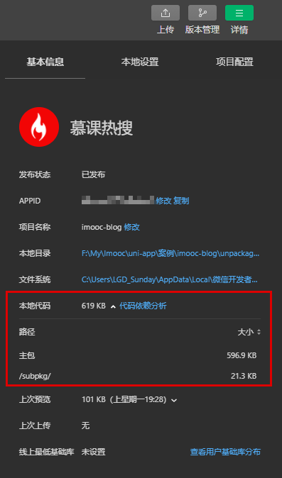

#  文章搜索页面

## 6-1：开篇

再上一章中，我们完成了 **热搜首页** 的开发，虽然经历了 ”千辛万苦“ ，但是对大家来说，应该也是收获满满。

那么在这一章节，我们将会进入新的篇章，来到 **文章搜索** 页面的开发。那么在 **文章搜索** 的页面开发中，我们又会经历哪些 **奇奇怪怪的 `bug` ，又将会获得哪些新的收获呢？** 

让我们一起期待吧！

## 6-2：文章搜索 - 分析文章搜索页面

1. 【慕课热搜】
   1. 展示 8 个热搜内容
2. 【搜索历史】
   1. 按照【从后向前】的顺序，展示搜索历史
   2. 点击【小垃圾筒】可删除历史记录
3. 【搜索结果】
   1. 不输入内容直接回车，按照当前的 `placeholder` 索引
   2. 输入内容，按照当前内容索引
   3. `item` 的展示分为三类
      1. 无图片展示
      2. 单个图片展示 
      3. 三个图片展示
   4. item 中关键字高亮
   5. 点击 【叉号】返回【搜索历史】
   6. 点击【取消】返回【慕课热搜】

## 6-3：文章搜索 - 使用分包，创建 `search-blog` 页面

### 分包

1. 什么是[分包](https://developers.weixin.qq.com/miniprogram/dev/framework/subpackages.html)

   [分包](https://developers.weixin.qq.com/miniprogram/dev/framework/subpackages.html)指：将小程序划分成不同的子包，在构建时打包成不同的分包，用户在使用时按需进行加载

   

2. 分包的好处

   - 可以优化小程序首次启动的下载时间
   - 在多团队共同开发时可以更好的解耦协作

**微信小程序** 提供了分包的能力，而 `uniapp` 也对其进行了支持。

### 实现分包

1. 打开 `pages.json`，新建 `subPackages` 节点

   ```js
   "subPackages": []
   ```

2. 节点中每个对象为一个分包，其中

   1.  `root`：分包包名
   2. `name`：分包别名
   3. `pages`：分包下的页面
      1. `path`：分包下的页面路径
      2. `style`：页面的样式

3. ```json
   "subPackages": [
       {
         "root": "subpkg",
         "name": "sub-1",
         "pages": [
           {
             "path": "pages/search-blog/search-blog",
             "style": {
               "navigationBarTitleText": "",
               "enablePullDownRefresh": false
             }
           }
         ]
       }
     ]
   ```

   **可在详情查看分包数据：**

   

## 6-4：文章搜索 - 完成跳转，渲染搜索框

### 页面跳转

```vue
<template>
  <view class="hot-container">
    <view class="search-box" @click="onToSearch">
      <!-- 搜索模块 -->
      <my-search placeholderText="uni-app 自定义组件" />
    </view>
  </view>
</template>

<script>
import { getHotTabs, getHotListFromTabType } from 'api/hot';
export default {
  // 定义方法
  methods: {
    ...
    /**
      搜索框点击事件
     */
    onToSearch() {
      uni.navigateTo({
        url: '/subpkg/pages/search-blog/search-blog'
      });
    }
  }
};
</script>

```

### 渲染搜索框

```vue
<template>
  <view class="search-blog-container">
    <!-- search模块 -->
    <view class="search-bar-box">
      <my-search />
    </view>
  </view>
</template>

<script>
export default {
  data() {
    return {};
  }
};
</script>

<style lang="scss" scoped>
.search-blog-container {
  .search-bar-box {
    background-color: $uni-bg-color;
    padding: $uni-spacing-row-sm;
    position: sticky;
    top: 0px;
    z-index: 9;
  }
}
</style>

```


## 6-5：文章搜索 - 为  `my-search` 组件赋予搜索的能力

**my-search**

```vue
<template>
  <view class="my-search-container">
    <!-- 搜索输入框 -->
    <uni-search-bar
      v-if="isShowInput"
      class="my-search-bar"
      :radius="100"
      @confirm="onSearch"
      @focus="onFocus"
      @blur="onBlur"
      @clear="onClear"
      @cancel="onCancel"
      @input="onInput"
      :bgColor="config.backgroundColor"
      :placeholder="placeholderText"
      :value="value"
    >
      <uni-icons slot="clearIcon" type="clear" color="#999999" />
    </uni-search-bar>
    <!-- 搜索按钮 -->
    <view class="my-search-box" v-else>
      ...
    </view>
  </view>
</template>

<script>
export default {
  name: 'my-search',
  props: {
    // placeholder
    placeholderText: {
      type: String,
      default: '搜索'
    },
    // 配置对象
    config: {
      type: Object,
      default: () => ({
        height: 36,
        backgroundColor: '#ffffff',
        icon: '/static/images/search.png',
        textColor: '#454545',
        border: '1px solid #c9c9c9'
      })
    },
    // 是否显示输入框
    isShowInput: {
      type: Boolean,
      default: false
    },
    // 输入的内容
    // value 名称不可修改，与 $emit('input') 事件对应
    value: {
      type: String
    }
  },
  data() {
    return {};
  },
  methods: {
    /**
     * 点击搜索按钮触发
     */
    onSearch() {
      this.$emit('search', this.value);
    },
    /**
     * 输入框获取焦点触发
     */
    onFocus() {
      this.$emit('focus', this.value);
    },
    /**
     * 输入框失去焦点触发
     */
    onBlur() {
      this.$emit('blur', this.value);
    },
    /**
     * 点击输入框中的清空按钮时
     */
    onClear() {
      this.$emit('clear', this.value);
    },
    /**
     * 点击取消按钮时
     */
    onCancel() {
      this.$emit('cancel', this.value);
    },
    /**
     *  value 改变时触发事件
     */
    onInput(val) {
      // input 的事件名称不可修改，与 props 中的 value 对应
      // 当同时存在：
      // props -> value
      // $emit('input', val)
      // 时，在组件外可以使用 v-model 完成双向数据绑定。
      // 即：用户输入内容时，父组件传递过来的 value 同步发生变化
      // 详细见 vue 中 v-model 指令：https://cn.vuejs.org/v2/guide/components-custom-events.html#%E8%87%AA%E5%AE%9A%E4%B9%89%E7%BB%84%E4%BB%B6%E7%9A%84-v-model
      this.$emit('input', val);
    }
  }
};
</script>

<style lang="scss" scoped>
.my-search-container {
  display: flex;
  align-items: center;
  .my-search-bar {
    width: 100%;
  }
  ...
}
</style>

```

**search-blog.vue**

```vue
<template>
  <view class="search-blog-container">
    <!-- search模块 -->
    <view class="search-bar-box">
      <my-search
        :placeholderText="defaultText"
        v-model="searchVal"
        :isShowInput="true"
        :config="{
          backgroundColor: '#f1f0f3'
        }"
        @search="onSearchConfirm"
        @focus="onSearchFocus"
        @blur="onSearchBlur"
        @clear="onSearchClear"
        @cancel="onSearchCancel"
      />
    </view>
  </view>
</template>

<script>
export default {
  data() {
    return {
      // 绑定输入框中的内容
      searchVal: '',
      // 默认的placeholderText
      defaultText: '默认的placeholderText'
    };
  },
  methods: {
    /**
     * 搜索内容
     */
    onSearchConfirm(val) {
      console.log('搜索内容：' + this.searchVal);
    },
    // searchbar 获取焦点
    onSearchFocus(val) {
      console.log('searchbar 获取焦点');
    },
    /**
     * searchbar 失去焦点
     */
    onSearchBlur(val) {
      console.log('searchbar 失去焦点');
    },
    /**
     * searchbar 清空内容
     */
    onSearchClear() {
      console.log('searchbar 清空内容');
    },
    /**
     * searchbar 取消按钮
     */
    onSearchCancel(val) {
      console.log('searchbar 取消按钮');
    }
  }
};
</script>

<style lang="scss" scoped>
.search-blog-container {
  .search-bar-box {
    background-color: $uni-bg-color;
    padding: $uni-spacing-row-sm;
  }
}
</style>

```

**因为 uni-search-bar 组件没有提供 文本居左的属性，所以想要让文本居左显示，需要修改 `uni-search-bar` 的源代码：**

```css
.uni-searchbar__box {
  // 处理初始 searchbar 位置
  justify-content: start;
}
```

## 6-6：文章搜索 - 显示推荐搜索

**api/search.js**

```js
import request from '../utils/request';

/**
 * 默认搜索内容
 */
export function getDefaultText() {
  return request({
    url: '/search/default-text'
  });
}

```

**search-blog.vue**

```js
  created() {
    this.loadDefaultText();
  },
  methods: {
    /**
     * 获取推荐搜索文本
     */
    async loadDefaultText() {
      const { data: res } = await getDefaultText();
      this.defaultText = res.defaultText;
    }
   }
```


## 6-7：文章搜索 - 创建三个业务组件

**search-blog.vue**

```html
    <!-- 热搜列表 -->
    <view class="search-hot-list-box">
      <!-- 列表 -->
      <search-hot-list />
    </view>
    <!-- 搜索历史 -->
    <view class="search-history-box">
      <search-history />
    </view>
    <!-- 搜索结果 -->
    <view class="search-result-box">
      <search-result-list />
    </view>
```


## 6-8：文章搜索 - 控制业务组件的展示效果

```vue
<template>
  <view class="search-blog-container">
    ...
    <!-- 热搜列表 -->
    <view class="search-hot-list-box" v-if="showType === HOT_LIST">
      <!-- 列表 -->
      <search-hot-list />
    </view>
    <!-- 搜索历史 -->
    <view class="search-history-box" v-else-if="showType === SEARCH_HISTORY">
      <search-history />
    </view>
    <!-- 搜索结果 -->
    <view class="search-result-box" v-else>
      <search-result-list />
    </view>
  </view>
</template>

<script>
import { getDefaultText } from 'api/search';
// 0: 热搜列表 - 默认
const HOT_LIST = '0';
// 1：搜索历史
const SEARCH_HISTORY = '1';
// 2：搜索结果
const SEARCH_RESULT = '2';
export default {
  data() {
    return {
      HOT_LIST,
      SEARCH_HISTORY,
      SEARCH_RESULT,
      // 默认情况下 || 点击输入框的取消按钮时，显示【热搜列表】
      // 当 searchBar 获取焦点时 || 点击输入框清空按钮时，显示 【搜索历史】
      // 用户点击热搜列表 item || 用户点击搜索历史 || 用户按下搜索键，显示 【搜索结果】
      showType: HOT_LIST,
    };
  },
  methods: {
    ...
    /**
     * 搜索内容
     */
    onSearchConfirm(val) {
      // 用户未输入文本，直接搜索时，使用【推荐搜索文本】
      this.searchVal = val ? val : this.defaultText;
      if (this.searchVal) {
        this.showType = SEARCH_RESULT;
      }
    },
    // searchbar 获取焦点
    onSearchFocus(val) {
      this.showType = SEARCH_HISTORY;
    },
    /**
     * searchbar 失去焦点
     */
    onSearchBlur(val) {},
    /**
     * searchbar 清空内容
     */
    onSearchClear() {
      this.showType = SEARCH_HISTORY;
    },
    /**
     * searchbar 取消按钮
     */
    onSearchCancel(val) {
      this.showType = HOT_LIST;
    }
  }
};
</script>

```

## 6-9：热搜列表 - 数据获取

**api/search.js**

```js
/**
 * 热搜搜索列表
 */
export function getSearchHotList() {
  return request({
    url: '/search/hot-list'
  });
} 	
```

**search-hot-list.vue**

```vue

<script>
import { getSearchHotList } from 'api/search';

export default {
  name: 'search-hot-list',
  data() {
    return {
      hotList: []
    };
  },
  created() {
    this.getSearchHotList();
  },
  methods: {
    /**
     * 获取热搜列表数据
     */
    async getSearchHotList() {
      const { data: res } = await getSearchHotList();
      this.hotList = res.list;
      console.log(this.hotList);
    }
  }
};
</script>

```

## 6-10：热搜列表 - 数据展示

**search-blog.vue**

```html
<!-- 热搜列表 -->
    <view class="search-hot-list-box card" v-if="showType === HOT_LIST">
      <!-- 列表 -->
      <search-hot-list />
    </view>
```


**styles/global.scss**

```css
// 卡片视图
.card {
  border: 1px solid #f9f9f9;
  border-radius: 5px;
  margin: 12px;
  padding: 12px;
  box-shadow: 2px 2px 5px 1px rgba(143, 143, 143, 0.1);
}
```


**search-hot-list.vue**

```vue
<template>
  <view class="search-hot-list-container">
    <!-- 标题 -->
    <view class="search-hot-title">慕课热搜 - 全网技术 一网打尽</view>
    <block v-for="(item, index) in hotList" :key="index">
      <view class="search-hot-item" >
        <!-- 序号 -->
        <hot-ranking :ranking="index + 1"></hot-ranking>
        <!-- 文本 -->
        <text class="title line-clamp">{{ item.label }}</text>
        <!-- hot-icon -->
        <image v-if="index <= 2" class="search-hot-icon" src="/static/images/hot-icon.png" />
      </view>
    </block>
  </view>
</template>

<script>
</script>

<style lang="scss" scoped>
.search-hot-list-container {
  .search-hot-title {
    font-weight: bold;
    font-size: $uni-font-size-base;
    color: $uni-text-color-hot;
    padding: 0 12px $uni-spacing-col-lg 12px;
    margin: 0 -12px $uni-spacing-col-lg -12px;
    box-shadow: 2px 2px 5px 1px rgba(143, 143, 143, 0.1);
  }
  .search-hot-item {
    display: flex;
    align-items: center;
    padding: $uni-spacing-col-lg 0;
    .title {
      color: $uni-text-color;
      font-size: $uni-font-size-base;
      margin: 0 $uni-spacing-row-base;
    }
    .search-hot-icon {
      width: 14px;
      height: 14px;
    }
  }
}
</style>

```

## 6-11：热搜列表 - 热搜点击处理

**search-hot-list.vue**

```vue
<template>
  ...
      <view class="search-hot-item" @click="onItemClick(item, index)">
        ...
      </view>
  ...
</template>

<script>
...
export default {
  ...
  methods: {
    ...
    /**
     * item 点击事件
     */
    onItemClick(item, index) {
      this.$emit('onSearch', item.label);
    }
  }
};
</script>

```

**search-blog.vue**

```vue
<template>
  <view class="search-blog-container">
    ...
    <!-- 热搜列表 -->
    <view class="search-hot-list-box card" v-if="showType === HOT_LIST">
      <!-- 列表 -->
      <search-hot-list @onSearch="onSearchConfirm" />
    </view>
    ...
  </view>
</template>

<script>
...
export default {
  ...
  methods: {
    ...
    /**
     * 搜索内容
     */
    onSearchConfirm(val) {
      // 用户未输入文本，直接搜索时，使用【推荐搜索文本】
      this.searchVal = val ? val : this.defaultText;
      if (this.searchVal) {
        this.showType = SEARCH_RESULT;
      }
    },
    ...
  }
};
</script>
...

```

## 6-12：搜索历史 - 渲染基本结构

**search-history.vue**

```vue
<template>
  <view class="search-history-container">
    <!-- title 区域 -->
    <view class="search-history-title-box">
      <view class="search-history-title">搜索历史</view>
      <view v-if="!isShowClear">
        <uni-icons type="trash" @click="isShowClear = true" />
      </view>
      <view v-else>
        <text class="txt">全部删除</text>
        <text class="txt" @click="isShowClear = false">完成</text>
      </view>
    </view>
    <!-- 内容区域 -->
    <view class="search-history-box">
      <block v-for="(item, index) in searchData" :key="index">
        <view class="search-history-item">
          <text class="history-txt line-clamp">{{ item }}</text>
          <uni-icons v-show="isShowClear" type="clear" />
        </view>
      </block>
    </view>
  </view>
</template>

<script>
export default {
  name: 'search-history',
  data() {
    return {
      isShowClear: false,
      searchData: ['sunday', 'uniapp', 'vue', '前端']
    };
  }
};
</script>

<style lang="scss" scoped></style>

```

## 6-13：搜索历史 - 美化基本样式

**search-history.vue**

```vue
<style lang="scss" scoped>
.search-history-container {
  padding: $uni-spacing-col-lg $uni-spacing-row-lg;
  .search-history-title-box {
    display: flex;
    justify-content: space-between;

    .search-history-title {
      font-size: $uni-font-size-sm;
      color: $uni-text-color;
      padding: $uni-spacing-col-sm $uni-spacing-row-sm;
    }
    .txt {
      color: $uni-text-color-grey;
      font-size: $uni-font-size-sm;
      padding: $uni-spacing-col-sm $uni-spacing-row-sm;
    }
  }
  .search-history-box {
    margin-top: $uni-spacing-col-lg;
    .search-history-item {
      width: 50%;
      box-sizing: border-box;
      display: inline-block;
      padding: $uni-spacing-col-base $uni-spacing-row-base;
      position: relative;
      .history-txt {
        width: 85%;
        display: inline-block;
        color: $uni-text-color;
        font-size: $uni-font-size-base;
      }
    }
    .search-history-item:nth-child(odd):before {
      content: ' ';
      border-left: 1px solid #999;
      display: inline-block;
      height: 10px;
      position: absolute;
      top: 50%;
      transform: translateY(-50%);
      right: 0;
    }
  }
}
</style>

```

## 6-14：搜索历史 - 保存历史数据到 `searchData`

**search-history.vue**

当 `onSearchConfirm` 被回调时，将赋值之后的 `this.searchVal` 保存到 `searchData` 中。

所以我们需要对代码进行一些修改，把 `searchData` 从 `search-history` 中转移到 `search-blog` 中

**search-blog**

```vue
<template>
  <view class="search-blog-container">
    <!-- search模块 -->
    <view class="search-bar-box">
     ...
    <!-- 搜索历史 -->
    <view class="search-history-box" v-else-if="showType === SEARCH_HISTORY">
      <search-history :searchData="searchData" />
    </view>
    ...
  </view>
</template>

<script>
...
export default {
  data() {
    return {
      ...
      // 搜索历史数据
      searchData: []
    };
  },
  ...
  methods: {
    ...
    /**
     * 搜索内容
     */
    onSearchConfirm(val) {
      // 用户未输入文本，直接搜索时，使用【推荐搜索文本】
      this.searchVal = val ? val : this.defaultText;
      // 保存搜索历史数据
      this.saveSearchData();
      // 切换视图
      ...
    },
    /**
     * 保存搜索历史数据
     */
    saveSearchData() {
      // 1. 如果数据已存在，则删除
      const index = this.searchData.findIndex((item) => item === this.searchVal);
      if (index !== -1) {
        this.searchData.splice(index, 1);
      }
      // 2. 新的搜索内容需要先于旧的搜索内容展示
      this.searchData.unshift(this.searchVal);
    },
  }
};
</script>

```

**search-history**

```vue
<script>
export default {
  name: 'search-history',
  props: {
    searchData: {
      type: Array,
      required: true
    }
  },
  data() {
    return {
      isShowClear: false
    };
  }
};
</script>
```

## 6-15：搜索历史 -  处理 `searchData` 的删除操作

删除分为两种：

1. 删除指定数据
2. 删除全部数据

**search-history**

```vue
<template>
  <view class="search-history-container">
    <!-- title 区域 -->
    <view class="search-history-title-box">
      ...
      <view v-else>
        <text class="txt" @click="onClearAll">全部删除</text>
        ...
      </view>
    </view>
    <!-- 内容区域 -->
    <view class="search-history-box">
      <block v-for="(item, index) in searchData" :key="index">
        <view class="search-history-item" @click="onHistoryItemClick(item, index)">
          ...
        </view>
      </block>
    </view>
  </view>
</template>

<script>
export default {
 ...
  methods: {
    onClearAll() {
      uni.showModal({
        title: '提示',
        content: '删除搜索历史记录？',
        showCancel: true,
        success: ({ confirm, cancel }) => {
          if (confirm) {
            // 删除 searchData
            this.$emit('removeAllSearchData');
            // 返回状态
            this.isShowClear = false;
          }
        }
      });
    },
    onHistoryItemClick(item, index) {
      if (this.isShowClear) {
        // 删除指定的 searchData
        this.$emit('removeSearchData', index);
      } else {
        this.$emit('onItemClick', item);
      }
    }
  }
};
</script>

```

**search-history**

```vue
<template>
  <view class="search-blog-container">
    ...
    <!-- 搜索历史 -->
    <view class="search-history-box" v-else-if="showType === SEARCH_HISTORY">
      <search-history
        :searchData="searchData"
        @removeAllSearchData="onRemoveAllSearchData"
        @removeSearchData="onRemoveSearchData"
        @onItemClick="onSearchConfirm"
      />
    </view>
   ...
  </view>
</template>

<script>
...
export default {
  ... 
  methods: {
    ...
    /**
     * 删除数据
     */
    onRemoveSearchData(index) {
      this.searchData.splice(index, 1);
    },
    onRemoveAllSearchData() {
      this.searchData = [];
    },
    ...
  }
};
</script>

...

```

## 6-16：搜索历史 -  找出现在的问题

到目前，我们已经完成了 **搜索历史** 的展示和删除的功能，但是还有一个 **数据持久化** 的功能未实现。

未实现的功能我们先不着急，我们先回头看一下我们现在的代码。

> 在现在的代码中，我们在 `search-blog` 中通过 `searchData` 保存了所有的搜索历史数据。
>
> 而在真正的搜索历史页面中，反而是通过 `props` 接收了 **父组件传递过来的数据。**
>
> 把 **添加、删除搜索历史的功能**，都放到了 `search-blog` 页面里进行了实现，反而把 **删除的激活** 操作放到了 `search-history` 组件中。

这样的一系列操作，我们光描述都要花费上 **一分钟** 的时间，更不用说让别人去读你的代码了。

如果我们在这样的代码基础之上，再去实现 **数据持久化** 的功能，那么咱们的代码就会的更加复杂，难以理解了。

所以说，我们现在迫切需要做一件事情，那就是：**让 `search-blog` 和 `search-history` 解耦，让 `searchData` 和 组件 解耦 ！**

那么这个事情，我们怎么做呢？

这里请允许我先卖一个关子。

欲知后事如何，请见下一章**《全局状态管理》**

## 6-17：总结

本章节中，我们完成了 **部分** 的文章搜索功能。

1. 使用 **分包** 创建了 `search-blog` 页面
2. 分析页面得到了 三个组件
   1. 热搜列表：`search-hot-list`
   2. 搜索历史：`search-history`
   3. 搜索结果：`search-result-list`
3. 定义了规则，控制了三个组件的展示规律
4. 完成了 **热搜列表** 的功能
5. 在完成 **搜索历史** 时，遇到了问题：**`search-blog` 和 `search-history`、`searchData` 和 组件** 之间 **强耦合** 

想要解决这个问题，那么我们需要用到一个新的东西，叫做 **《全局状态管理工具》**，那么这个东西怎么用呢？他有什么样的价值呢？ 

我们下一章再见！