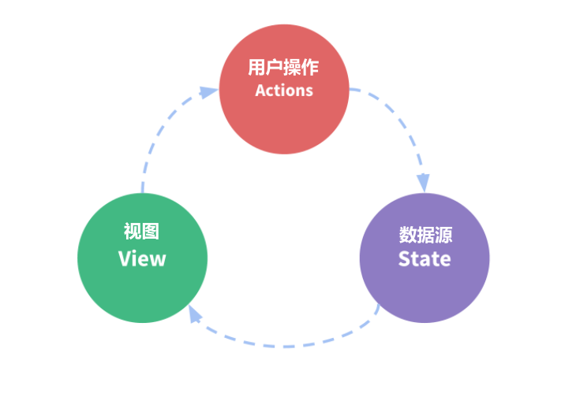
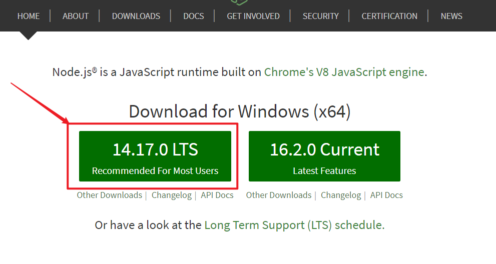
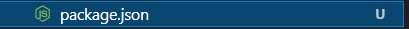
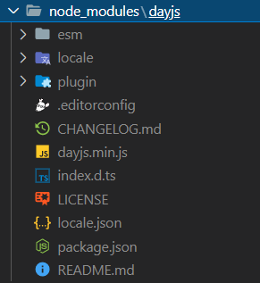
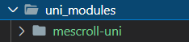

# 全局状态管理

## 7-1：开篇

在上一章中我们完成了 “一半” 的文章搜索功能，并且留下了一些问题。那么这些历史残留的问题，我们将会在本章节中通过 **全局状态管理工具** 进行处理。

那么究竟什么是 **全局状态管理工具**，**如何在 `uniapp` 中使用 全局状态管理工具**，剩下的 文章搜索功能 搜索功能如何完成，我们是否还会再遇到其他的坑呢？

这些内容我们都会在本章节中为大家一一讲解。

## 7-2：状态管理 - 全局状态管理工具

### 场景

在上一章中，我们遇到了一个问题：**`search-blog` 和 `search-history`、`searchData` 和 组件** 之间 **强耦合** 。

如果想要解决这个问题，那么我们需要使用到一个叫做：**全局状态管理工具** 的东西。

学习过 `vue` 的同学应该知道，在 `vue` 中，存在一个 [vuex](https://vuex.vuejs.org/zh/)  的库，这个库的作用就是：**全局状态管理**。

而在 `uniapp` 里，如果我们想要实现 **全局状态管理**，那么 [vuex](https://vuex.vuejs.org/zh/) 也将是一个非常好的选择。

那么下面我们就来看一下，什么是 **全局状态管理工具**，以及什么是 [vuex](https://vuex.vuejs.org/zh/) 

### 问题

> 1. 什么是全局状态管理模式 和 全局状态管理工具
> 2. 什么是 vuex

### 内容

**“单向数据流” 理念示意图**



- **state**，驱动应用的数据源；
- **view**，以声明方式将 **state** 映射到视图；
- **actions**，响应在 **view** 上的用户输入导致的状态变化。

但是，当我们的应用遇到**多个组件共享状态（数据）**时，单向数据流的简洁性很容易被破坏（回忆 `search-blog` 和 `search-history` 的代码）：

- 多个视图依赖于同一状态（数据）。
- 来自不同视图的行为需要变更同一状态（数据）。

所以我们不得不通过 **父子组件传递数据** 的方式，来频繁的修改状态（数据）。但是这种方式是 **非常脆弱，通常会导致无法维护的代码。**

-----

**什么是全局状态管理模式**

所以我们就需要就想到了一种方案，我们把：

 **把多个组件之间共用的数据抽离出来，通过一个 单例模式 进行管理**，而这种管理的方式就叫做【全局状态管理模式】。

具备 【全局状态管理模式】 的库，就是 【全局状态管理工具】

而在 `vue` 中存在一个专门的 【全局状态管理工具】，叫做 `vuex`。

因为 `uniapp` 追随 `vue` 和 `微信小程序` 的语法，所以我们可以在 `uniapp` 中使用 `vuex` 来进行 【全局状态管理】，并且这是一个 **非常被推荐** 的选择。

### 答案

> 1. 什么是全局状态管理模式 和 全局状态管理工具
>    1. 模式：把多个组件之间共用的数据抽离出来，通过一个 **单例模式** 进行管理。
>    2. 工具：具备 【全局状态管理模式】 的库
> 2. 什么是 vuex
>    1. 对 `vue` 应用程序进行全局状态管理的工具

## 7-3：状态管理 - 在项目中导入 vuex

**创建 `store` **

```js
// 1. 导入 Vue 和 Vuex
import Vue from 'vue';
// uniapp 已默认安装，不需要重新下载
import Vuex from 'vuex';

// 2. 安装 Vuex 插件
Vue.use(Vuex);
// 3. 创建 store 实例
const store = new Vuex.Store({});
export default store;

```

**在 main.js 中注册 vuex 插件**

```js

// 导入 vuex 实例
import store from './store';
...

const app = new Vue({
  ...App,
  store // 挂载实例对象
});
app.$mount();

```

## 7-4：状态管理 - 测试 vuex 是否导入成功

**创建 `modules/search.js` **

```js
export default {
  // 独立命名空间
  namespaced: true,
  // 通过 state 声明数据
  state: () => {
    return {
      msg: 'hello vuex'
    };
  }
};

```

**在 `index.js`  中注入模块**

```js
...
// 导入 search.js 暴露的对象
import search from './modules/search';

// 2. 安装 Vuex 插件
Vue.use(Vuex);
// 3. 创建 store 实例
const store = new Vuex.Store({
  modules: {
    search
  }
});
export default store;

```

**search-blog 中使用 模块中的数据**

```vue
<template>
  <view class="search-blog-container">
    <!-- 3. 使用导入的 vuex 模块中的数据 -->
    <div>{{ msg }}</div>
    ...
  </view>
</template>

<script>
// 1. 导入 mapState 函数
import { mapState } from 'vuex';
...
export default {
 ...
  computed: {
    // 2. 在 computed 中，通过 mapState 函数，注册 state 中的数据，导入之后的数据可直接使用（就像使用 data 中的数据一样）
    // mapState(模块名, ['字段名','字段名','字段名'])
    ...mapState('search', ['msg'])
  }
};
</script>


```

## 7-5：状态管理 - 构建 search 模块

`search.js`

```js
export default {
  // 独立命名空间
  namespaced: true,
  // 通过 state 声明数据
  state: () => ({
    searchData: []
  }),
  // 更改 state 数据的唯一方式是：提交 mutations
  mutations: {
    /**
     * 添加数据
     */
    addSearchData(state, val) {
      if (!val) return;
      const index = state.searchData.findIndex((item) => item === val);
      if (index !== -1) {
        state.searchData.splice(index, 1);
      }
      state.searchData.unshift(val);
    },
    /**
     * 删除指定数据
     */
    removeSearchData(state, index) {
      state.searchData.splice(index, 1);
    },
    /**
     * 删除所有数据
     */
    removeAllSearchData(state) {
      state.searchData = [];
    }
  }
};

```

## 7-6：状态管理 - 使用 search 模块完成搜索历史管理

`search-blog`

```vue
<template>
  <view class="search-blog-container">
...
    <!-- 热搜列表 -->
    <view class="search-hot-list-box card" v-if="showType === HOT_LIST">
      <!-- 列表 -->
      <search-hot-list @onSearch="onSearchConfirm" />
    </view>
...
  </view>
</template>

<script>
// 导入 mapMutations 函数
import { mapMutations } from 'vuex';
...
export default {
  ...
  methods: {
    ...mapMutations('search', ['addSearchData']),
    /**
     * 搜索内容
     */
    onSearchConfirm(val) {
      ...
      // 保存搜索历史数据
      this.addSearchData(this.searchVal);
      ...
    },
    /**
     * @deprecated
     * 保存搜索历史数据
     */
    saveSearchData() {
      // 1. 如果数据已存在，则删除
      const index = this.searchData.findIndex((item) => item === this.searchVal);
      if (index !== -1) {
        this.searchData.splice(index, 1);
      }
      // 2. 新的搜索内容需要先于旧的搜索内容展示
      this.searchData.unshift(this.searchVal);
    },
    /**
     * @deprecated
     * 删除数据
     */
    onRemoveSearchData(index) {
      this.searchData.splice(index, 1);
    },
    
  }
};
</script>


```

`search-history`

```vue
<script>
// 1. 导入 mapState 函数
import { mapState, mapMutations } from 'vuex';

export default {
  name: 'search-history',
  props: {
    /**
     * @deprecated
     */
    // searchData: {
    //   type: Array,
    //   required: true
    // }
  },

  methods: {
    ...mapMutations('search', ['removeSearchData', 'removeAllSearchData']),
    onClearAll() {
      uni.showModal({
        title: '提示',
        content: '删除搜索历史记录？',
        showCancel: true,
        success: ({ confirm, cancel }) => {
          if (confirm) {
            // 删除 searchData
            this.removeAllSearchData();
            // 返回状态
            this.isShowClear = false;
          }
        }
      });
    },
    onHistoryItemClick(item, index) {
      if (this.isShowClear) {
        // 删除指定的 searchData
        this.removeSearchData(index);
      } else {
        this.$emit('onItemClick', item);
      }
    }
  },
  computed: {
    // 2. 在 computed 中，通过 mapState 函数，注册 state 中的数据，导入之后的数据可直接使用（就像使用 data 中的数据一样）
    // mapState(模块名, ['字段名','字段名','字段名'])
    ...mapState('search', ['searchData'])
  }
};
</script>

```

## 7-7：状态管理 - 数据持久化

已完成 数据和组件的分离，所以【数据持久化】不需要涉及到组件内的代码

`store/search.js`

```js
const STORAGE_KEY = 'search-list';

export default {
  // 独立命名空间
  namespaced: true,
  // 通过 state 声明数据
  state: () => ({
    // 优先从 storage 中读取
    searchData: uni.getStorageSync(STORAGE_KEY) || []
  }),
  // 更改 state 数据的唯一方式是：提交 mutations
  mutations: {
    /**
     * 保存数据到 storage
     */
    saveToStorage(state) {
      uni.setStorage({
        key: STORAGE_KEY,
        data: state.searchData
      });
    },
    /**
     * 添加数据
     */
    addSearchData(state, val) {
      ...
      // 调用 saveToStorage
      this.commit('search/saveToStorage');
    },
    /**
     * 删除指定数据
     */
    removeSearchData(state, index) {
      ...
      // 调用 saveToStorage
      this.commit('search/saveToStorage');
    },
    /**
     * 删除所有数据
     */
    removeAllSearchData(state) {
      ...
      // 调用 saveToStorage
      this.commit('search/saveToStorage');
    }
  }
};

```

## 7-8：搜索结果 - 获取搜索结果数据

`search.js`

```js
import request from '../utils/request';

/**
 * 搜索结果
 */
export function getSearchResult(data) {
  return request({
    url: '/search',
    data
  });
}

```

`search-result-list.vue`

```vue
<template>
  <view> 搜索结果 </view>
</template>

<script>
import { getSearchResult } from 'api/search';
export default {
  name: 'search-result-list',
  props: {
    // 搜索关键字
    queryStr: {
      type: String,
      required: true
    }
  },
  data() {
    return {
      // 数据源
      resultList: [],
      // 页数
      page: 1
    };
  },
  created() {
    this.loadSearchResult();
  },
  methods: {
    /**
     * 获取搜索数据
     */
    async loadSearchResult() {
      const { data: res } = await getSearchResult({
        q: this.queryStr,
        p: this.page
      });
      this.resultList = res.list;
      console.log(this.resultList);
    }
  }
};
</script>

<style lang="scss"></style>

```

`search-blog`

```html
    <!-- 搜索结果 -->
    <view class="search-result-box" v-else>
      <search-result-list :queryStr="searchVal" />
    </view>
```


## 7-9：搜索结果 - 渲染搜索结果数据

创建三个组件，应该应对三种展示情况：

1. `search-result-item-theme-1`：无图片样式
2. `search-result-item-theme-2`：一张图片样式
3. `search-result-item-theme-3`：三张图片样式

`search-result-item-theme-1`

```vue
<template>
  <view class="search-result-item-box">
    <!-- 标题 -->
    <rich-text :nodes="data.title" class="item-title line-clamp-2"></rich-text>
    <!-- 内容区 - 样式 1 -->
    <rich-text :nodes="data.description" class="item-desc line-clamp-2"></rich-text>
    <!-- 底部 -->
    <view class="item-desc-bottom">
      <view class="item-author">{{ data.author }}</view>
      <view class="item-read-num">
        <uni-icons class="read-num-icon" color="#999999" type="compose" />
        <text>{{ data.updateTime }}</text>
      </view>
    </view>
  </view>
</template>

<script>
export default {
  props: {
    data: {
      type: Object,
      required: true
    }
  },
  data: () => ({})
};
</script>

<style lang="scss" scoped>
.search-result-item-box {
  margin-bottom: $uni-spacing-col-big;
  // 标题
  .item-title {
    font-size: $uni-font-size-base;
    font-weight: bold;
    color: $uni-text-color-title;
  }

  .item-desc {
    margin-top: $uni-spacing-col-base;
    font-size: $uni-font-size-base;
    color: $uni-color-subtitle;
  }

  // 底部作者 + 阅读量
  .item-desc-bottom {
    margin-top: $uni-spacing-col-base;
    display: flex;
    color: $uni-text-color-grey;
    font-size: $uni-font-size-sm;
    .item-author {
      margin-right: $uni-spacing-row-lg;
    }
    .item-read-num {
      .read-num-icon {
        color: $uni-text-color-grey;
        margin-right: $uni-spacing-row-sm;
      }
    }
  }
}
</style>

```

`search-result-item-theme-2`

```vue
<template>
  <view class="search-result-item-box">
    <!-- 标题 -->
    <rich-text :nodes="data.title" class="item-title line-clamp-2"></rich-text>
    <view class="item-info-box">
      <view class="item-desc-box">
        <rich-text :nodes="data.description" class="item-desc line-clamp-2"></rich-text>
        <view class="item-desc-bottom">
          <view class="item-author">{{ data.nickname }}</view>
          <view class="item-read-num">
            <uni-icons class="read-num-icon" color="#999999" type="compose" />
            <text>{{ data.updateTime }}</text>
          </view>
        </view>
      </view>
      <image class="item-img" :src="data.pic_list[0]" />
    </view>
  </view>
</template>

<script>
export default {
  props: {
    data: {
      type: Object,
      required: true
    }
  },
  data: () => ({})
};
</script>

<style lang="scss" scoped>
.search-result-item-box {
  margin-bottom: $uni-spacing-col-big;
  // 标题
  .item-title {
    font-size: $uni-font-size-base;
    font-weight: bold;
    color: $uni-text-color-title;
  }

  .item-info-box {
    display: flex;
    margin-top: $uni-spacing-col-base;
    .item-desc-box {
      width: 65%;
      font-size: $uni-font-size-base;
      color: $uni-color-subtitle;
      // 底部作者 + 阅读量
      .item-desc-bottom {
        margin-top: $uni-spacing-col-base;
        display: flex;
        color: $uni-text-color-grey;
        font-size: $uni-font-size-sm;
        .item-author {
          margin-right: $uni-spacing-row-lg;
        }
        .item-read-num {
          .read-num-icon {
            color: $uni-text-color-grey;
            margin-right: $uni-spacing-row-sm;
          }
        }
      }
    }

    .item-img {
      width: 33%;
      height: 70px;
    }
  }
}
</style>

```

`search-result-item-theme-3`

```vue
<template>
  <view class="search-result-item-box">
    <!-- 标题 -->
    <rich-text :nodes="data.title" class="item-title line-clamp-2"></rich-text>
    <!-- 内容区 - 样式 3 -->
    <view class="item-info-img-box">
      <image v-for="item in data.pic_list" :key="item" class="item-img" :src="item" />
    </view>
    <!-- 底部 -->
    <view class="item-desc-bottom">
      <view class="item-author">{{ data.nickname }}</view>
      <view class="item-read-num">
        <uni-icons class="read-num-icon" color="#999999" type="compose" />
        <text>{{ data.updateTime }}</text>
      </view>
    </view>
  </view>
</template>

<script>
export default {
  props: {
    data: {
      type: Object,
      required: true
    }
  },
  data: () => ({}),
  created() {
    if (this.data.pic_list.length > 3) {
      this.data.pic_list = this.data.pic_list.splice(0, 2);
    }
  }
};
</script>

<style lang="scss" scoped>
.search-result-item-box {
  margin-bottom: $uni-spacing-col-big;
  // 标题
  .item-title {
    font-size: $uni-font-size-base;
    font-weight: bold;
    color: $uni-text-color-title;
  }

  .item-info-img-box {
    display: flex;
    // 图片
    .item-img {
      width: 33%;
      height: 70px;
      box-sizing: border-box;
    }
    .item-img:nth-child(1n + 1) {
      margin-right: $uni-spacing-row-sm;
    }
  }

  // 底部作者 + 阅读量
  .item-desc-bottom {
    margin-top: $uni-spacing-col-base;
    display: flex;
    color: $uni-text-color-grey;
    font-size: $uni-font-size-sm;
    .item-author {
      margin-right: $uni-spacing-row-lg;
    }
    .item-read-num {
      .read-num-icon {
        color: $uni-text-color-grey;
        margin-right: $uni-spacing-row-sm;
      }
    }
  }
}
</style>

```

`uni.scss`

```scss
$uni-spacing-col-big: 24px;
```

`search-result-list`

```vue
<template>
  <view class="search-result-list-container">
    <!-- 循环渲染列表数据 -->
    <block v-for="(item, index) in resultList" :key="index">
      <view class="search-result-item-box">
        <!-- 内容区 - 样式 1 -->
        <search-result-item-theme-1
          v-if="!item.pic_list || item.pic_list.length === 0"
          :data="item"
        />

        <!-- 内容区 - 样式 2 -->
        <search-result-item-theme-2 v-else-if="item.pic_list.length === 1" :data="item" />

        <!-- 内容区 - 样式 3 -->
        <search-result-item-theme-3 v-else :data="item" />

        <!-- / -->
      </view>
    </block>
  </view>
</template>

<style lang="scss" scoped>
.search-result-list-container {
  padding: $uni-spacing-col-lg $uni-spacing-row-lg;
  .search-result-item-box {
    margin-bottom: $uni-spacing-col-big;
  }
}
</style>

```


## 7-10：搜索结果 - 处理相对时间

相对时间可以借助 [dayjs](https://day.js.org/zh-CN/) 进行处理。想要在 `uniapp` 中使用  [dayjs](https://day.js.org/zh-CN/) ，那么需要导入 `npm` 工具（以下内指令需要在项目路径的终端下进行）：

1. 需要在电脑中安装 `node` 环境，[node 安装地址](https://nodejs.org/en/)，推荐下载 `LTS` 版本
   

2. 通过 `npm init -y` 初始化 `npm` 包管理工具
   

3. 通过 `npm install dayjs@1.10.4 --save-dev` 安装，安装完成，项目中会多出 `node_modules` 文件夹
   

4. 打开 `filters/index.js`，添加如下代码：

   ```js
   // 1. 导入dayjs
   import dayjs from 'dayjs';
   // 2. dayjs 默认语言是英文，我们这里配置为中文
   import 'dayjs/locale/zh-cn';
   // 3. 引入 relativeTime
   import rTime from 'dayjs/plugin/relativeTime';
   
   // 4. 加载中文语言包
   dayjs.locale('zh-cn');
   // 5. 加载相对时间插件
   dayjs.extend(rTime);
   
   /**
    * 6. 定义过滤器，通过 dayjs().to(dayjs(val)) 方法把【当前时间】处理为【相对时间】
    */
   export function relativeTime(val) {
     return dayjs().to(dayjs(val));
   }
   ```

5. 分别在 `search-result-item-theme-1`、`search-result-item-theme-2`、`search-result-item-theme-3` 中使用过滤器 `<text>{{ data.updateTime | relativeTime }}</text>`
   

## 7-11：搜索结果 - 高亮搜索结果关键字

在 `title` 字段下，搜索关键字都通过 `em` 标签进行了标记，所以所谓的 **搜索关键字高亮** 就是 **对 `em` 标签添加高亮样式**

**search-result-list**

```js
// 更改返回数据样式（行内样式）
      res.list.forEach((item) => {
        item.title = item.title.replace(/<em>/g, "<em style='color:#f94d2a; margin:0 2px'>");
        item.description = item.description.replace(
          /<em>/g,
          "<em style='color:#f94d2a; margin:0 2px'>"
        );
      });
```


## 7-12：搜索结果 - 介绍并使用 mescroll-uni 组件


[mescroll-uni ](http://www.mescroll.com/uni.html) 是一个专门为 `uni app` 准备的 `pullToRefresh` 组件。可以帮助 `uniapp` 实现 **下拉刷新、上拉加载的功能**。

1. 在 [插件市场](https://ext.dcloud.net.cn/plugin?id=343) 点击 **使用 HBuilderX 导入插件**

2. 导入成功，`uni-modules` 文件夹下会多出 `mescroll-ui` 文件夹
   

3. `mescroll-uni` 的实现借助了 **微信小程序** 中的 [onPullDownRefresh](https://developers.weixin.qq.com/miniprogram/dev/reference/api/Page.html#onPullDownRefresh) 和 [onReachBottom](https://developers.weixin.qq.com/miniprogram/dev/reference/api/Page.html#onReachBottom) 这两个 **页面** 事件。因为 **微信小程序组件中没有这两个事件**，所以 `mescroll-uni` 在 **页面** 和 **组件** 中的使用方式 **不同**

4. 我们现在先来看 `mescroll-uni` 在 **组件** 中的使用

5. `mescroll-uni` 在 **组件** 中使用分为两大块：

   1. 组件

      ```vue
      <template>
        <view class="search-result-list-container">
          <!-- 1. 通过 mescroll-body 包裹列表，指定 ref 为 mescrollRef ，监听@init、@down、@up 事件 -->
          <mescroll-body ref="mescrollRef" @init="mescrollInit" @down="downCallback" @up="upCallback">
            <!-- 循环渲染列表数据 -->
            <block v-for="(item, index) in resultList" :key="index">
      		...
            </block>
          </mescroll-body>
        </view>
      </template>
      
      <script>
      // 2. 导入对应的 mixins
      import MescrollMixin from '@/uni_modules/mescroll-uni/components/mescroll-uni/mescroll-mixins.js';
      export default {
        // 3. 注册 mixins
        mixins: [MescrollMixin],
        methods: {
          // 4. 实现三个回调方法
          /**
           * 首次加载
           */
          mescrollInit() {
            console.log('mescrollInit');
          },
          /**
           * 下拉刷新的回调
           */
          downCallback() {
            console.log('downCallback');
          },
          /**
           * 上拉加载的回调
           */
          upCallback() {
            console.log('upCallback');
          },
        }
      };
      </script>
      
      ```

      

   2. 组件所在的页面

      ```vue
      <template>
        <view class="search-blog-container">
          <!-- 搜索结果 -->
          <view class="search-result-box" v-else>
            <!-- 1. 给mescroll-body的组件添加: ref="mescrollItem" (固定的,不可改,与mescroll-comp.js对应)-->
            <search-result-list ref="mescrollItem" :queryStr="searchVal" />
          </view>
        </view>
      </template>
      
      <script>
      // 2. 引入mescroll-comp.js
      import MescrollCompMixin from '@/uni_modules/mescroll-uni/components/mescroll-uni/mixins/mescroll-comp.js';
          
      export default {
        // 3. 注册 mixins
        mixins: [MescrollCompMixin],
      };
      </script>
      
      ```

      

## 7-13：搜索结果 - 实现下拉刷新上拉加载功能

```vue
<script>
export default {
    ...
  data() {
    return {
      // 数据源
      resultList: [],
      // 页数
      page: 1,
      // 实例
      mescroll: null,
      // 处理渲染，会回调 down和up 方法，为了避免该问题，定义 init 变量，表示当前是否为首次请求
      isInit: true
    };
  },
  // created() {
  //   不需要主动调用
  //  this.loadSearchResult();
  // },
  // 页面渲染完成之后回调，想要获取组件实例，需要在该回调中进行
  mounted() {
    // 通过 $refs 获取组件实例
    this.mescroll = this.$refs.mescrollRef.mescroll;
  },
  methods: {
    // 4. 实现三个回调方法
    /**
     * List 组件的首次加载
     */
    async mescrollInit() {
      await this.loadSearchResult();
      this.isInit = false;
      // 结束 上拉加载 && 下拉刷新
      this.mescroll.endSuccess();
    },
    /**
     * 下拉刷新的回调
     */
    async downCallback() {
      if (this.isInit) return;
      this.page = 1;
      await this.loadSearchResult();
      // 结束 上拉加载 && 下拉刷新
      this.mescroll.endSuccess();
    },
    /**
     * 上拉加载的回调
     */
    async upCallback() {
      if (this.isInit) return;
      this.page += 1;
      await this.loadSearchResult();
      // 结束 上拉加载 && 下拉刷新
      this.mescroll.endSuccess();
    },
    /**
     * 获取搜索数据
     */
    async loadSearchResult() {
      ...
      // 使用下拉刷新上拉加载的赋值策略
      // this.resultList = res.list;
      // 判断是否为第一页数据
      if (this.page === 1) {
        this.resultList = res.list;
      } else {
        this.resultList = [...this.resultList, ...res.list];
      }
    }
  }
};
</script>

```


## 7-14：搜索结果 - 处理空数据场景

**创建空数据组件**`empty-data`

```vue
<template>
  <view class="empty-data-cocntainer">
    <image src="/static/images/empty-data.png" class="img" />
    <view class="txt">暂无数据</view>
  </view>
</template>

<script>
export default {
  name: 'empty-data',
  data() {
    return {};
  }
};
</script>

<style lang="scss" scoped>
.empty-data-cocntainer {
  display: flex;
  flex-direction: column;
  align-items: center;
  padding-top: 35%;
  .img {
    width: 64px;
    height: 64px;
  }
  .txt {
    margin-top: $uni-spacing-col-sm;
    color: $uni-text-color-grey;
    font-size: $uni-font-size-base;
  }
}
</style>

```

**在无数据时，进行渲染**

`search-result-list`

```vue
<template>
  <view class="search-result-list-container">
    <empty-data v-if="isEmpty"></empty-data>

    <mescroll-body
      v-else
    ></mescroll-body>
  </view>
</template>

<script>
export default {
  ...
  methods: {
...
    /**
     * 获取搜索数据
     */
    async loadSearchResult() {
      ...
      // this.resultList = [];
      // 无数据，显示空数据组件
      if (this.resultList.length === 0) {
        this.isEmpty = true;
      }
    }
  }
};
</script>

```


## 7-15：文章搜索 - 细节修复

1. 搜索历史数据量限制 `store/modules/search.js`

```js
    /**
     * 添加数据
     */
    addSearchData(state, val) {
      if (!val) return;
      const index = state.searchData.findIndex((item) => item === val);
      if (index !== -1) {
        state.searchData.splice(index, 1);
      }
      // 判断是否超过了最大缓存数量
      if (state.searchData.length > HISTORY_MAX) {
        state.searchData.splice(HISTORY_MAX - 1, state.searchData.length - HISTORY_MAX - 1);
      }

      state.searchData.unshift(val);
      // 调用 saveToStorage
      this.commit('search/saveToStorage');
    },
```


## 7-16：总结

在本章节中我们接触到了一个全新的知识点 **全局状态管理工具  vuex **， 我们利用它解决了 **数据与组件深度耦合** 的问题。

在正式的项目中（无论是 `uniapp` 项目还是 `前端项目`） ，**全局状态管理工具 ** 都是非常重要的一个内容。

在处理完了 “历史遗留” 问题之后，我们解决了文章搜索的最后一个模块 **搜索结果**，我们利用 三个组件分别应对了三种不同的渲染场景，并且通过 **行内样式** 的形式解决了 关键字高亮的问题。

其中为了处理 **pullToRefresh** 的场景，我们还接触到了一个新的库 **mescroll-uni**，利用它很好的解决了 **下拉刷新，上拉加载的问题**。

那么在下一章节，我们则会进入到 **文章详情的功能开发**。等待我们的又将会是什么样的难题呢？

