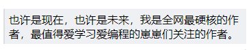
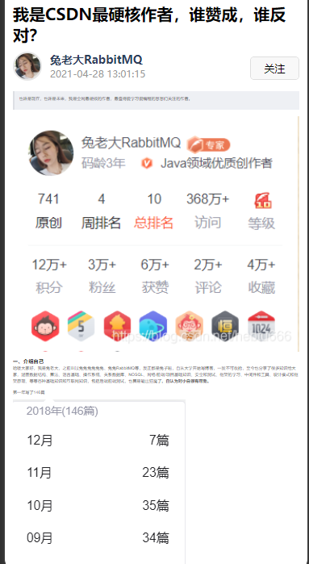
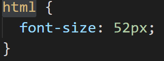

# 文章详情页面

## 8-1：开篇

从本章开始我们要进入文章详情的页面开发。

在文章详情页面可以展示：

1. 文章标题
2. 作者信息
3. 发布时间
4. 文章内容
5. 文章评论

同时你可以在这里进行：

1. 作者关注
2. 文章评论
3. 文章点赞
4. 文章收藏

等操作。

基本功能大家可以进入到我们已经发布的小程序《慕课热搜》中进行查看。

那么在这样的一个复杂的详情页面中，我们又会遇到什么样的复杂难题？又将如何进行解决呢？

我们一起来期待吧！


## 8-2：文章详情 - 点击进入文章详情页面

在 `subpkg` 下创建 **文章详情页面** `blog-detail`

**热搜列表进入文章详情**

`hot-list-item`

```html
<view class="item-container" @click="$emit('click')">
```

`hot`

```vue
 <hot-list-item
     ...
     @click="onItemClick(item)"
 ></hot-list-item>


onItemClick(item) {
      uni.navigateTo({
        url: `/subpkg/pages/blog-detail/blog-detail`
      });
    }
```

**搜索结果页面进入文章详情**

`search-result-list`

```vue
    <view class="search-result-item-box" @click="onItemClick(item)">
    
    /**
     * item 点击事件
     */
    onItemClick(item) {
      uni.navigateTo({
        url: `/subpkg/pages/blog-detail/blog-detail`
      });
    }
```


## 8-3：文章详情 - 获取文章详情数据

查看**接口文档** 我们知道，想要获取文章详情需要传递两个参数：

1. `author`：作者名
2. `articleId`：文章 id

这两个参数需要在 **跳转到文章详情页面时进行传递** ，所以我们需要修改下 `navigateTo` 的方法：

`hot`

```js
    /**
     * item 点击事件
     */
    onItemClick(item) {
      uni.navigateTo({
        url: `/subpkg/pages/blog-detail/blog-detail?author=${item.user_name}&articleId=${item.id}`
      });
    }
```

`search-result-list`

```js
    /**
     * item 点击事件
     */
    onItemClick(item) {
      uni.navigateTo({
        url: `/subpkg/pages/blog-detail/blog-detail?author=${item.author}&articleId=${item.id}`
      });
    }
```

数据传递之后，需要在 `blog-detail` 中接收。

```js
export default {
  data() {
    return {
      // 作者名
      author: '',
      // 文章 ID
      articleId: ''
    };
  },
  onLoad(options) {
    this.author = options.author;
    this.articleId = options.articleId;
  }
};
```

有了请求参数之后，接下来就可以进行数据请求了。

`api/article`

```js
import request from '../utils/request';

/**
 * 获取文章详情
 */
export function getArticleDetail(data) {
  return request({
    url: '/article/details',
    data
  });
}

```

`blog-detail`

```vue
<script>
import { getArticleDetail } from 'api/article';
export default {
  data() {
    return {
      // 作者名
      author: '',
      // 文章 ID
      articleId: '',
      // 文章详情数据
      articleData: null
    };
  },
  onLoad(options) {
    this.author = options.author;
    this.articleId = options.articleId;
    this.loadArticleDetail();
  },
  methods: {
    /**
     * 获取文章详情数据
     */
    async loadArticleDetail() {
      // 展示加载框
      uni.showLoading({
        title: '加载中'
      });
      const { data: res } = await getArticleDetail({
        author: this.author,
        articleId: this.articleId
      });
      this.articleData = res.data;
      console.log(this.articleData);
    }
  }
};
</script>

```

`utils/request.js`

```js
function request({ url, data, method }) {
  return new Promise((resolve, reject) => {
    uni.request({
      ...
      complete: () => {
        // 关闭加载
        uni.hideLoading();
      }
    });
  });
}


```

## 8-4：文章详情 - 分析并渲染文章详情的基本结构

整个文章详情可以被分为三个部分实现：

1. 文章内容区
2. 评论列表区
3. 底部功能区

我们先来实现  **文章内容区**：

`blog-detail`

```vue
<template>
  <view class="detail-container">
    <!-- 文章内容区域 -->
    <block v-if="articleData">
      <!-- 标题 -->
      <view class="title">{{ articleData.articleTitle }}</view>
      <view class="detail-info">
        <view class="detail-left">
          <view class="avatar-box">
            <!-- 头像 -->
            <image class="avatar" :src="articleData.avatar"></image>
          </view>
          <view class="author-box">
            <!-- 作者 -->
            <text class="author">{{ articleData.nickName }}</text>
            <!-- 发布时间 -->
            <text class="release-time">{{ articleData.date }}</text>
          </view>
        </view>
        <view class="detail-right">
          <!-- 关注按钮 -->
          <button class="follow" size="mini">关注</button>
        </view>
      </view>
      <!-- 文章内容 -->
      <rich-text :nodes="articleData.content"></rich-text>
    </block>
  </view>
</template>
```

## 8-5：文章内容 - 美化文章内容区域

`blog-detail`

```css
<style lang="scss" scoped>
.detail-container {
  padding: $uni-spacing-col-base $uni-spacing-row-base;
  .title {
    font-size: $uni-font-size-title;
    color: $uni-text-color-title;
    font-weight: bold;
  }
  .detail-info {
    padding: $uni-spacing-col-base 0;
    display: flex;
    justify-content: space-between;

    .detail-left {
      display: flex;
      .author-box {
        margin-left: $uni-spacing-row-base;
        display: flex;
        flex-direction: column;
        .author {
          font-size: $uni-font-size-base;
          font-weight: bolder;
          color: $uni-color-title;
        }
        .release-time {
          font-size: $uni-font-size-sm;
          color: $uni-text-color-grey;
        }
      }
    }

    .detail-right {
      display: flex;
      align-items: center;
    }
  }
}
</style>
```

`global.scss`

```css
// 头像
.avatar {
  width: 32px;
  height: 32px;
  border-radius: 50%;
  border: 2px solid #e5e5e5;
}
```

## 8-6：文章内容 - 分析文章内容的样式实现

目前我们虽然已经完成了基本的 `html` 和 `css` ，但是我们可以发现，现在的 **文章内容** 部分与完成之后的项目差距其实挺大的。那么怎么解决这个问题呢？

想要解决这个问题，我们需要先明确一点：**所有和样式相关的问题，都需要通过 `css` 进行解决！**

明确了这点之后，我们就知道，想要解决这个问题，那么还是必须要从 `css` 进行着手。

回忆一下我们之前解决 **搜索结果高亮关键字的功能**，我们知道 对于 `rich-text` 来说，它并不会把 **富文本** 渲染为真实 `DOM` ，放入到 `DOM` 中，所以我们如果直接通过 `css` 指定样式，那么是没有效果的。

所以我们当时通过了 **行内样式** 的形式进行了 **高亮文本的展示**。

但是这样的一种方案，放入到我们当前的场景中是否合适呢？

答案是：**不合适的**。

因为对于 **文章内容** 来说，它涉及到了非常多的 `html标签`，每个 `html 标签` 设计到的样式也非常复杂，如果我们还期望通过 **行内样式** 来去解决的话，那么未免 **太不现实** 了。

那么我们应该怎么去解决这个问题呢？大家可以先去思考一下这个问题。不需要思考出具体的实现方案，只需要给出一个可行的方案即可。

-----

在这里，我就认为大家已经针对这个问题进行过思考了，那么我们就直接公布可行方案：

1. 把包含 `html` 的富文本，转化为 **小程序可识别的 元素 进行展示**
2. 获取网络中现有的，用来处理文章详情的 `css`，对该 `css` 进行改造
3. 为每个元素添加对应的类名，使其可拥有更完美的样式

通过以上三步即可实现。

那么在下一节中我们将去实现对应的代码


## 8-7：文章内容 - 实现文章内容的样式渲染

在上一章中我们明确了 **文章内容样式渲染的实现方案**，一共分为三步：

1. 把包含 `html` 的富文本，转化为 **小程序可识别的 元素 进行展示**
2. 获取网络中现有的，用来处理文章详情的 `css`，对该 `css` 进行改造
3. 为每个元素添加对应的类名，使其可拥有更完美的样式

那么这一章节，我们就一步一步来进行实现。

**1：把包含 `html` 的富文本，转化为 小程序可识别的 元素 进行展示**

想要实现这个功能，我们需要借助一个现有的第三方库 [mp-html](https://ext.dcloud.net.cn/plugin?id=805) 

 [mp-html](https://ext.dcloud.net.cn/plugin?id=805) 是一个专门用来解决 **富文本渲染的一个库** ，它的解决方案就是 **把包含 `html` 的富文本，转化为 小程序可识别的 元素 进行展示**，正好符合我们的需求。

导入并使用 [mp-html](https://ext.dcloud.net.cn/plugin?id=805) ：

1. 点击进入 [mp-html](https://ext.dcloud.net.cn/plugin?id=805)，点击 **使用 `HBuilderX 导入插件`**

2. 在 `blog-detail` 中导入组件，并使用

   ```vue
   <template>
     <view class="detail-container">
       <!-- 文章内容区域 -->
       <block v-if="articleData">
         ...
         <!-- 文章内容 -->
         <mp-html class="markdown_views" :content="articleData.content" scroll-table />
       </block>
     </view>
   </template>
   
   <script>
   // 导入组件
   import mpHtml from '@/uni_modules/mp-html/components/mp-html/mp-html';
   
   import { getArticleDetail } from 'api/article';
   export default {
     // 注册组件
     components: {
       mpHtml
     },
     ...
   };
   </script>
   
   ```

   通过 **微信小程序** 查看渲染之后的 `DOM` 树，可以发现所有的 **富文本** 已经被真实渲染了。


**2：获取网络中现有的，用来处理文章详情的 `css`，对该 `css` 进行改造**

那么现在，我们就只需要增加对应的 `css` 样式就可以了。那么 `css` 样式从哪里来呢？

获取 `css` 的样式大家可以直接从：[theme](https://theme.typora.io/) 网站去进行下载，然后进行导入：

1. 下载对应的 css 压缩包

2. 在 `styles` 中新建 `article-detail.scss` 文件

3. 复制下载的 `css` 到 样式文件

4. 在 `blog-detail.vue` 中导入 `css`

   ```css
   // 注意：需要删除 scoped
   <style lang="scss">
   @import '~@/styles/article-detail.scss';
   ```


**3：为每个元素添加对应的类名，使其可拥有更完美的样式**

现在虽然 `DOM` 虽然已经被渲染出来了，但是其实现在距离我们最终的样式还是又一些差距的。

因为在导入的 `css` 中，很多的样式都是根据 `p` 标签，`span` 标签 这样的，标签选择器进行的样式指定，而我们被渲染出来的 `dom` 是不包含这些选择器的，所以我们需要给不同的标签增加不同的类名，然后修改对应的 `css` 使其可以通过 **类名选择器** 覆盖样式。

**为 `dom` 增加类名**

想要添加类名比较简单，我们可以直接通过 **正则进行选取替换：**

```vue
<template>
  <view class="detail-container">
    <!-- 文章内容区域 -->
    <block v-if="articleData">
      ...
      <!-- 文章内容 -->
      <mp-html
        // 必须为 mp-html 增加 markdown_views 的类名
        class="markdown_views"
        :content="addClassFromHTML(articleData.content)"
        scroll-table
      />
    </block>
  </view>
</template>

<script>
export default {
 ...
  methods: {
    /**
     * 为所有的 DOM 增加类名
     */
    addClassFromHTML(info) {
      // 先替换 blockquote
      return info.replace(/<blockquote>/gi, '<blockquote class="blockquote-cls">');
    },
...
  }
};
</script>

```

现在查看 `DOM` 结构，我们就可以发现，在部分被渲染为 `view` 组件的元素上，已经多了一个 `class` 为 `blockquote-cls` 了。

**为 `css` 修改类名选择器**

在 `css` 文件中，全局搜索 `blockquote` ，将其修改为 `.blockquote-cls`。

即可发现样式已经被渲染成功了：



接下来我们就可以为 **所有的标签增加类名** ，同时为 **`css` 修改对应的样式**

```js
addClassFromHTML(info) {
      return info
        .replace(/<p>/gi, '<p class="p-cls">')
        .replace(/<a>/gi, '<a class="a-cls">')
        .replace(/<h1>/gi, '<h1 class="h1-cls">')
        .replace(/<h2>/gi, '<h2 class="h2-cls">')
        .replace(/<h3>/gi, '<h3 class="h3-cls">')
        .replace(/<h4>/gi, '<h4 class="h4-cls">')
        .replace(/<h5>/gi, '<h5 class="h5-cls">')
        .replace(/<h6>/gi, '<h6 class="h6-cls">')
        .replace(/<ul>/gi, '<ul class="ul-cls">')
        .replace(/<li>/gi, '<li class="li-cls">')
        .replace(/<ol>/gi, '<ol class="ol-cls">')
        .replace(/<td>/gi, '<td class="td-cls">')
        .replace(/<th>/gi, '<th class="th-cls">')
        .replace(/<tr>/gi, '<tr class="tr-cls">')
        .replace(/<dl>/gi, '<dl class="dl-cls">')
        .replace(/<dd>/gi, '<dd class="dd-cls">')
        .replace(/<hr>/gi, '<hr class="hr-cls">')
        .replace(/<pre>/gi, '<pre class="pre-cls">')
        .replace(/<strong>/gi, '<strong class="strong-cls">')
        .replace(/<input>/gi, '<input class="input-cls">')
        .replace(/<table>/gi, '<table class="table-cls">')
        .replace(/<details>/gi, '<details class="details-cls">')
        .replace(/<code>/gi, '<code class="code-cls">')
        .replace(/<kbd>/gi, '<kbd class="kbd-cls">')
        .replace(/<summary>/gi, '<summary class="summary-cls">')
        .replace(/<blockquote>/gi, '<blockquote class="blockquote-cls">')
        .replace(/<img/gi, '<img class="img-cls"');
    }
```

 

```css
html {
  font-size: 52px;
}
body {
  font-size: 16px;
}
.markdown_views {
  font-family: -apple-system, SF UI Text, Arial, PingFang SC, Hiragino Sans GB, Microsoft YaHei,
    WenQuanYi Micro Hei, sans-serif, SimHei, SimSun;
  font-size: 16px;
  width: 710rpx;
  overflow-x: hidden;
}
.markdown_views .p-cls {
  font-size: 0.32rem;
  color: #4f4f4f;
  font-weight: normal;
  line-height: 0.52rem;
  margin: 0 0 0.32rem 0;
}
.markdown_views .strong-cls {
  font-weight: bold;
}
.markdown_views i,
cite,
em,
var,
address,
dfn {
  font-style: italic;
}
.markdown_views * {
  -webkit-box-sizing: border-box;
  box-sizing: border-box;
}
#content_views.night .h1-cls,
#content_views.night .h2-cls,
#content_views.night .h3-cls,
#content_views.night .h4-cls,
#content_views.night .h5-cls,
#content_views.night .h6-cls {
  color: #4f4f4f;
  margin-top: 0 !important;
  font-weight: bold;
}
.markdown_views .ul-cls,
.markdown_views .ol-cls {
  margin: 0 0 0.48rem 0;
  padding: 0;
}
.markdown_views .ul-cls .ol-cls {
  margin: 0 0 0.48rem 0.64rem;
}
.markdown_views .ul-cls .li-cls {
  list-style-type: disc;
  margin: 0.16rem 0 0 0.64rem;
}
.markdown_views .ol-cls .li-cls {
  list-style-type: decimal;
  margin-left: 0.8rem;
  margin-top: 0.16rem;
}
.markdown_views .img-cls {
  max-width: 100%;
  vertical-align: baseline;
}
html .htmledit_views .h1-cls,
html .markdown_views .h1-cls {
  font-size: 0.4rem;
  line-height: 0.6rem;
}
html .htmledit_views .h2-cls,
html .markdown_views .h2-cls {
  font-size: 0.38rem;
  line-height: 0.6rem;
}
html .htmledit_views .h3-cls,
html .markdown_views .h3-cls {
  font-size: 0.36rem;
  line-height: 0.6rem;
}
html .htmledit_views .h4-cls,
html .markdown_views .h4-cls {
  font-size: 0.34rem;
  line-height: 0.54rem;
}
html .htmledit_views .h5-cls,
html .markdown_views .h5-cls {
  font-size: 0.32rem;
  line-height: 0.54rem;
}
html .htmledit_views .h6-cls,
html .markdown_views .h6-cls {
  font-size: 0.3rem;
  line-height: 0.54rem;
}
.markdown_views .h1-cls .code-cls {
  font-size: 0.56rem;
}
.markdown_views .h2-cls .code-cls {
  font-size: 0.48rem;
}
.markdown_views .h3-cls .code-cls {
  font-size: 0.44rem;
}
.markdown_views .h4-cls .code-cls {
  font-size: 0.4rem;
}
.markdown_views .h5-cls .code-cls {
  font-size: 0.36rem;
}
.markdown_views .h6-cls .code-cls {
  font-size: 0.32rem;
}
.markdown_views .blockquote-cls {
  display: block;
  padding: 0.32rem;
  margin: 0 0 0.48rem 0;
  border-left: 0.16rem solid #dddfe4;
  background: #eef0f4;
  overflow: auto;
  overflow-scrolling: touch;
  word-wrap: break-word;
}
.markdown_views .blockquote-cls .ul-cls,
.markdown_views .blockquote-cls .ol-cls {
  margin-bottom: 0;
  padding: 0;
  font-size: 0.28rem;
  line-height: 0.44rem;
}
.markdown_views .blockquote-cls .ul-cls .li-cls {
  margin-bottom: 0;
}
.markdown_views .blockquote-cls .ol-cls .li-cls {
  margin-bottom: 0;
}
.markdown_views .blockquote-cls p {
  font-size: 0.28rem;
  line-height: 0.44rem;
  color: #999;
  font-weight: normal;
  margin-bottom: 0;
}
.markdown_views .hr-cls {
  margin: 0.48rem 0;
  border: none;
  border-bottom: solid #ddd 0.02rem;
}
.markdown_views tbody {
  border: 0;
}
.markdown_views .table-cls .tr-cls {
  border: 0;
  border-top: 0.02rem solid #ddd;
  background-color: #fff;
}
.table-box {
  max-width: 100%;
  overflow-x: auto;
}
.markdown_views .table-cls {
  border-collapse: collapse;
  display: table;
  width: 100%;
  text-align: center;
  margin-bottom: 0.48rem;
}
.markdown_views tbody {
  border: 0;
}
.markdown_views .table-cls .tr-cls:nth-child(2n) {
  background-color: #f7f7f7;
}
.markdown_views .table-cls .tr-cls .th-cls,
.markdown_views .table-cls .tr-cls .td-cls {
  font-size: 0.24rem !important;
  color: #4f4f4f;
  line-height: 0.44rem;
  border: 0.02rem solid #ddd;
  padding: 0.16rem 0.16rem;
  text-align: left;
  word-break: normal;
  vertical-align: middle;
}
.markdown_views .table-cls .tr-cls .th-cls .code-cls,
.markdown_views .table-cls .tr-cls .td-cls .code-cls {
  white-space: normal;
  word-wrap: break-word;
}
.markdown_views .table-cls .tr-cls .th-cls {
  font-weight: bold;
  background-color: #eff3f5;
}
.markdown_views .dl-cls {
  margin: 0.48rem;
}
.markdown_views .dl-cls .dt-cls {
  margin: 0.16rem;
  font-weight: bold;
}
.markdown_views .dl-cls .dt-cls .dd-cls {
  margin: 0.16rem;
}
.markdown_views abbr[title],
.markdown_views abbr[data-original-title] {
  cursor: help;
  border-bottom: 0.02rem dotted #999;
}
.markdown_views .initialism {
  font-size: 90%;
  text-transform: uppercase;
}
.markdown_views .pre-cls {
  margin-bottom: 0.48rem;
  background-color: #282c34;
  color: #fff;
  width: 100%;
  overflow-x: scroll;
  padding: 4px 8px;
}
.markdown_views .a-cls {
  color: #4ea1db;
  text-decoration: none;
}
.markdown_views .a-cls:hover,
.markdown_views .a-cls:focus {
  color: #ca0c16;
}
.markdown_views .a-cls:visited {
  color: #6795b5;
}
.markdown_views .footnote {
  vertical-align: top;
  position: relative;
  top: -0.08rem;
  font-size: 0.24rem;
}
.markdown_views .footnotes .ol-cls .li-cls {
  font-size: 0.28rem;
  line-height: 0.44rem;
  margin: 0 0 0.16rem 0.48rem;
}
.markdown_views .sequence-diagram,
.markdown_views .flow-chart {
  text-align: center;
  margin-bottom: 0.48rem;
}
.markdown_views .sequence-diagram,
.markdown_views .flow-chart {
  text-align: center;
  margin-bottom: 0.48rem;
  font-size: 0.28rem !important;
}
.markdown_views .sequence-diagram [fill='#000'],
.markdown_views .flow-chart [fill='#000'],
.markdown_views .sequence-diagram [fill='#000000'],
.markdown_views .flow-chart [fill='#000000'],
.markdown_views .sequence-diagram [fill='black'],
.markdown_views .flow-chart [fill='black'] {
  fill: #4f4f4f;
}
.markdown_views .sequence-diagram [stroke='#000000'],
.markdown_views .flow-chart [stroke='#000000'] {
  stroke: #4f4f4f;
}
.markdown_views .MathJax_SVG_Display {
  text-align: center;
  margin: 0.48rem 0;
  font-size: 0.36rem;
  font-weight: 400;
  color: #4f4f4f;
  position: relative;
  text-indent: 0;
  max-width: none;
  max-height: none;
  min-width: 0;
  min-height: 0;
  width: 100%;
}
.markdown_views .toc {
  font-size: 0.32rem;
  line-height: 0.48rem;
  margin: 0 0 0.48rem 0;
  padding: 0;
}
.markdown_views .toc .ul-cls {
  margin: 0 0 0.16rem 0;
  padding: 0;
}
.markdown_views .toc .ul-cls .li-cls {
  list-style-type: none;
  margin: 0.16rem 0 0 0.48rem;
}
.markdown_views .pre-numbering .li-cls {
  padding: 0 0.16rem;
  list-style: none;
  margin: 0;
}
.markdown_views .dl-cls .dd-cls {
  margin: 0 0 0.16rem 0.8rem;
}
.markdown_views .kbd-cls {
  padding: 0.04rem 0.16rem;
  border: 0.02rem solid rgba(63, 63, 63, 0.25);
  -webkit-box-shadow: 0 0.02rem 0 rgba(63, 63, 63, 0.25);
  box-shadow: 0 0.02rem 0 rgba(63, 63, 63, 0.25);
  background-color: #fff;
  color: #333;
  border-radius: 0.08rem;
  display: inline-block;
  margin: 0 0.04rem;
  white-space: nowrap;
}
.markdown_views mark {
  color: #555963;
}
.markdown_views .katex-display,
.markdown_views .MathJax_Display {
  overflow-y: hidden;
  overflow-x: auto;
}
.markdown_views .pre-cls .code-cls {
  display: block;
  font-size: 14px;
  line-height: 22px;
  overflow-x: auto;
  padding: 0 !important;
  color: #000;
  white-space: pre;
  word-wrap: normal;
  word-break: normal !important;
  background-color: #f6f8fa;
  border-radius: 4px;
}
@media screen and (-webkit-min-device-pixel-ratio: 0) {
  .markdown_views .pre-cls .code-cls {
    min-width: 94%;
  }
}
.markdown_views .pre-cls.prettyprint,
.markdown_views .prettyprint {
  margin: 0 0 24px 0;
  padding: 8px 16px 6px 56px;
  background-color: #f6f8fa;
  border: none;
}
.prettyprint {
  position: relative;
  overflow-y: hidden;
  overflow-x: auto;
}
.markdown_views .prettyprint .pre-numbering {
  position: absolute;
  width: 48px;
  background-color: #eef0f4;
  top: 0;
  left: 0;
  margin: 0;
  padding: 10px 0 8px;
  list-style: none;
  text-align: right;
}
.markdown_views .pre-numbering .li-cls {
  padding: 0 8px;
  list-style: none;
  margin: 0;
}
.markdown_views.prism-atom-one-dark .pre-cls .code-cls {
  background-color: #282c34;
  color: #abb2bf;
}
.markdown_views.prism-atom-one-dark .pre-cls .code-cls.hljs * {
  color: #abb2bf;
}
.markdown_views.prism-atom-one-dark .prettyprint,
.markdown_views.prism-atom-one-dark .pre-cls.prettyprint {
  background-color: #282c34;
}
.markdown_views.prism-atom-one-dark .prettyprint .pre-numbering {
  background-color: #282c34;
}
.markdown_views.prism-atom-one-dark .pre-numbering .li-cls {
  color: #abb2bf !important;
  border-right: 1px solid #c5c5c5;
}
.markdown_views.prism-atom-one-light .pre-cls .code-cls {
  background-color: #fafafa;
}
.markdown_views.prism-atom-one-light .prettyprint,
.markdown_views.prism-atom-one-light .pre-cls.prettyprint {
  background-color: #fafafa;
}
.markdown_views.prism-atom-one-light .prettyprint .pre-numbering {
  background-color: #fafafa;
}
.markdown_views.prism-atom-one-light .pre-numbering .li-cls {
  color: #383a42 !important;
  border-right: 1px solid #c5c5c5;
}
.markdown_views.prism-tomorrow-night .pre-cls .code-cls {
  background-color: #1d1f21;
  color: #c5c8c6;
}
.markdown_views.prism-tomorrow-night .pre-cls .code-cls.hljs * {
  color: #c5c8c6;
}
.markdown_views.prism-tomorrow-night .prettyprint,
.markdown_views.prism-tomorrow-night .pre-cls.prettyprint {
  background-color: #1d1f21;
}
.markdown_views.prism-tomorrow-night .prettyprint .pre-numbering {
  background-color: #1d1f21;
}
.markdown_views.prism-tomorrow-night .pre-numbering .li-cls {
  color: #c5c8c6 !important;
  border-right: 1px solid #c5c5c5;
}
.markdown_views.prism-dracula .pre-cls .code-cls {
  background-color: #282a36;
  color: #f8f8f2;
}
.markdown_views.prism-dracula .pre-cls .code-cls.hljs * {
  color: #f8f8f2;
}
.markdown_views.prism-dracula .prettyprint,
.markdown_views.prism-dracula .pre-cls.prettyprint {
  background-color: #282a36;
}
.markdown_views.prism-dracula .prettyprint .pre-numbering {
  background-color: #282a36;
}
.markdown_views.prism-dracula .pre-numbering .li-cls {
  color: #f8f8f2 !important;
  border-right: 1px solid #c5c5c5;
}
.markdown_views.prism-github-gist .pre-cls .code-cls {
  background-color: #f3f4f5;
}
.markdown_views.prism-github-gist .prettyprint,
.markdown_views.prism-github-gist .pre-cls.prettyprint {
  background-color: #f3f4f5;
}
.markdown_views.prism-github-gist .prettyprint .pre-numbering {
  background-color: #f3f4f5;
}
.markdown_views.prism-github-gist .prettyprint .prism {
  background-color: #f3f4f5;
}
.markdown_views.prism-github-gist .pre-numbering .li-cls {
  color: #5e6687 !important;
  border-right: 1px solid #c5c5c5;
}
.markdown_views.prism-kimbie-light .pre-cls .code-cls {
  background-color: #fbebd4;
}
.markdown_views.prism-kimbie-light .prettyprint,
.markdown_views.prism-kimbie-light .pre-cls.prettyprint {
  background-color: #fbebd4;
}
.markdown_views.prism-kimbie-light .prettyprint .pre-numbering {
  background-color: #fbebd4;
}
.markdown_views.prism-kimbie-light .pre-numbering .li-cls {
  color: #84613d !important;
  border-right: 1px solid #c5c5c5;
}
.markdown_views.prism-tomorrow-night-eighties .pre-cls .code-cls {
  background-color: #2d2d2d;
  color: #ccc;
}
.markdown_views.prism-tomorrow-night-eighties .pre-cls .code-cls.hljs * {
  color: #ccc;
}
.markdown_views.prism-tomorrow-night-eighties .prettyprint,
.markdown_views.prism-tomorrow-night-eighties .pre-cls.prettyprint {
  background-color: #2d2d2d;
}
.markdown_views.prism-tomorrow-night-eighties .prettyprint .pre-numbering {
  background-color: #2d2d2d;
}
.markdown_views.prism-tomorrow-night-eighties .pre-numbering .li-cls {
  color: #ccc !important;
  border-right: 1px solid #c5c5c5;
}
.markdown_views.prism-atelier-sulphurpool-light .pre-cls .code-cls {
  background-color: #f5f7ff;
}
.markdown_views.prism-atelier-sulphurpool-light .prettyprint,
.markdown_views.prism-atelier-sulphurpool-light .pre-cls.prettyprint {
  background-color: #f5f7ff;
}
.markdown_views.prism-atelier-sulphurpool-light .prettyprint .pre-numbering {
  background-color: #f5f7ff;
}
.markdown_views.prism-atelier-sulphurpool-light .pre-numbering .li-cls {
  color: #5e6687 !important;
  border-right: 1px solid #c5c5c5;
}
html body.night-body,
.night {
  background-color: #2a2d33;
}
html body.night-body .img-cls.mathcode {
  -webkit-filter: invert(1);
  filter: invert(1);
}
.night .h1-cls,
.night .h2-cls,
.night .h3-cls,
.night .h4-cls,
.night .h5-cls,
.night .h6-cls,
.night p,
.night p span,
.night .li-cls,
.night .dl-cls,
.night .dt-cls,
.night .dd-cls,
.night .strong-cls,
.night .table-cls,
.night .table-cls .tr-cls,
.night .table-cls .tr-cls .th-cls,
.night .table-cls .tr-cls .td-cls,
.night .table-cls .tr-cls:nth-child(2n) {
  color: #dadfe8 !important;
}
.night .p-cls,
.night .strong-cls,
.night .h1-cls,
.night .h2-cls,
.night .h3-cls,
.night .h4-cls,
.night .h5-cls,
.night .h6-cls,
.night .ol-cls .li-cls,
.night .ul-cls .li-cls {
  background-color: #2a2d33 !important;
}
.night .code-cls .ol-cls,
.night .code-cls .ul-cls,
.night .prettyprint .li-cls {
  color: #888e99 !important;
}
.night .blockquote-cls .p-cls,
.night .blockquote-cls {
  background-color: #25272b !important;
}
.night .blockquote-cls {
  border-left: 4px solid #34373d;
}
.night .blockquote-cls .p-cls {
  color: #888e99;
}
.night .code-cls .ol-cls .li-cls div.hljs-ln-numbers {
  border-right-style: none;
}
.night .prettyprint .pre-numbering,
.night .prettyprint .pre-numbering .li-cls,
.night .code-cls .ol-cls .li-cls div.hljs-ln-numbers .hljs-ln-line {
  background: #34373d !important;
}
.night .prettyprint .pre-numbering,
.night .prettyprint .pre-numbering .li-cls {
  border-right-style: none;
}
.night .code-cls .ol-cls,
.night .code-cls .ul-cls {
  padding-left: 0;
  background-color: #25272b;
}
.night .table-cls .tr-cls,
.night .table-cls .tr-cls .th-cls,
.night .table-cls .tr-cls:nth-child(2n) {
  background-color: #2a2d33;
}
.night .table-cls .tr-cls,
.night .table-cls .tr-cls .th-cls,
.night .table-cls .tr-cls .td-cls,
.night .table-cls .tr-cls:nth-child(2n) {
  border: 1px solid #555963 !important;
}
.night .hljs {
  padding: 0;
}
.article_content.night {
  background-color: #2a2d33;
}
.night .pre-cls .code-cls {
  color: #fff;
  background-color: #25272b !important;
}
.night .hljs,
.night .pre-cls.prettyprint,
.night .pre-cls {
  background-color: #25272b;
}
.night svg {
  background-color: #fff;
}
.night .prettyprint .prism,
.night .prettyprint div[style] {
  background-color: #25272b !important;
  padding-left: 20px;
  padding-top: 10px;
  padding-bottom: 8px;
}
.night .prettyprint .prism .token.comment {
  color: #999aaa;
}
.night .pre-cls .code-cls .ol-cls .li-cls {
  background-color: #25272b !important;
}
.night .markdown_views .code-cls {
  background-color: transparent;
}
.night .markdown_views .hr-cls {
  border-bottom-color: #555963 !important;
}
.night .markdown_views .prettyprint .pre-numbering {
  top: 0;
}
.night .markdown_views .pre-cls.prettyprint,
.night .markdown_views .prettyprint {
  padding: 0 16px 6px 50px;
}
.night .markdown_views mark {
  color: #2a2d33;
}
.mermaid {
  line-height: initial;
}
.mermaid span.edgeLabel {
  font-size: inherit !important;
}

```

替换之后得到如下页面：



如果 **忽略掉文字大小**，只看这个样式其实还是蛮好看的对吧。

但是这个字体大小是怎么回事呢？我们下一小节为大家解惑！

## 8-8：文章内容 - 解决字体过小的问题

在上一小节我们解决了 **文章内容** 的渲染样式问题，但是在渲染之后，我们发现这个 **文字也太小了吧**。那么这个问题怎么解决呢？我们一起来看一下！

**分析问题：**

首先我们先来看一看下出现这个问题的原因是什么呢？

我们知道：**所有影响样式的问题都是由 `css` 引起的。** 那么这样的问题也不例外，查看我们的 `css` 可以发现，**文章内容** 中所有的 **文字大小** 都是由  `rem` 进行指定的。

同时我们知道 `rem` 的大小取决于 `html` 根目录的 `font-size` 大小，那么明白了这个之后，问题应该就好解决了对不对。我们是不是只需要给 **`html` 根标签添加一个对应的 `font-size` 就可以了**。

所以我们可以到 `article-detail.scss` 顶部，但是我们发现它这里已经有了对应的 `css` 了！！



既然已经有了这个 `css` 那为什么还不能生效呢？？

---

原因其实非常简单，大家想一下咱们现在是在 **微信小程序** 中，**微信小程序** 中有 `html` 标签吗？ 是不是没有啊。

所以通过指定 `html` 样式的形式是无法解决 **微信小程序** 中的字体大小问题的。

**微信小程序字体大小解决方案：**

那么我们应该怎么解决这个问题呢？

在 `uniapp` 中，为我们提供了一个单独的组件  [page-meta](https://uniapp.dcloud.io/component/page-meta?id=page-meta) 。

[page-meta](https://uniapp.dcloud.io/component/page-meta?id=page-meta) 是一个特殊的标签，有点类似 `html` 里的`header`标签。页面的背景色、原生导航栏的参数，都可以写在这里。我们可以通过 `root-font-size` 属性指定页面的 **`根font-size`（类似于 `html` 根元素的 `font-size`）**

所以，我们可以直接使用 <page-meta> 包裹元素：

```html
<template>
  <page-meta root-font-size="52px">
    <view class="detail-container">
      ...
    </view>
  </page-meta>
</template>
```

此时，在返回模拟器，即可发现 **文字大小问题已经解决**

**注意：目前文章详情还无法在 浏览器 中进行展示，具体原因我们会在后面 【适配方案】 中进行讲解！！**

## 8-9：评论列表 - 获取评论列表数据

定义接口 `article.js`

```js
/**
 * 获取文章评论列表
 */
export function getArticleCommentList(data) {
  return request({
    url: '/article/comment/list',
    data
  });
}
```

创建新的组件 `article-comment-list`

```vue
<script>
import { getArticleCommentList } from 'api/article';

export default {
  name: 'article-comment-list',
  props: {
    // 文章 ID
    articleId: {
      type: String,
      required: true
    }
  },
  data() {
    return {
      // 当前页数
      page: 1,
      // 每页评论数
      pageSize: 5,
      // 评论列表
      commentList: []
    };
  },
  created() {
    this.loadCommentList();
  },
  methods: {
    /**
     * 获取评论列表
     */
    async loadCommentList() {
      const { data: res } = await getArticleCommentList({
        articleId: this.articleId,
        page: this.page,
        size: this.pageSize
      });
      this.commentList = res.list;
      console.log(this.commentList);
    }
  }
};
</script>

```

`blog-detail`

```html
<!-- 文章内容 -->
...
<!-- 评论列表 -->
<view class="comment-box">
	<article-comment-list :articleId="articleId" />
</view>
```

## 8-10：评论列表 - 渲染评论列表（精简评论）

对于评论列表，包含两部分的内容：

1. 精简评论
2. 全部评论（包含分页）

`article-comment-list`

```html
<template>
  <view class="comment-limt-container">
    <view class="comment-title">精简评论</view>
    <block v-for="(item, index) in commentList.slice(0, 2)" :key="index">
      <!-- item 项组件 -->
      <article-comment-item :data="item.info" />
    </block>
    <view class="show-more" @click="$emit('moreClick')">查看更多评论</view>
  </view>
</template>
```


`article-comment-item`

```vue
<template>
  <view class="comment-item-container">
    <!-- 头像 -->
    <view class="avatar-box">
      <image class="avatar" :src="data.avatar" />
    </view>
    <!-- 评论信息 -->
    <view class="info-box">
      <!-- 评论人 -->
      <text class="comment-user">{{ data.nickName || data.uname }}</text>
      <!-- 评论内容 -->
      <text class="comment-info">{{ data.content }}</text>
      <!-- 评论时间 -->
      <text class="comment-time">{{ data.postTime | relativeTime }}</text>
    </view>
  </view>
</template>

<script>
export default {
  name: 'article-comment-item',
  props: {
    data: {
      type: Object,
      required: true
    }
  },
  data() {
    return {};
  }
};
</script>

```

## 8-11：评论列表 - 美化评论列表

`article-comment-list`

```css
<style lang="scss" scoped>
.comment-title {
  font-weight: bold;
  color: $uni-text-color-title;
  font-size: $uni-font-size-lg;
  margin: $uni-spacing-col-lg 0;
}
.comment-limt-container {
  .show-more {
    margin: $uni-spacing-col-lg;
    text-align: center;
    color: $uni-text-color-more;
    font-size: $uni-font-size-base;
  }
}
</style>
```

`article-comment-item`

```css
<style lang="scss" scoped>
.comment-item-container {
  padding: $uni-spacing-col-lg 0;
  display: flex;
  .info-box {
    margin-left: $uni-spacing-row-sm;
    display: flex;
    flex-direction: column;
    .comment-user {
      font-size: $uni-font-size-sm;
      font-weight: bolder;
      color: $uni-text-color;
    }
    .comment-info {
      margin-top: $uni-spacing-col-sm;
      font-size: $uni-font-size-base;
      color: $uni-text-color;
    }
    .comment-time {
      margin-top: $uni-spacing-col-sm;
      font-size: $uni-font-size-sm;
      color: $uni-text-color-grey;
    }
  }
}
</style>

```

`uni.scss`

```scss
$uni-text-color-more: #5d83a8; // 更多颜色
```

## 8-12：评论列表 - 渲染全部评论列表

`article-comment-list`

```html
<template>
  <!-- 精简评论 -->
  <view class="comment-limt-container" v-if="!isShowAllComment">
   	...
    <!-- 查看更多 -->
    <view class="show-more" @click="onMoreClick">查看更多评论</view>
  </view>
  <!-- 全部评论 -->
  <view class="comment-all-container" v-else>
    <!-- 1. 通过 mescroll-body 包裹列表，指定 ref 为 么scrollRef，监听 @init，@down，@up 事件 -->
    <mescroll-body
      ref="mescrollRef"
      @init="mescrollInit"
      @up="upCallback"
      :down="{
        use: false
      }"
    >
      <view class="comment-title">全部评论</view>
      <block v-for="(item, index) in commentList" :key="index">
        <!-- item 项组件 -->
        <article-comment-item :data="item.info"></article-comment-item>
      </block>
    </mescroll-body>
  </view>
</template>

<script>
// 2. 导入对应的 mixins
import MescrollMixin from '@/uni_modules/mescroll-uni/components/mescroll-uni/mescroll-mixins.js';
export default {
  // 3. 注册 mixins
  mixins: [MescrollMixin],
  data() {
    return {
      // 当前页数
      page: 1,
      // 每页的评论数
      pageSize: 5,
      // 数据源
      commentList: [],
      // 是否展示全部评论
      isShowAllComment: false
    };
  },
  methods: {
    /**
     * 首次加载
     */
    mescrollInit() {},
    /**
     * 上拉加载更多
     */
    upCallback() {},
    /**
     * 查看全部评论的点击事件
     */
    onMoreClick() {
      this.isShowAllComment = true;
    }
  }
};
</script>

```

`blog-detail`

```vue
<template>
  <!-- 评论列表 -->
        <view class="comment-box">
          <!-- 1. 给 mescroll-body 的组件添加：ref="mescrollItem"（mescrollItem 是固定的不可以变化） -->
          <article-comment-list ref="mescrollItem" :articleId="articleId"></article-comment-list>
        </view>
</template>

<script>
// 2. 引入 mescroll-comp.js
import MescrollCompMixin from '@/uni_modules/mescroll-uni/components/mescroll-uni/mixins/mescroll-comp.js';
export default {
  // 3. 注册 mixins
  mixins: [MescrollCompMixin],
};
</script>

```

## 8-13：评论列表 - 完成全部评论的分页加载

`article-comment-list`

```vue

<script>
export default {
  ...
  data() {
    return {
      // 当前页数
      page: 1,
      // 每页评论数
      pageSize: 5,
      // 评论列表
      commentList: [],
      // 是否为 init
      isInit: true,
      // 组件实例
      mescroll: null
    };
  },
  methods: {
    /**
     * 获取评论列表
     */
    async loadCommentList() {
      ...
      // 判断是否为第一页数据
      if (this.page === 1) {
        this.commentList = res.list;
      } else {
        this.commentList = [...this.commentList, ...res.list];
      }
    },
    /**
     * 首次加载
     */
    async mescrollInit() {
      await this.loadCommentList();
      this.isInit = false;
      // 结束 上拉加载 && 下拉刷新
      this.getMescroll().endSuccess();
    },
    /**
     * 上拉加载更多
     */
    async upCallback() {
      if (this.isInit) return;
      this.page += 1;
      await this.loadCommentList();
      // 结束 上拉加载 && 下拉刷新
      this.getMescroll().endSuccess();
    },
    /**
     * 返回 mescroll实例对象
     */
    getMescroll() {
      if (!this.mescroll) {
        this.mescroll = this.$refs.mescrollRef.mescroll;
      }
      return this.mescroll;
    }
  }
};
</script>

```

## 8-14：评论列表 - 处理数据加载完成的提示

服务端会返回评论的总数量，如果当前评论数量 === 总数量 则表示 **数据已全部加载！**

在 `mescroll` 中提供了对应的对比方法：`mescroll.endBySize(当前数据量，总数据量)`

`article-comment-list`

```vue
<script>
export default {
  data() {
    return {
      // 评论总数
      commentListTotal: 0,
    };
  },
  methods: {
    /**
     * 获取评论列表
     */
    async loadCommentList() {
      ...
      // 获取总数量
      this.commentListTotal = res.count;
      // 判断是否为第一页数据
      ...
    },
    /**
     * 首次加载
     */
    async mescrollInit() {
      ...
      // 判断数据是否加载完成
      this.mescroll.endBySize(this.commentList.length, this.commentListTotal);
    },
    /**
     * 上拉加载更多
     */
    async upCallback() {
      ...
      // 判断数据是否加载完成
      this.mescroll.endBySize(this.commentList.length, this.commentListTotal);
    },
  }
};
</script>

```

想要修改结束的提示，可以直接通过配置修改：

```vue
    <mescroll-body
      :up="{
        textNoMore: '-- 我也是有底线的！ --'
      }"
    >
```

## 8-15：功能区域 - 封装功能组件

底部功能区域包含三个部分：

1. 输入框
2. 点赞按钮
3. 收藏按钮

创建底部功能组件：`article-operate`

```vue
<template>
  <view class="operate-container">
    <!-- 输入框 -->
    <view class="comment-box">
      <my-search placeholderText="评论一句，前排打call..."></my-search>
    </view>
    <!-- 点赞 -->
    <view class="options-box">
      <article-praise />
    </view>
    <!-- 收藏 -->
    <view class="options-box">
      <article-collect />
    </view>
  </view>
</template>
```

输入框使用 `my-search` 组件

创建点赞组件：`article-praise`

```vue
<template>
  <view class="praise-box">
    <image class="img" src="/static/images/un-praise.png" />
    <text class="txt">点赞</text>
  </view>
</template>
```

创建收藏组件：`article-collect`

```vue
<template>
  <view class="collect-box">
    <image class="img" src="/static/images/un-collect.png" />
    <text class="txt">收藏</text>
  </view>
</template>
```

在 **文章详情 `blog-detail`** 使用该组件

```html
<!-- 文章内容区域 -->
...
<!-- 底部功能区 -->
<article-operate />
```

## 8-16：功能区域 - 样式美化

`article-operate`

```css
<style lang="scss" scoped>
.operate-container {
  position: fixed;
  left: 0;
  right: 0;
  bottom: 0;
  background-color: $uni-bg-color;
  padding: 4px 6px 32px 6px;
  display: flex;
  border-top: 1px solid $uni-bg-color-grey;
  align-items: center;
  .comment-box {
    flex-grow: 2;
  }
  .options-box {
    flex-grow: 1;
  }
}
</style>
```

`article-praise`

```css
<style lang="scss" scoped>
.praise-box {
  display: flex;
  flex-direction: column;
  align-items: center;

  .img {
    width: $uni-img-size-base;
    height: $uni-img-size-base;
    color: $uni-text-color;
  }

  .txt {
    font-size: $uni-font-size-sm;
    color: $uni-text-color;
  }
}
</style>
```


`article-collect`

```css
<style lang="scss" scoped>
.collect-box {
  display: flex;
  flex-direction: column;
  align-items: center;

  .img {
    width: $uni-img-size-base;
    height: $uni-img-size-base;
  }

  .txt {
    font-size: $uni-font-size-sm;
    color: $uni-text-color;
  }
}
</style>
```

## 8-17：功能区域 - 增加 `my-search` 的样式适配

`my-search`

```vue
<template>
  <view class="my-search-container">
	...
    <!-- 搜索按钮 -->
    <view
      class="my-search-box"
      v-else
      :style="{
        height: config.height + 'px',
        backgroundColor: config.backgroundColor,
        border: config.border
      }"
    >
      <image class="icon" :src="config.icon" />
      <text
        class="placeholder"
        :style="{
          color: config.textColor
        }"
        >{{ placeholderText }}</text
      >
    </view>
  </view>
</template>


```

`article-operate`

```html
     <my-search
        placeholderText="评论一句，前排打call..."
        :config="{
          height: 28,
          backgroundColor: '#eeedf4',
          icon: '/static/images/input-icon.png',
          textColor: '#a6a5ab',
          border: 'none'
        }"
      ></my-search>
```

## 8-18：明确功能业务

目前在 **文章详情** 中尚未完成的功能主要有 4 个：

1. 关注用户
2. 发布评论
3. 文章点赞
4. 文章收藏

对于这四个功能来说，需要在用户登录完成之后才能进行。

所以想要完成这四个功能，我们需要先完成 **用户登录** 功能！

## 8-19：总结

在本章节中我们完成了 **文章详情的展示功能**。

其中最复杂的模块应该是有两个：

1. 文章详情的展示
2. 文章评论的展示

对于 **文章详情** 来说，核心的思路在于你需要想办法为 **富文本赋予样式**。而要想实现这个功能你就必须要明白 **富文本** 的渲染机制。只要能够想通这一点，那么剩下的功能就不会特别复杂了。

而对于 **文章评论** 来说，因为要涉及到 **精简评论** 和 **全部评论** 的切换展示，所以这里会有一个比较复杂的逻辑存在。这一块的内容可能需要大家多捋捋代码。

当然，这些还仅限于 **文章详情的展示功能**，像其他的比如：

1. 关注
2. 收藏
3. 点赞
4. 评论

这些功能需要 **用户登录之后才可以进行操作**，所以从下一章开始，我们就需要去实现用户的 **登录** 功能啦！