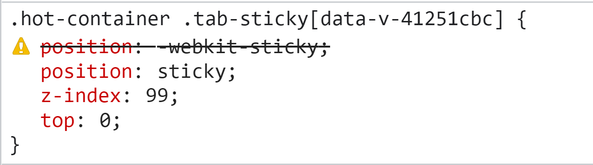
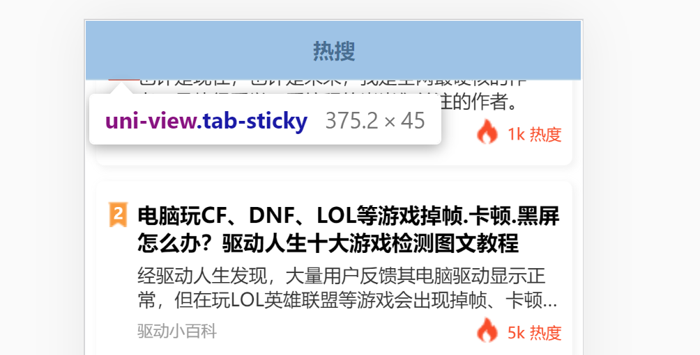

# 多平台适配

## 11-1：开篇

在上一章中，我们知道了，当【慕课热搜】运行到 `h5` 端的时候，那么会出现一些问题，这些问题具体有：

1. `hot` 列表滚动，`tabs` 置顶效果消失
2. 在火狐浏览器中，横线出现非常粗的滚动条
3. 进行文章详情再返回，会出现 `ui` 错乱
4. 文章详情无法展示
5. 文章详情样式问题（现在无法看到）
6. 热播视频全部无法播放
7. 登录功能无法使用

那么本章节中，我们就会专门来去处理这些问题。

这些问题处理的过程，也就是 **项目适配到 `h5` 的过程。**

针对每个问题的处理，我们会分成三块来进行讲解，分别是：

1. 分析问题出现的原因
2. 提出对应的解决方案
3. 完成该问题的处理代码

那么一切准备就绪，接下来就进入我们本章节的内容吧。

## 11-2：uniapp 中的条件编译

想要搞定适配的功能，那么我们首先需要了解一个东西，那就是：[条件编译](https://uniapp.dcloud.io/platform)

我们可以通过：**特殊的注释作为标记，将注释里面的代码编译到不同平台**。

这样的注释主要有两种：

1. 以 `#ifdef %PLATFORM% ` 开头，以 `#endif` 结尾：仅在某平台存在
2. 以 `#ifndef %PLATFORM%  ` 开头，以 `#endif` 结尾：除了某平台均存在

其中 `%PLATFORM% ` 表示 **平台名称**

比如说，我们可以在 `App.vue` 中，写下这样一行代码：

```js
  onLaunch: function () {
    /* #ifdef H5 */
    console.log('当前处于 H5 编译平台');
    /* #endif */
    /* #ifndef H5 */
    console.log('当前处于非 H5 编译平台');
    /* #endif */
  },
```

那么 `当前处于 H5 编译平台` 只会在 **浏览器打印**

`当前处于非 H5 编译平台` 只会在 **非浏览器打印**

具体的 `%PLATFORM% `  取值，大家可以参考 [条件编译官方文档](https://uniapp.dcloud.io/platform) ， 这里就不作一一的赘述了。

那么在了解了，条件编译的语法之后，接下来我们就可以处理 多平台适配相关的内容了。


## 11-3：多平台适配 - `tabs` 置顶效果消失

### 分析原因

在控制台中检查 `tab-sticky` 的，我们可以发现 它的样式指定其实是没有问题的：



`position: sticky` 依然生效，那么问题是出现在哪里呢？

当我们把页面进行滚动之后，然后再控制台查看 `tab-sticky` 的位置，此时我们就可以发现问题：



`tab-sticky` 虽然吸顶了，但是它的吸顶位置为 `top:0` 。

这样的效果在 **微信小程序是没有问题的**，但是在 **浏览器端就会被遮挡！**

### 解决方案

明确了原因之后，想要处理这个问题就很容易了。我们只需要在 **浏览器端调整 `top` 的位置就可以了。**

### 处理代码

`hot.vue`

```css
  .tab-sticky {
    position: -webkit-sticky;
    position: sticky;
    z-index: 99;
    /* #ifndef H5 */
    top: 0;
    /* #endif */
    /* #ifdef H5 */
    top: 44px;
    /* #endif */
  }
```


## 11-4：多平台适配 - 火狐浏览器处理粗滚动条

### 分析原因

在浏览器中出现 **粗滚动条** 的原因是因为： **浏览器对滚动条的处理问题**。

### 解决方案

隐藏浏览器滚动条

### 处理代码

`my-tabs`

```css
  /* #ifdef H5 */
  /deep/.uni-scroll-view::-webkit-scrollbar {
    display: none;
  }

  /deep/.uni-scroll-view {
    scrollbar-width: none;
  }
  /* #endif */
```

## 11-5：多平台适配 -  `ui` 错乱 与 文章详情无法展示

### 分析原因

在我们刚进入到首页的时候，我们的 `ui` 是没有任何问题的。但是当我们进入到 **文章详情** 在返回到首页时，我们就会发现：**`item` 的 `ui` 变得错乱了** 

那么想要去分析这个问题的原因，就需要到 **文章详情** 页面，看一下，看看 **文章详情** 究竟做了什么事情。

在 **文章详情** 中，我们之前使用过 `page-meta` 来去处理：**微信小程序中文章详情文字过小的问题**。

而现在在 **浏览器端** 之所以出现这些问题，就是因为 `page-meta` 导致的。

### 解决方案

在 `h5` 中，不使用 `page-mate` ，只使用 `article-detail.scss` 中的 

```css
html {
  font-size: 52px;
}
```

即可

### 处理代码

```vue
<template>
  <!-- #ifndef H5 -->
  <page-meta root-font-size="52px">
    <!-- #endif -->
    ...
    <!-- #ifndef H5 -->
  </page-meta>
  <!-- #endif -->
</template>

```

## 11-6：多平台适配 -  文章详情样式处理

### 分析原因

通过控制台查看，我们可以发现 `article-detail.scss` 文件的样式并没有生效，出现这个问题的原因，是因为当 `uni-app` 运行到浏览器端的时候，页面组件中 `style` 标签的引入会失效。

### 解决方案

在 `main.js` 中统一引入

### 处理代码

```js
...
// 文章详情样式
import './styles/article-detail.scss';
...
```

## 11-7：多平台适配 -  热播视频全部无法播放

### 分析原因

在浏览器中视频无法播放，并且会出现 403 的错误。

对于这一块，大家需要首先先明确 `403` 错误表示的是什么意思：

> 403错误是一种在网站访问过程中，常见的错误提示，表示资源不可用。 服务器理解客户的请求，但拒绝处理它，通常由于服务器上文件或目录的权限设置导致的WEB访问错误。

简单来说就是：服务端不愿意处理你的请求。

在某些网站中，服务端只会处理 **它信任的客户端请求，而不愿意处理它不认识的客户端的请求。** 

而想要解决这个问题，我们就需要对 **请求进行伪装**，我们无法伪装成 **他信任的人**，但是我们可以 **隐藏身份，让服务端不确定它是不是认识你。** 这样在默认情况下，服务端就 “勉为其难” 的处理你的请求。

那么想要进行伪装，就需要使用到  [referrer](https://developer.mozilla.org/zh-CN/docs/Web/HTTP/Headers/Referrer-Policy) 的 `no-referrer` 指令

### 解决方案

1. 在项目的根目录创建 `index.html` 文件，作为 **根模板**。（可参考：[自定义模板](https://uniapp.dcloud.io/collocation/manifest?id=h5) 相关文档）
2. 添加 `<meta name="referrer" content="no-referrer" />` 标签
3. 在 `manifest.json->h5->template` 节点中关联这个`html`文件的路径
4. 重新编译项目到浏览器

### 处理代码

`index.html`

```html
<!DOCTYPE html>
<html lang="zh-CN">
    <head>
        <meta charset="utf-8">
        <meta http-equiv="X-UA-Compatible" content="IE=edge">
        <title>
            <%= htmlWebpackPlugin.options.title %>
        </title>
				<!-- 访问来源信息不随着请求一起发送 -->
				<!-- 解决 web 访问商品 403 的问题 -->
				<meta name="referrer" content="no-referrer" />
        <!-- Open Graph data -->
        <!-- <meta property="og:title" content="Title Here" /> -->
        <!-- <meta property="og:url" content="http://www.example.com/" /> -->
        <!-- <meta property="og:image" content="http://example.com/image.jpg" /> -->
        <!-- <meta property="og:description" content="Description Here" /> -->
        <script>
            var coverSupport = 'CSS' in window && typeof CSS.supports === 'function' && (CSS.supports('top: env(a)') || CSS.supports('top: constant(a)'))
            document.write('<meta name="viewport" content="width=device-width, user-scalable=no, initial-scale=1.0, maximum-scale=1.0, minimum-scale=1.0' + (coverSupport ? ', viewport-fit=cover' : '') + '" />')
        </script>
        <link rel="stylesheet" href="<%= BASE_URL %>static/index.<%= VUE_APP_INDEX_CSS_HASH %>.css" />
    </head>
    <body>
        <noscript>
            <strong>Please enable JavaScript to continue.</strong>
        </noscript>
        <div id="app"></div>
        <!-- built files will be auto injected -->
    </body>
</html>
```

`manifest.json`

```json
  "h5": {
    "template": "index.html"
  }
```

## 11-8：多平台适配 -  一键登录功能

### 分析原因

在 `my-login` 中，只处理了 **微信一键登录** 的功能

### 解决方案

按照接口，直接处理对应数据即可。

### 处理代码

`my-login`

```vue
<template>
  <view class="my-container">
    <!-- 用户未登录 -->
    <block v-if="!token">
      <image class="avatar avatar-img" src="/static/images/default-avatar.png" mode="scaleToFill" />
      <view class="login-desc">登录后可同步数据</view>
      <!-- #ifdef MP-WEIXIN -->
      <button class="login-btn" type="primary" @click="getUserInfo">微信用户一键登录</button>
      <!-- #endif -->
      <!-- #ifndef MP-WEIXIN -->
      <button class="login-btn" type="primary" @click="onAutoLogin">一键登录</button>
      <!-- #endif -->
    </block>
  </view>
</template>

<script>
export default {
  methods: {
    ...
    /**
     * 一键登录
     */
    async onAutoLogin() {
      // 展示加载框
      uni.showLoading({
        title: '加载中'
      });
      await this.login({
        encryptedData: 'BmGEMqpGI5w',
        errMsg: 'getUserProfile:ok',
        iv: 'c+NbINO4CuEWCBYGG2FxWw==',
        rawData:
          '{"nickName":"小慕同学","gender":1,"language":"zh_CN","city":"","province":"","country":"China","avatarUrl":"https://m.imooc.com/static/wap/static/common/img/logo-small@2x.png"}',
        signature: '449a10f11998daf680fe546a5176e6e2973516ce',
        userInfo: { nickName: '小慕同学', gender: 1, language: 'zh_CN', city: '', province: '' }
      });
      this.$emit('onLoginSuccess');
      // 隐藏loading
      uni.hideLoading();
    },
  }
};
</script>

```

## 11-9：总结

本章节中，我们处理了 **多平台适配** 的问题，其中的核心 `api` 就是 **`uni` 所提供的条件编译语法**

那么到现在为止【慕课热搜】已经可以在：

1. 微信小程序
2. `h5`

进行运行了。这样其实就已经达到了我们的目的。

这里大家要注意，在实际的开发场景中，我们去进行 **多平台适配** 的时候，并不是适配的越多越好的。

因为适配的越多，证明我们需要付出越大的成本。

所以，通常我们会根据我们的应用属性，来决定要适配哪些平台。

如果你的应用是涉及到 **支付** 相关的，那么一般需要适配：

- 微信小程序
- 支付宝小程序

如果是非支付相关的，一般只需要：

- 微信小程序
- `h5` 

就可以了。

