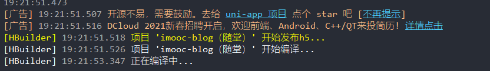

# 项目发布

## 12-1：开篇

截止到此时，我们整个的【慕课热搜】项目就已经全部开发完成了。

那么接下来我们就可以打包上线这个项目。

我们这里的打包会分为：

1. 微信小程序
2. `h5`

两个平台的项目打包。

那么下面我们就分别来去看。

## 12-2：打包微信小程序

1. 打开 `HBuilder`
2. 打开当前要打包的项目
3. 点击发行，找到【小程序 - 微信】
   
4. 确认小程序名称和 `appid`，确认无误点击 【发行】
   
5. 等待控制台编译
   
6. 编译完成之后，会自动打开【微信开发者工具】
7. 点击【上传】即可
   
8. 后续流程可参考【02-小程序初体验】 - 【项目发布流程】

## 12-3：打包 h5 页面

1. 打开 `HBuilder`
2. 打开当前要打包的项目
3. 点击发行，找到【网站 - PC web 或手机 H5 】
   
4. 确认【网站标题】，无需【网站域名】，直接点击发行即可
   
5. 等待项目编译
   
6. 编译成功后，项目会被导出到指定路径
   
7. 找到该路径下的文件，即为【打包后的问题】
   
8. **注意：** 不可直接打开 `index.html` 进行访问，需要通过 `web 服务` 进行访问！
   1. 本地可通过 [anywhere](https://www.npmjs.com/package/anywhere) 快速启动静态文件服务器
   2. 使用方式：
      1. 下载：`npm install anywhere -g` 
      2. 在项目路径下执行 `anywhere` 命令

## 12-4：总结

本章节我们讲解了如何打包：

1. 微信小程序
2. `h5` 客户端

那么如果大家想要打包其他平台应用的话，也非常简单，同样在发行下点击对应的按钮即可。

