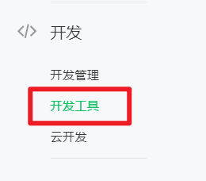

# 小程序开发前的准备

在进行【小程序】开发之前，我们需要做一些准备工作：

1. 前往 [微信公众平台](https://mp.weixin.qq.com/) ，注册账号 并 登录
2. 下载并安装【微信开发者工具】

## 注册小程序

1. 进入 [微信公众平台](https://mp.weixin.qq.com/) 
2. 点击立即注册
   
3. 账号类型选择【小程序注册】
   
4. 完成基本的注册流程
   
5. 【小程序】注册完成之后即可前往  [微信公众平台](https://mp.weixin.qq.com/) 【微信扫码完成登录】
6. 

## 下载并安装【微信开发者工具】

1. 在【已登录】的小程序页面中，点击【开发工具】                                                                                                                                                                                                                                                                                                                                                                                                                                                                                                                                                                                                                                                                                                                                                                                                                                                                                                                               
   
2. 找到【开发者工具】，点击【下载】
   
3. 推荐下载【稳定版本】，大家可以根据自己的系统进行选择下载
   
4. 一路下一步，即可完成安装

